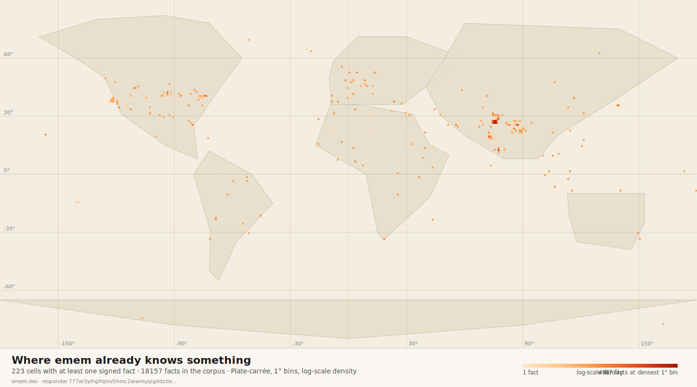
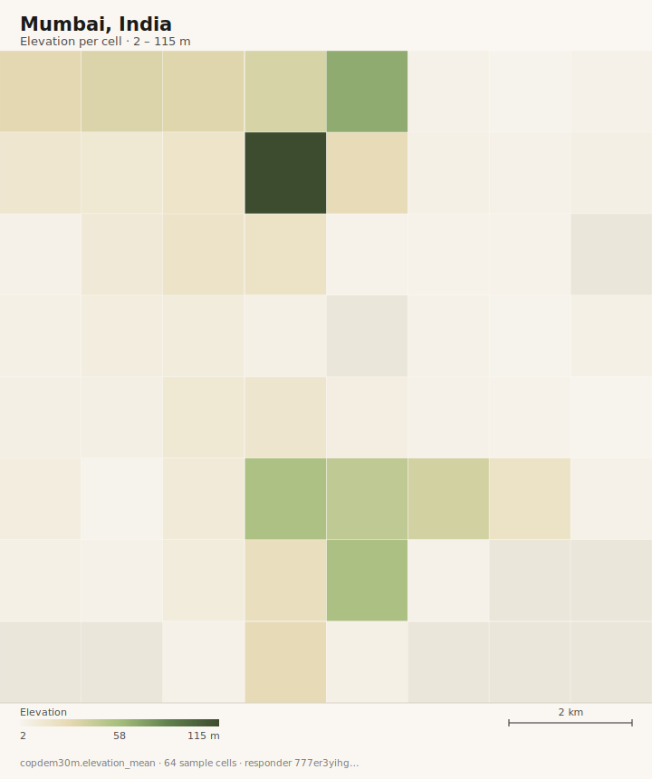
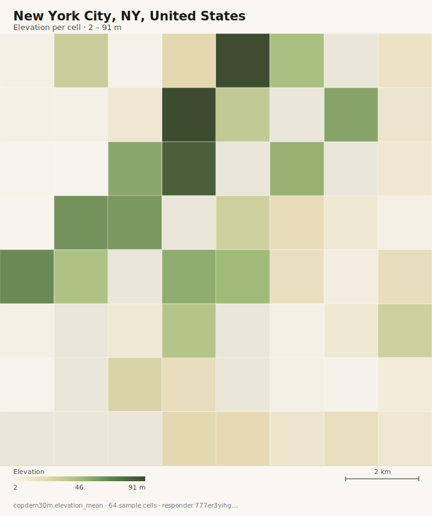
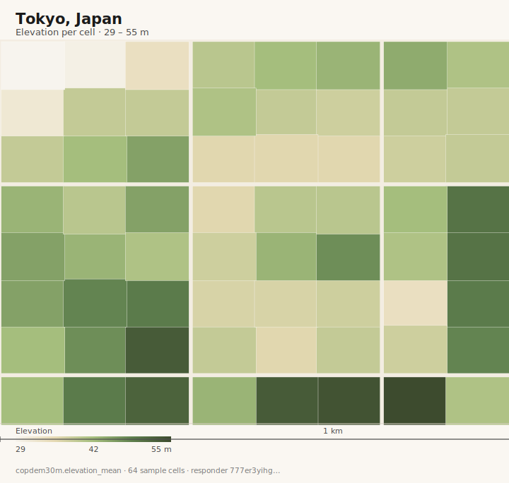

<div align="center">
  

  <h1>emem</h1>

  <p>Earth memory, signed at the edge.</p>

  <p>
    <a href="LICENSE"></a>
    <a href="https://www.rust-lang.org/"></a>
    <a href="https://modelcontextprotocol.io/"></a>
    <a href="https://www.openapis.org/"></a>
    <a href="https://github.com/Vortx-AI/emem/pkgs/container/emem"></a>
  </p>

  <p>
    <a href="https://emem.dev"><strong>Hosted</strong></a> ·
    <a href="https://emem.dev/agents.md">Docs</a> ·
    <a href="https://emem.dev/spec.md">Spec</a> ·
    <a href="https://emem.dev/openapi.json">OpenAPI</a> ·
    <a href="https://emem.dev/humans">Try it</a> ·
    <a href="https://emem.dev/verify">/verify</a> ·
    <a href="https://emem.dev/docs/gallery">Gallery</a> ·
    <a href="https://huggingface.co/spaces/vortx-ai/emem">HF Space</a>
  </p>
</div>

---

<p align="center">
  <a href="https://emem.dev/v1/coverage_map.svg">
    
  </a><br/>
  <em>Where emem has attested facts right now. 1440×720 plate-carrée. The same SVG renders live at <code>/v1/coverage_map.svg</code>.</em>
</p>

<p align="center">
  <a href="https://emem.dev/v1/places/scene_overlay.svg?place=Mumbai&band=copdem30m.elevation_mean&n_cells=64"></a>
  <a href="https://emem.dev/v1/places/scene_overlay.svg?place=Manhattan&band=copdem30m.elevation_mean&n_cells=64"></a>
  <a href="https://emem.dev/v1/places/scene_overlay.svg?place=Tokyo&band=copdem30m.elevation_mean&n_cells=64"></a>
  <br/>
  <em>Mumbai · Manhattan · Tokyo, painted by Copernicus DEM elevation. Each image is a live endpoint URL; click to see the latest signed render. <a href="https://emem.dev/docs/gallery">/docs/gallery</a> has the full set.</em>
</p>

---

An LLM asked what is at a place will usually guess. It has no stable handle for the patch of ground at 19.07° N, 72.87° E and no audit trail for the number it returns. emem is the missing handle. Every cell on Earth gets a 64-bit identifier (about 9.55 m on a side at the equator). Every measurement at that cell is recorded as a fact keyed by cell, band, and time, signed with ed25519 over the blake3 hash of its canonical CBOR. Paste the 26-character content id into a chat and your colleague can pull the same bytes from any responder and verify the signature in their browser at [/verify](https://emem.dev/verify). The hosted node is `https://emem.dev`; there are no keys, no accounts, and the same handlers answer both MCP and plain REST.

When an agent asks for a band at a cell that has no signed fact yet, the responder fetches the underlying tile through one of its forty-three upstream sources, signs the result as its own primary attestation, persists it, and returns in the same response. The cold path takes about 180 ms; warm reads are sub-ten milliseconds. Every cell on Earth answers cite-ably from day one, without a pre-seeded corpus.

Three foundation encoders sit GPU-pinned alongside the responder: Clay v1.5 reads Sentinel-2 at a 2.56 km receptive field, Prithvi-EO-2.0-300M-TL reads HLS at 6.7 km, and Tessera reads Sentinel-1 plus Sentinel-2 per-pixel. Each carries its own aliasing pattern, so disagreements are informative. The `clay_prithvi_tessera_triple_consensus@1` recipe votes the three; six domain variants follow for deforestation, wetland change, urban expansion, disaster anomaly, climate archetype, and coastal erosion. Receipts pin the algorithm CID, so a third party can replay the score against the same input facts and reproduce the same number.

When a band genuinely has no data at a cell (the encoder is offline, the place is outside coverage, the archetype seed never materialised), the responder returns a signed *absence* with a typed reason. An empty answer is itself a citable receipt, not a 404 and not an empty array. Whitepaper at [/whitepaper.md](https://emem.dev/whitepaper.md) walks the math.

## Try it (no install, no key)

```bash
# Geocode a place to a cell64.
curl -s -X POST https://emem.dev/v1/locate \
  -H 'content-type: application/json' \
  -d '{"q":"Bengaluru"}' | jq .cell64
# "defi.zb493.xoso.zcb6a"

# Recall a band at that cell (auto-fetched if cold).
curl -s -X POST https://emem.dev/v1/recall \
  -H 'content-type: application/json' \
  -d '{"cell":"defi.zb493.xoso.zcb6a","bands":["weather.temperature_2m"]}' \
  | jq '.facts[0]'

# Ask a free-text question; the foundation-embedding fan-out fires
# automatically on "find places like" / "what changed" intents.
curl -s -X POST https://emem.dev/v1/ask \
  -H 'content-type: application/json' \
  -d '{"q":"find places like Yellowstone","place":"Yellowstone National Park"}' \
  | jq '.foundation_embeddings'
```

The receipt's `fact_cid` is a durable handle. Re-fetching it from any responder, in any year, returns the same bytes.

## Verify an answer (four curls)

The pitch lives or dies on this flow. Every recall response carries a receipt with `fact_cids[]`, `merkle_proof`, and an Ed25519 `signature` over the canonical preimage `BLAKE3(primitive ‖ served_at ‖ schema_cid ‖ registry_cid ‖ responder_pubkey ‖ key_epoch ‖ fact_cids ‖ merkle_root)`. The signer's public key is stable; the receipt is reproducible.

```bash
# 1. Resolve a place to a cell64.
CELL=$(curl -s -X POST https://emem.dev/v1/locate \
  -H 'content-type: application/json' \
  -d '{"q":"Golden Gate Park, San Francisco"}' | jq -r .cell64)

# 2. Recall a band and capture the receipt envelope.
curl -s -X POST https://emem.dev/v1/recall \
  -H 'content-type: application/json' \
  -d "{\"cell\":\"$CELL\",\"band\":\"indices.ndvi\"}" > /tmp/recall.json

jq '.receipt | {primitive, served_at, responder_pubkey_b32, fact_cids, merkle_proof: .merkle_proof.root}' \
  /tmp/recall.json

# 3. Ask the responder to verify its own signature (server-side check).
jq '{receipt: .receipt}' /tmp/recall.json > /tmp/receipt.json
curl -s -X POST https://emem.dev/v1/verify_receipt \
  -H 'content-type: application/json' --data @/tmp/receipt.json
# {"valid":true,"preimage_blake3_hex":"…","fact_cids_count":1,"signer_pubkey_b32":"…",…}

# 4. Reproduce: pull the same fact_cid from any responder, on any day.
# The cell, band, tslot, and derivation.fn_key are content-addressed —
# the bytes you receive will hash to the same fact_cid.
jq '.facts[0].derivation' /tmp/recall.json
```

For a browser-only verify, open [`/verify/<fact_cid>`](https://emem.dev/verify) — the page does the same Ed25519 check in WebCrypto + `@noble/ed25519` so you never have to trust the responder you got the receipt from. A guided walk lives at [`/demos/signed-answer`](https://emem.dev/demos/signed-answer).

## Connect your AI assistant

The MCP endpoint is `https://emem.dev/mcp`. Drop a config snippet into your client.

| Client                | Config                                                              |
|-----------------------|---------------------------------------------------------------------|
| Claude Desktop        | [examples/claude-desktop.json](examples/claude-desktop.json)        |
| Claude Code           | [examples/claude-code.mcp.json](examples/claude-code.mcp.json)      |
| Cursor                | [examples/cursor.mcp.json](examples/cursor.mcp.json)                |
| Cline (VS Code)       | [examples/cline.mcp.json](examples/cline.mcp.json)                  |
| Gemini CLI            | `gemini extensions install https://emem.dev/gemini-extension.json`  |
| ChatGPT (Custom GPT)  | [examples/openai-gpt-action.json](examples/openai-gpt-action.json)  |
| LangChain (Python)    | [examples/langchain.py](examples/langchain.py)                      |
| LlamaIndex (Python)   | [examples/llamaindex.py](examples/llamaindex.py)                    |

Python and TypeScript SDKs live under `sdks/` (publication to PyPI / NPM pending; install from the repo today).

## Primitives

49 MCP tools, 71 documented REST paths (68 under `/v1/*`, surfaced through `/openapi.json`). Every tool carries a `when_to_use` string written for LLM tool-selection, and four MCP behavioural annotations (`readOnlyHint`, `destructiveHint`, `idempotentHint`, `openWorldHint`).

- **Locate:** name or lat/lng → `cell64`. Five-layer cascade: wide-bbox table → embedded gazetteer → GeoNames cities-5000 (68 581 places, in-process) → sled cache → Photon → Nominatim. Polygon geometry from Overture `divisions/division_area`. District-level queries reroute through Overture when Nominatim returns a POI courthouse.
- **Recall / recall_many / recall_polygon:** 118 materializer-wired band names across 35 cube slots. Auto-fetch on miss; signed Absence on out-of-coverage.
- **Find similar:** k-NN over any vector band. Hamming fast path (sign-bit pop-count) auto-derives from the cosine band when the binary sibling is absent. Mode `hamming_then_rerank` triages with Hamming then re-orders by cosine; the over-sampling factor is EWMA-adaptive.
- **Compare / compare_bands / diff / trajectory:** pairwise and time-series.
- **Verify:** structured claim against attested facts; returns signed verdict + evidence CIDs.
- **Physics:** `/v1/heat_solve` (2-D explicit FTCS heat, MODIS LST stencil), `/v1/wave_solve` (1-D shallow-water along seaward bathymetry gradient), `/v1/jepa_predict` (closed-form NDVI AR(2) seasonal), `/v1/jepa_predict_v2` (Tessera embedding dynamics; short-circuits to last-vintage identity baseline while the trained head is pending, receipt carries `untrained_baseline`).
- **Ask:** free-text question with topic routing. Intents matching "find places like" / "what changed" / "deforestation" / "anomaly" fan out across the three foundation encoders concurrently; the response carries `foundation_embeddings` with per-encoder neighbour lists and cross-encoder consensus voting.
- **Domain shortcuts:** `emem_at`, `emem_ndvi`, `emem_air`, `emem_lst`, `emem_soil`, `emem_water`, `emem_forest`, `emem_weather`. Collapse locate → recall → polygon-aggregate into one call by place name.
- **Field boundaries:** Fields of The World (~3.17 B field polygons, 241 countries, 10 m, CC-BY-4.0) via PMTiles range reads on `source.coop`.
- **Visual surfaces:** `/v1/coverage_map.svg` (1440×720 plate-carrée of attested cells, log-scale density) and `/v1/places/scene_overlay.svg?place=…&band=…` (per-place value-painted bbox grid; band-aware ColorBrewer ramps, horizontal legend, km scale bar, signed source line). The MCP equivalents return the same SVG as an `EmbeddedResource` block. The full set, plus the 32-diagram protocol/industry suite, lives at [/docs/gallery](https://emem.dev/docs/gallery) and [/docs/diagrams](https://emem.dev/docs/diagrams).

## Algorithms

155 named composition recipes (`flood_risk@2`, `walkability_score@1`, `heat_index@2`, `carbon_sink_score@1`, `eudr_compliance@1`, ...) live in a content-addressed registry. Each carries:

- `formula`: plain math the agent can read and apply.
- `inputs`: band keys with role + explanation.
- `when_to_use`: agent-targeted trigger guidance.
- `citation`: peer-reviewed source.
- `accuracy_band`: honest precision estimate, not marketing.
- `parameters`: typed tunable thresholds (gate, k, timeout, ...).
- `learned_from`: citation provenance for every tuned number. An auditor can trace any gate threshold back to a referee.

Algorithms with an `evaluation: Expr` AST are also re-executable in-process: the responder walks the AST against the snapshot recall and returns a signed composite scalar that any third party with matching `algorithms_cid` and input fact CIDs reproduces deterministically.

Browse at [`GET /v1/algorithms`](https://emem.dev/v1/algorithms) or per-key at [`GET /v1/algorithms/<key>`](https://emem.dev/v1/algorithms/clay_prithvi_tessera_triple_consensus@1).

## Discovery

Designed for agents to read, not for humans to remember:

```
GET /openapi.json                  — OpenAPI 3.1 of every REST route
GET /v1/agent_card                 — live capability snapshot + manifest CIDs
GET /v1/tools                      — 49 MCP tools with when_to_use + annotations
GET /v1/algorithms?summary=true    — 155 algorithm keys + categories
GET /v1/topics                     — 27 topic-grouped bands + algorithms (router brain)
GET /v1/manifests                  — bands_cid, algorithms_cid, sources_cid, schema_cid
GET /.well-known/{emem,agent,mcp,ai-plugin}.json
POST /mcp                          — JSON-RPC 2.0 (Streamable HTTP)
GET /llms.txt    /llms-full.txt    — plaintext catalog for LLM ingestion
GET /humans      /humans.json      — interactive try-it surface + machine twin
GET /verify      /verify/<fact_cid>— in-browser ed25519 receipt verifier
GET /docs/gallery                  — live coverage map + per-place scenes + 32 diagrams
GET /docs/diagrams/                — 32 SVGs of protocol + industry deployments
```

Every receipt pins four content-addressed registry CIDs (`bands_cid`, `algorithms_cid`, `sources_cid`, `schema_cid`). A peer that recomputes a fact under matching CIDs produces the same bytes. A peer with drifted registries returns a different `bands_cid` on `/health` and the divergence is visible before any data flows.

## Run it locally

```bash
cargo run --release --bin emem-server
# Or via container.
docker run -p 5051:5051 ghcr.io/vortx-ai/emem:latest
```

No required env vars. `EMEM_BIND` overrides the listener (default `0.0.0.0:5051`). `EMEM_DATA` overrides the data directory (default `./var/emem`; pass `:memory:` for ephemeral). For TLS, systemd, ACME on `:443`, and the HuggingFace Space wrapper, see [docs/operators/operating.md](docs/operators/operating.md).

## Address algebra

| field   | bits         | wire form                        | example                    |
|---------|--------------|----------------------------------|----------------------------|
| `cell`  | 64           | four base-1024 bigrams, dot-sep  | `defi.zb493.xoso.zcb6a`    |
| `tslot` | 64           | base32-nopad-leb128, `t.` prefix | `t.aaaaagy`                |
| `cid`   | 32 B BLAKE3  | base32-nopad-lowercase, 26 chars | `qi3jo4sqcg…l2hgjtwm`      |
| `vec`   | 1792-D fp16  | 12-byte prefix in receipts       | full vector via `recall`   |

The active grid is ~9.54 m × ~9.55 m at the equator (lat 21 bits × lng 22 bits, asymmetric to match the 360°/180° ratio). Above the equator, longitude pitch narrows with cos(lat). The Hilbert-ordered base-1024 alphabet keeps adjacent cells string-prefix-similar, so an LLM that emits `defi.zb493…` already lands in roughly the right place. `GET /v1/grid_info` declares the active resolution honestly; the spec target is a hierarchical migration toward H3-equivalent res-13 (~3.4 m).

## Repo layout

```
emem/
├── crates/                       # 14 workspace crates, MSRV 1.88, version 0.0.6
│   ├── emem-core/                # bands, algorithms, functions, sources, topics, schema
│   ├── emem-codec/               # cell64, cid64, vec64, hilbert, geo, alphabet
│   ├── emem-fact/                # canonical CBOR; fact, receipt, attestation
│   ├── emem-claim/               # claim predicates (Op enum)
│   ├── emem-cache/               # sled cache wrapper
│   ├── emem-fetch/               # 12 data connectors + 6 utility modules
│   ├── emem-storage/             # sled hot cache + append-only merkle log
│   ├── emem-cubes/               # 1792-D voxel cube handle
│   ├── emem-primitives/          # recall, find_similar, trajectory, compare, diff, verify, query_region
│   ├── emem-attest/              # merkle root over fact CIDs
│   ├── emem-intent/              # rule-based intent → plan planner
│   ├── emem-mcp/                 # 49-tool MCP descriptor registry
│   ├── emem-api-rest/            # axum router, physics solvers, foundation fan-out
│   └── emem-cli/                 # binaries: emem-server, emem-livedemo, emem-realdemo, emem-demo, emem-ask-eval
├── sdks/
│   ├── emem-py/                  # Python client (httpx, sync + async)
│   └── emem-ts/                  # TypeScript client (zero runtime deps, native fetch)
├── python/                       # FastAPI sidecar over UDS: Prithvi-EO-2.0, Galileo, Clay v1.5, JEPA-v2
├── examples/                     # MCP configs + LangChain / LlamaIndex
├── ops/                          # systemd units, journald retention
└── web/                          # SSR HTML, humans, verify, llms.txt, agent.json
```

The 12 data connectors back **43 declared source schemes** and **20 live materializer registrations**. Most schemes route through `cog.rs`, the universal STAC + COG sampler, plus bespoke modules for `chirps`, `dmsp_ols`, `firms`, `ftw`, `geonames`, `hansen_gfc`, `koppen`, `overture`, `terraclimate`, `wdpa`, `worldpop`.

## Inference

The GPU sidecar (Python FastAPI over Unix domain socket) co-resides four encoders on a 20 GB VRAM budget:

- **Clay v1.5:** 1024-D CLS, S2 L2A 10 bands, ~12 ms warm. Teacher (DINOv2 `vit_large_patch14_reg4_dinov2.lvd142m`) pre-staged at boot so `HF_HUB_OFFLINE=1` holds.
- **Prithvi-EO-2.0-300M-TL:** 1024-D CLS, HLS V2 6-band, ~13 ms warm.
- **Galileo** (variant `base` in production; `tiny` / `nano` selectable via `EMEM_GALILEO_VARIANT`): S2-only modality wired (S1 / ERA5 / SRTM / VIIRS / Dynamic-World / WorldCover / LandScan / location zero-masked; the scaffold is multimodal but only S2 is connected today). The advertised capability is `galileo-<variant>` in `/v1/capabilities.extensions[]`.
- **JEPA v2 dynamics:** untrained baseline. Metadata-only `is_trained()` check short-circuits to last-vintage identity; receipt carries `untrained_baseline` and `via: "short_circuit_untrained"`. Training is upstream-bottlenecked on multi-vintage Tessera availability.

Sidecar crash does not cascade. The REST router degrades to scalar bands and signs the GPU-anchored algorithms as Absence with `gpu_unavailable`. See [docs/developers/inference.md](docs/developers/inference.md).

## Honest limits

- **No commercial sub-meter imagery.** Sentinel-2 (10 m), Landsat (30 m), HLS. For Planet Pelican (50 cm) or Maxar bring your own connector.
- **No edge / onboard inference.** Sidecar runs on a single host.
- **Single-host deployment.** No federation, no global routing, no SOC 2.
- **JEPA v2 is untrained today.** The endpoint exists and signs honestly; predictions equal the last attested vintage until the dynamics head is trained.
- **12 data connectors, 20 live materializer registrations.** Catalog-by-count is not the pitch; every wired band is auto-fetchable, signed, and content-addressed. Bands without a wired materializer are listed under `declared_but_no_materializer_at_this_responder`.
- **Tessera is upstream-rate-limited.** `dl2.geotessera.org` reliably serves 2024 vintages today; historical backfill across all eight vintages (2017–2024) is partial.
- **No interactive notebook UI.** For exploration there is `/humans` (try-it drawer, manifest grid, ontology SVG); for analytics, drive from a notebook against the REST or MCP endpoint.

## Resources

| | |
|--|--|
| Agent loop  | [https://emem.dev/agents.md](https://emem.dev/agents.md)                                           |
| Wire spec   | [https://emem.dev/spec.md](https://emem.dev/spec.md)                                               |
| llms.txt    | [https://emem.dev/llms.txt](https://emem.dev/llms.txt)                                             |
| OpenAPI 3.1 | [https://emem.dev/openapi.json](https://emem.dev/openapi.json)                                     |
| MCP         | `https://emem.dev/mcp`                                                                             |
| Verify      | [https://emem.dev/verify](https://emem.dev/verify)                                                 |
| Container   | `ghcr.io/vortx-ai/emem:latest` (multi-arch, anonymously pullable)                                  |
| HF Space    | [huggingface.co/spaces/vortx-ai/emem](https://huggingface.co/spaces/vortx-ai/emem)                 |
| Issues / PRs| [github.com/Vortx-AI/emem/issues](https://github.com/Vortx-AI/emem/issues)                         |
| Security    | [SECURITY.md](SECURITY.md), `avijeet@vortx.ai`                                                     |

## License

Apache-2.0. See [LICENSE](LICENSE) and [NOTICE](NOTICE).

Default-build data sources are open: Copernicus DEM, JRC GSW (CC-BY 4.0), Hansen GFC, ESA WorldCover (CC-BY 4.0), Overture Maps (places, buildings, transportation, `divisions/division_area`; ODbL / CDLA-Permissive), Fields of The World (CC-BY 4.0), GeoNames cities-5000 (CC-BY 4.0), OSM (ODbL), met.no, Open-Meteo, Tessera. No API keys, no operator credentials, no SaaS lock-in.
