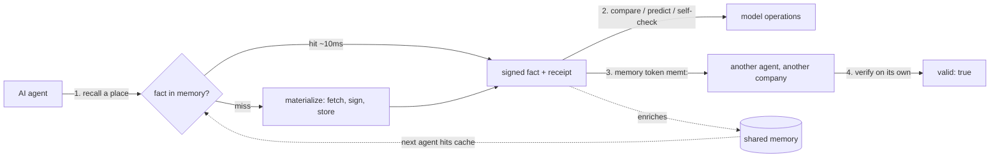

# emem

**Shared, verifiable memory for AI agents.**

An AI agent forgets. Between one call and the next, it loses what it learned. Ask two agents the same question and they answer twice, from scratch, and you have no way to check either one. When the answer touches the real world, a coordinate, a forest, a field, a flood line, the agent guesses from training data or re-derives it every single time.

emem is the memory that is missing. One shared store. Append-only. Every fact signed. When any agent records a fact, that fact exists for every other agent, and anyone can verify it without trusting whoever wrote it.

Point an MCP client at `https://emem.dev/mcp`. No key needed to read.

[](LICENSE)
[](https://modelcontextprotocol.io/)
[](https://www.rust-lang.org/)

> **If you are an agent reading this:** start at [`https://emem.dev/llms.txt`](https://emem.dev/llms.txt). Call `emem_ask` with a plain question, or `emem_recall` with a place. Every answer comes back signed. To hand a fact to another agent, make a memory token with `emem_memory_token`. The other agent checks it on its own.

---

## Why this exists

Three problems show up the moment you run agents in production.

**They forget.** State lives inside one session. Close it and the knowledge is gone. The next run starts cold.

**They can't share what they know.** An agent at one company learns something true. An agent at another company needs it a month later. There is no common place to leave it, and no way for the second agent to trust it if there were.

**They make things up.** A confident answer about a real place, with no source you can open and check. This is the failure that ends pilots.

Session memory, vector stores, and knowledge graphs help with the first problem for text. None of them give you a shared record of the physical world that any agent can read, any agent can add to, and any agent can verify. That is what emem is.

## The 30-second demo

One agent records a fact about a real place. It gets back a signed memory. It hands a short token to a second agent. The second agent confirms the fact is real, without ever trusting the first agent.

**Agent A records a fact.** `POST /v1/recall` (MCP tool `emem_recall`):

```bash
curl -s -X POST https://emem.dev/v1/recall \
  -H 'content-type: application/json' \
  -d '{"cell":"defi.zb493.xuqA.zcb5f","bands":["copdem30m.elevation_mean"]}'
```

```json
{
  "facts": [{
    "band": "copdem30m.elevation_mean", "cell": "defi.zb493.xuqA.zcb5f",
    "tslot": 0, "value": 918.0, "unit": "m", "confidence": 0.95,
    "signed_at": "2026-05-03T17:45:32Z",
    "signer_pubkey_b32": "777er3yihgifqmv5hmc2wwmyszgddzderzhsx6rex4yoakwomvka"
  }],
  "receipt": {
    "request_id": "01KR39HY37333FD3C9PBV0F67B",
    "primitive": "emem.recall", "served_at": "2026-05-08T07:59:08Z",
    "cells": ["defi.zb493.xuqA.zcb5f"],
    "fact_cids": ["yqbolgeoycqkvj3zkxukb4bjw4odhpwvfzqo3fbgwf4spk45zala"],
    "responder_pubkey_b32": "777er3yihgifqmv5hmc2wwmyszgddzderzhsx6rex4yoakwomvka",
    "signature": [254, 85, 234, "..."]
  }
}
```

The cell was empty a moment ago. This one call fetched the fact, signed it, stored it, and returned it. It is now in memory for every agent.

**Agent A makes a token.** `emem_memory_token`:

```
memt:defi.zb493.xuqA.zcb5f:yqbolgeoycqkvj3zkxukb4bjw4odhpwvfzqo3fbgwf4spk45zala
```

That string is a portable citation. Agent A drops it into a message, a log, or a report.

**Agent B checks it.** `emem_verify_receipt`, or in a browser at `/verify`:

```json
{ "valid": true, "signer_pubkey_b32": "777er3yihgifqmv5hmc2wwmyszgddzderzhsx6rex4yoakwomvka" }
```

Agent B did not have to trust Agent A. It recomputed the content ID and checked the signature against the responder's public key. That is the entire trust model. No account, no callback, no shared password.

## What an agent can do with it

Six operations. Each maps to real tools.

| Operation | What it means for an agent | Tools |
|---|---|---|
| **Recall** | read memory for a place | `emem_recall`, `emem_recall_many`, `emem_recall_polygon`, `emem_locate` |
| **Materialize** | write memory on a miss, automatically | happens inside `emem_recall`: fetch, sign, persist, return |
| **Verify** | trust a fact without trusting the sender | `emem_verify`, `emem_verify_receipt`, `emem_memory_token`, `emem_memory_bundle` |
| **Compare** | find places that resemble each other | `emem_state`, `emem_state_multi`, `emem_find_similar`, `emem_compare` |
| **Predict** | run a forward model, with honesty flags | `emem_jepa_predict`, `emem_jepa_predict_v2` |
| **Self-check** | find where memory disagrees with itself | `emem_memory_contradictions`, `emem_edges_recall`, `emem_diff` |

You do not have to pick. Call `emem_ask` with a plain-language question and it routes to the right operation, then returns a signed answer.


```mermaid
flowchart LR
    A[AI agent] -->|1. recall a place| M{fact in memory?}
    M -->|hit ~10ms| R[signed fact + receipt]
    M -->|miss| F[materialize: fetch, sign, store]
    F --> R
    R -->|2. compare / predict / self-check| W[model operations]
    R -->|3. memory token memt:| B[another agent, another company]
    B -->|4. verify on its own| V[valid: true]
    R -.enriches.-> C[(shared memory)]
    C -.next agent hits cache.-> M
```

## Memory that survives the handoff

This is the part built for long-running work across many agents and many companies.

A fact recorded today is still there next month, addressed by its content, not by a session that expired. An agent that has never met the agent that wrote it can read it and confirm it is genuine. The confirmation is a local calculation, not a call back to the writer, so it keeps working even if the original agent, service, or company is long gone.

That changes what a multi-party workflow can assume. Company A's agent leaves a signed observation. Company B's agent picks it up in a later step and proves it is authentic before acting on it. A regulator, an auditor, or a third agent months later recomputes the same content ID and gets the same answer. Nobody has to trust a shared database, because there is no shared database to trust. There is a shared memory that each party can check for itself.

Each agent also gets a private memory of its own. emem implements the six commands of the standard agent memory tool: `view`, `create`, `str_replace`, `insert`, `delete`, and `rename`. Every file is tagged by kind (episodic, semantic, procedural, or resource), and `memory_search` runs meaning-based search across them. The private files are the agent's scratchpad. The shared store is the common ground. Both are signed.

## The more it is used, the better it gets

emem is one shared memory, not a cache per agent. It grows because of what happens on a miss.

When an agent asks about a place that has no fact yet, the responder fetches it, signs it, stores it, and returns it in the same call. The next agent to ask the same question gets an answer in about 10 milliseconds instead of waiting about 180 for a cold fetch. Every question any agent asks makes the memory richer for every agent that comes after. Today the store holds signed facts across roughly 6,400 places and 89 kinds of measurement. The live count is always at `GET /v1/corpus_state_stats`.

Because every fact is addressed by its content, the same observation recorded by two independent responders lines up automatically. Two sources, one address, and you can see whether they agree.

## How one agent proves a fact to another

A memory token is a citation one agent hands to another. The receiver checks it alone.

- **One fact:** `emem_memory_token` returns `memt:<place>:<fact_id>`. Resolve it on any copy of the service with `emem_memory_token_resolve`.
- **Many facts:** `emem_memory_bundle` returns `memb:<bundle_id>`, one signed envelope over many facts.

The signature covers a fixed recipe: a hash of the request ID, the time served, the operation, the places, and the fact IDs. Anyone recomputes it with the responder's public key, published at `/.well-known/emem.json`. No account, no callback, no shared secret.

One honest limit. The signature does not cover the original question text or the choice of which place to read. It proves the responder signed these facts at these places. Whether those facts actually answer the question is the calling agent's job. Check `selected.is_high_confidence` from `emem_locate` before you trust a place-based answer.

## The model underneath

The parts that make emem more than a lookup table.

**Place fingerprints.** `emem_state` returns a dense numeric fingerprint for any place, signed and content-addressed. `emem_state_multi` runs the same place through every available model and returns one fingerprint per model, plus a clear list of any that are not wired up here.

**Resemblance.** `emem_find_similar` returns the nearest places to a given one, ranked by how alike their fingerprints are.

```json
{
  "neighbors": [
    {"cell": "defi.zb5cf.nura.zd83c", "score": 0.6537, "place_label_cached": "New York City, USA"},
    {"cell": "defi.zb563.noxo.xAvu", "score": 0.6426, "place_label_cached": "Shanghai, China"}
  ],
  "receipt": {"primitive": "emem.find_similar", "fact_cids": ["..."]}
}
```

**Prediction, with the truth about its own limits.** `emem_jepa_predict` is a simple fixed-formula predictor. `emem_jepa_predict_v2` is a learned one. It is honest about itself: the answer carries warnings, and it says so plainly when it is no better than a naive guess. A prediction that admits "I do not actually know" is doing its job. Read the warnings before you rely on the number.

**Catching its own contradictions.** `emem_memory_contradictions` looks for places and times where two sources signed values that disagree, scores how far apart they are, and records a signed "disagrees with" link instead of quietly picking a winner. `emem_edges_recall` reads the links attached to a fact.

**A test for agents.** `GET /v1/benchmark` is a graded set of questions for agents that use emem, scored by exact match at `POST /v1/benchmark/grade`. It measures whether an agent can actually use the memory well.

## Connect

Reading needs no key. Point any MCP client at `https://emem.dev/mcp`.

**Claude Code, Claude Desktop, Cursor, Cline:**
```json
{ "mcpServers": { "emem": { "type": "http", "url": "https://emem.dev/mcp" } } }
```

**Any MCP client over the standard bridge:**
```json
{ "command": "npx", "args": ["-y", "mcp-remote", "https://emem.dev/mcp"] }
```

**Plain HTTP, no key:**
```bash
curl -s -X POST https://emem.dev/v1/recall \
  -H 'content-type: application/json' \
  -d '{"cell":"defi.zb493.xuqA.zcb5f","bands":["weather.temperature_2m"]}'
```

**Run your own:**
```bash
docker run -p 5051:5051 ghcr.io/vortx-ai/emem:latest
```

Ready-made configs for Claude, Cursor, Cline, OpenAI, LangChain, and LlamaIndex are under `examples/`. Full agent guide at `https://emem.dev/agents.md`.

## Where the facts come from

This is the layer that fills memory on a miss. It sits below everything above, on purpose. An agent almost never touches it directly.

The raw material is the public record of the physical world: open satellite and earth-observation data from agencies like ESA, NASA, USGS, and the EU's Joint Research Centre, plus open reference datasets for land cover, water, terrain, and weather. Foundation models turn those raw readings into the numeric fingerprints used above. emem's job is the last step: sign the result, store it, and give it a stable address so it can be recalled and checked forever. The default build reads only open sources. No API keys, no operator credentials.

Individual measurements carry plain names like `indices.ndvi` (a greenness measure), `copdem30m.elevation_mean` (ground height), and `weather.temperature_2m` (air temperature). An agent rarely names them. It asks a question or names a place, and the router picks the right measurements.

## Who uses it today

Honest framing: this is version 0.x. The memory holds thousands of places, not billions. It grows every day it is used.

The first real user is a compliance agent for the EU Deforestation Regulation. It checks a plot of land, gets a signed verdict backed by more than one independent model, and drops the signed receipt into an official filing. The signature is what makes the claim hold up later: a regulator recomputes the content ID and checks it, without trusting the company that filed it. The rules take effect for large operators on 30 December 2026, so this is a live, near-term need, not a demo.

The same shape fits an insurer pricing a storm, a lender checking collateral, or a city planning around flood risk. One signed memory answers both the everyday question and the audit-grade one. If you build on emem, open an issue. The roadmap follows real agents hitting real gaps.

## Roadmap

Tracked in [issues](https://github.com/Vortx-AI/emem/issues). Near-term: keep training the learned predictor; wire the remaining input models; grow the memory's coverage; and move to a finer place grid, pinned so that answers recorded today never drift later.

## Contributing

Issues and pull requests welcome. See [CONTRIBUTING.md](CONTRIBUTING.md), [CODE_OF_CONDUCT.md](CODE_OF_CONDUCT.md), and [SECURITY.md](SECURITY.md). Pure Rust.

## License

Apache License 2.0. See [LICENSE](LICENSE) and [NOTICE](NOTICE). Built by [vortx.ai](https://vortx.ai). Contact avijeet@vortx.ai.
