<div align="center">


# emem

**Shared, verifiable memory of the physical world for AI agents.**

*Give your agents one memory of the real world they can read, write, and cite. Every fact is signed and addressed by its own hash, so anyone can re-check it offline against the signer's published key. No account needed to read.*

[](./LICENSE)
[](https://www.rust-lang.org)
[](https://emem.dev/mcp)
[](https://emem.dev/openapi.json)
[](https://doi.org/10.5281/zenodo.20706893)
[](https://huggingface.co/avijeetsingh1608/TerraGround-Gemma-4-12B-LoRA)
[](https://github.com/Vortx-AI/emem/pkgs/container/emem)

[Hosted node](https://emem.dev) · [Try it](https://emem.dev/humans) · [Verify a fact](https://emem.dev/verify) · [Whitepaper](https://doi.org/10.5281/zenodo.20706893) · [Companion model](https://huggingface.co/avijeetsingh1608/TerraGround-Gemma-4-12B-LoRA) · [Live proof: eudr.dev](https://eudr.dev) · [Agent guide](https://emem.dev/agents.md) · [Spec](https://emem.dev/spec.md) · [OpenAPI](https://emem.dev/openapi.json) · [Gallery](https://emem.dev/docs/gallery)

</div>

---

An AI agent forgets. Between one call and the next, it loses what it learned. Run two agents and they answer the same question twice, from scratch, and you have no way to check either one. When the answer touches the real world, a coordinate, a field, a warehouse, a flood line, the agent guesses or re-derives it every single time.

emem is the memory it is missing: one shared, append-only store of the physical world, places rather than arbitrary documents, where every fact is signed. When any agent records a fact, that fact exists for every other agent, addressed by its content, and anyone can prove it is genuine without trusting whoever wrote it. That is what makes it infrastructure for long-horizon work across organizations, not a cache inside one product.

It is a working protocol with a hosted node, a written spec, an open [whitepaper](https://doi.org/10.5281/zenodo.20706893), and a companion open model. Point an MCP client at `https://emem.dev/mcp`. No key needed to read.

<p align="center">
  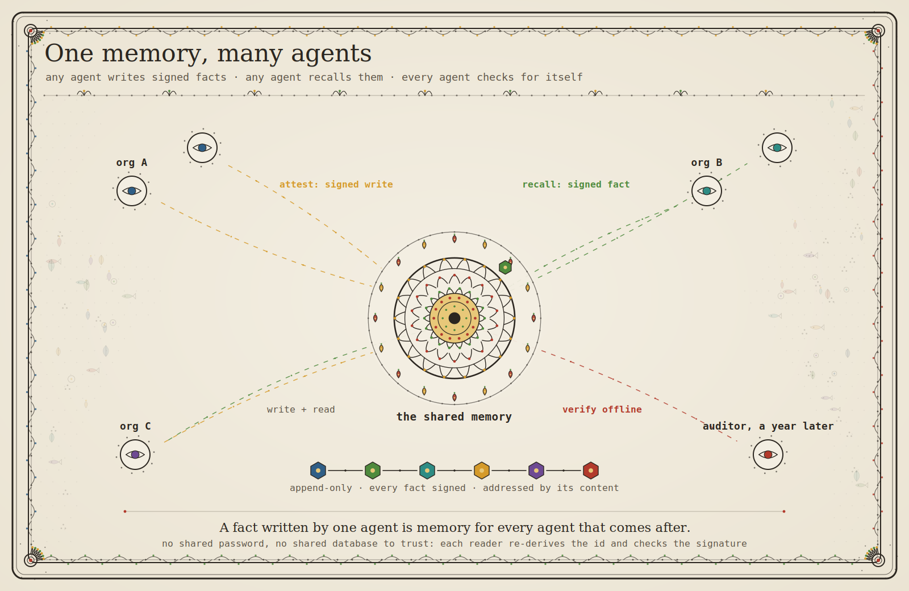
</p>

> **If you are an agent reading this**, four moves cover most sessions. Start at [`https://emem.dev/llms.txt`](https://emem.dev/llms.txt). Call `tools/list` with `{"tier":"core"}` so 10 tools load instead of 81. Recall with `emem_recall` or ask in plain language with `emem_ask`; every answer comes back signed. Before your context gets compacted or your turn ends, put the `memt:` token for anything you verified into your notes or your final answer; you, your successor, or a different agent entirely can resolve and re-check it later without trusting the transcript.

## Why to add Earth Memory in your long horizon tasks.

Three problems show up the moment you ship an agent that runs longer than one session.

**It forgets.** State lives inside one context window. The harness compacts the conversation, the verified detail from forty turns ago degrades into a paraphrase, and the next run starts cold.

**It can't share what it knows.** Your agent learns something true about the world. A teammate's agent, or a customer's, needs it a month later. There is no common place to leave it, and no way for the second agent to trust it if there were.

**It makes things up.** A confident answer about a real place, with no source you can open and check.

There is a fourth problem waiting behind those three: an unsigned memory can be poisoned. Published work on memory-injection attacks (MINJA, NeurIPS 2025) reports a 95% success rate at planting false records in a conventional agent memory store through queries alone. Signatures do not make a writer honest, but they pin every record to a key: in emem a planted fact is attributable, scoreable against other writers, and supersedable, instead of anonymous and silently trusted. Policy for which writers to trust stays with the reader (see [Where it is going](#where-it-is-going)).

Session memory, vector stores, and knowledge graphs help with the first problem for text. None of them give you a shared record of the physical world that any agent can read, any agent can add to, and any agent can verify. That is what emem is.

## The 30-second demo

One agent records a fact about a real place. It gets back a signed memory. It hands a short token to a second agent. The second agent confirms the fact is real, without ever trusting the first agent.

**Agent A records a fact.** `POST /v1/recall` (MCP tool `emem_recall`):

```bash
curl -s -X POST https://emem.dev/v1/recall \
  -H 'content-type: application/json' \
  -d '{"cell":"defi.zb493.xuqA.zcb5f","bands":["copdem30m.elevation_mean"]}'
```

```json
{
  "facts": [{
    "band": "copdem30m.elevation_mean", "cell": "defi.zb493.xuqA.zcb5f",
    "tslot": 0, "value": 918.0, "unit": "m", "confidence": 0.95,
    "signed_at": "2026-05-03T17:45:32Z",
    "signer_pubkey_b32": "777er3yihgifqmv5hmc2wwmyszgddzderzhsx6rex4yoakwomvka"
  }],
  "receipt": {
    "request_id": "01KR39HY37333FD3C9PBV0F67B",
    "primitive": "emem.recall", "served_at": "2026-05-08T07:59:08Z",
    "cells": ["defi.zb493.xuqA.zcb5f"],
    "fact_cids": ["yqbolgeoycqkvj3zkxukb4bjw4odhpwvfzqo3fbgwf4spk45zala"],
    "responder_pubkey_b32": "777er3yihgifqmv5hmc2wwmyszgddzderzhsx6rex4yoakwomvka",
    "signature": [254, 85, 234, "..."]
  }
}
```

Both blocks are abridged and rounded; the live response also carries the merkle proof, manifest ids, and the cell's attested-band list. The place was empty a moment ago. This one call fetched the value from a named source, signed it, stored it, and returned it. It is now in memory for every agent. Run the same call today and you get the same value and the same `fact_cid`, byte for byte.

**Agent A makes a token.** `emem_memory_token`:

```
memt:defi.zb493.xuqA.zcb5f:yqbolgeoycqkvj3zkxukb4bjw4odhpwvfzqo3fbgwf4spk45zala
```

That string is a portable citation. Agent A drops it into a message, a log, or a report.

**Agent B checks it.** `emem_verify_receipt`, or in a browser at [`/verify`](https://emem.dev/verify):

```json
{ "valid": true, "merkle_proof_valid": true, "facts_confirmed": true }
```

Agent B did not have to trust Agent A. It recomputed the content ID and checked the signature against the responder's public key. That is the core of the trust model, with one honest limit noted [below](#how-a-fact-is-made-and-proven). No account, no callback, no shared password.

<p align="center">
  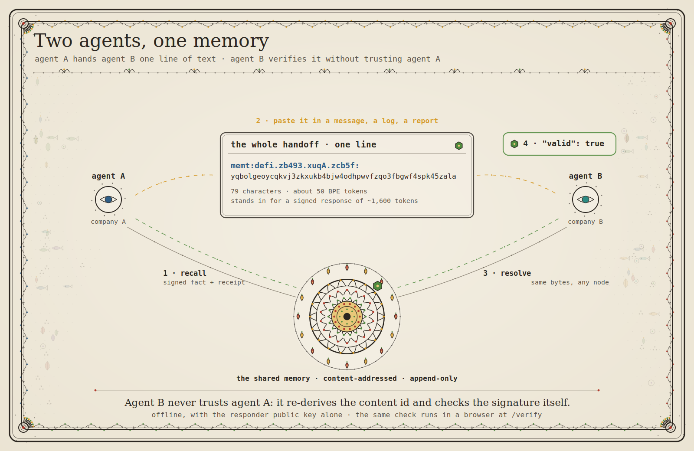
</p>

## An area of the memory, in 3D

The memory is not an abstraction; you can look at a piece of it. The four worlds below run live at [emem.dev/worlds](https://emem.dev/worlds) and are rendered by the templates under [`examples/3d-worlds/`](examples/3d-worlds/): the loader samples a bounding box into cells, recalls them in batches (first touch materializes and signs each cell), and builds one 3-D gaussian per cell of signed facts. The rendering is standard 3D Gaussian Splatting — anisotropic covariances, EWA screen-space projection, depth-sorted alpha compositing — and every gaussian parameter is a measurement: centre from the fact's own lat/lng and height band, footprint from the sampled grid pitch, tilt from the slope and aspect computed over the neighbouring cells' signed elevations, thickness from the residual roughness left after removing that slope (or a band's published standard error), opacity from the fact's attested confidence. Nothing is interpolated. Where the memory has no fact, there is no splat, and any splat's `fact_cid` re-checks at [`/verify`](https://emem.dev/verify).

<p align="center">
  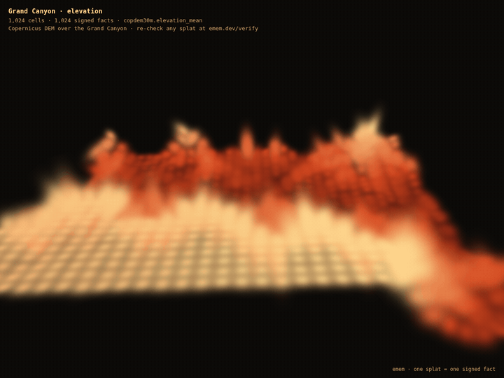
</p>

<p align="center">
  
</p>

The first is a single band doing everything: 1,024 Copernicus DEM elevation facts over the Grand Canyon, height and colour from one measurement, each gaussian lying in the tangent plane of the terrain around it. The second fuses three bands per splat over Interlaken: 3,026 facts across elevation, Sentinel-2 NDVI, and JRC surface-water recurrence, so the relief, the forests, and the lakes each come from their own signed source.

<p align="center">
  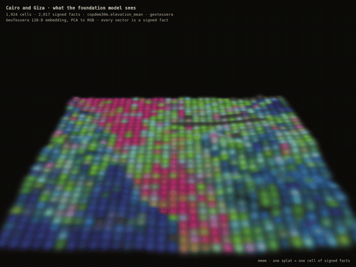
</p>

<p align="center">
  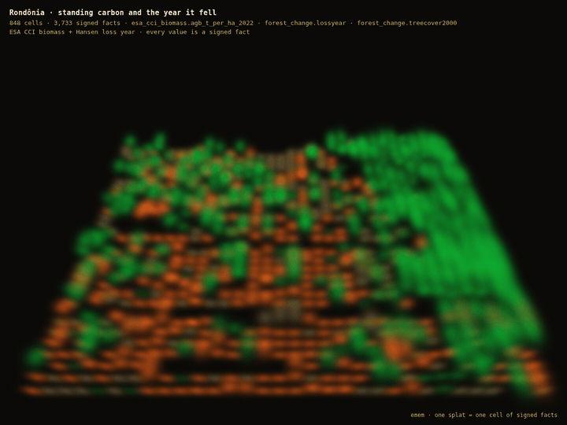
</p>

The third world colours Cairo and Giza by the memory's own 128-D GeoTessera foundation embedding, projected onto its three principal components: desert, Nile-valley farmland, and urban fabric separate on their own, with no land-cover labels anywhere in the loop (2,017 facts). The fourth is the Rondônia deforestation frontier with no terrain at all: height is ESA CCI above-ground biomass, each splat's thickness is that estimate's published standard error, and colour is the Hansen loss year (3,733 facts) — standing carbon rises, cleared land sits flat, and the BR-364 fishbone pattern is the frontier itself. Open any template in a browser, change the bbox and bands in the config block at the top, and the same machinery renders any area of Earth your agents care about, against emem.dev or your own node.

The worlds also leave as artifacts. `python3 examples/3d-worlds/make_splats.py --preset carbon --out out/rondonia --verify` runs the same fetch and the same math, then writes a standard 3D Gaussian Splatting `.ply` (opens in SuperSplat, gsplat, or any 3DGS viewer), the compact `.splat` binary, and a provenance sidecar carrying the per-splat `fact_cid`s, the verbatim signed receipts, and the sha256 of the artifact bytes — splats you can hand to someone who can then re-check every input against the responder's public key (`--verify` round-trips each receipt through `/v1/verify_receipt`; 1,025 of 1,025 valid on the Grand Canyon export). Both the raw and the processed data ship in the repo: [`examples/3d-worlds/scenes/`](examples/3d-worlds/scenes/) holds each world's fetched scene (`*.scene.json`, the signed fact values exactly as recalled), the exported `.ply` and `.splat`, and the `*.provenance.json` receipts — render any world offline by serving a scene as `window.EMEM_DATA`, or open a `.ply` straight in a 3DGS viewer.

Looking at a world should never cost the minutes it takes to build one. The hosted node bakes each preset once ([`scripts/bake_worlds.sh`](scripts/bake_worlds.sh)), verifies every receipt, and serves the finished artifacts from disk: [emem.dev/worlds](https://emem.dev/worlds) hash-checks the fetched scene against its provenance sha256 in your browser before drawing the first splat, and [`/v1/worlds`](https://emem.dev/v1/worlds) lists every artifact for download, with an open-in-SuperSplat link on the page. Browsers never trigger the materialize-and-sign build themselves.

[emem.dev/worlds](https://emem.dev/worlds) is an instrument, not a video. Drag to orbit, scroll to zoom, and pan; a per-world legend says what height, thickness, and colour each stand for. Click any splat to read that cell's measured band values, follow its `fact_cid` to [`/verify`](https://emem.dev/verify), or copy its `memt:` token for an agent to recall. Recolour the whole world by any other signed band in the scene, change the vertical exaggeration and splat size live, and drape real satellite imagery (Esri World Imagery, fetched for the scene's own bounding box) beneath the signed geometry as reference, labelled reference-only and never folded into the facts. Every panel minimises so the render fills the screen. The same interaction ships in the editable [`examples/3d-worlds/`](examples/3d-worlds/) templates through `window.__ememWorld`, and the deterministic capture path that produces the GIFs above is untouched.

The original point-sprite renderer drew each fact as a glowing vertical column; the two first-generation DEM worlds stay for comparison:

<p align="center">
  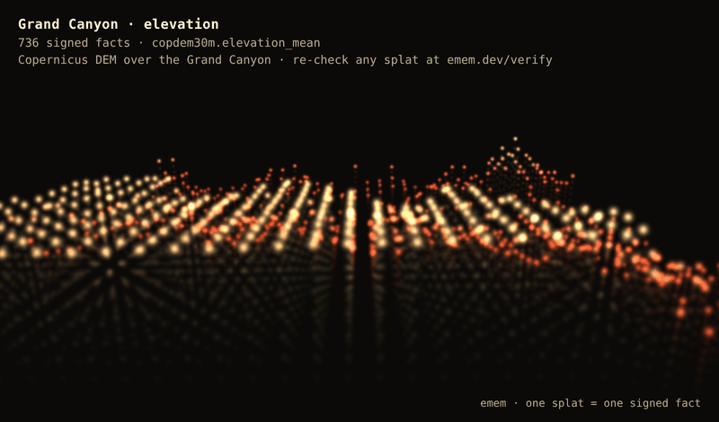
</p>

<p align="center">
  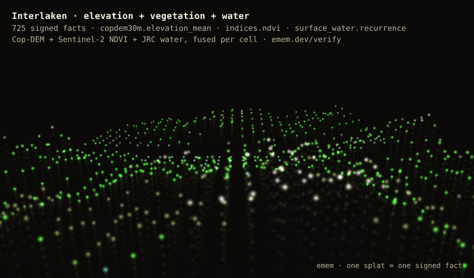
</p>

The gaussian construction itself is pinned by a hand-derived fixture that the browser math and the exporter must both reproduce to 1e-6, and the renderer by pixel checks: a projected gaussian's radial profile fits exp(-r²/2σ²) with R² > 0.99, and the compositing order flips correctly across a half orbit. See [`examples/3d-worlds/README.md`](examples/3d-worlds/README.md) for the formulas.

## What a fact costs to hand over

Agents pay for context in tokens, so the unit of exchange matters. In emem, agents exchange addresses instead of payloads, and resolve them only when they need the bytes. Measured with `tiktoken` (cl100k_base and o200k_base) against the live responder:

| What you put in the other agent's context | Size | BPE tokens |
|---|---|---:|
| `memt` memory token (address + fingerprint of one fact) | 79 chars | 46 to 49 |
| The full signed response it stands in for (fact, receipt, proof) | ~4 KB JSON | about 1,600 |
| A `cell64` place id on its own | 21 chars | 12 to 13 |

Measured July 2026; the full response grows as a cell accrues attested bands, so the ratio only improves. A conversation between agents carries one line per fact instead of pages, roughly a 30x saving, and the line is self-certifying: the receiver re-derives the BLAKE3 hash of the resolved bytes and checks it against the fingerprint in the token. `emem_memory_bundle` does the same for a set of facts under a single `memb:` token.

## Memory that outlives the context window

Every long-horizon agent hits the same wall: the context fills up, the harness summarizes, and details the agent verified thirty turns ago quietly turn into prose. Numbers drift in the paraphrase. Nobody notices until something downstream is wrong.

emem's answer is to keep the address in context and the payload out of it. A `memt:` line is small enough to survive any summarization pass, and after compaction it re-hydrates through `emem_memory_token_resolve` to the exact signed bytes, with the signature still checking. The summarizer keeps a handle, not a paraphrase, so compaction stops being lossy for anything the agent bothered to record.

<p align="center">
  
</p>

The same holds across sessions and across models. A fact recorded under one model's session resolves identically under the next, because the address is derived from the bytes, not from who asked. And below the tokens sits slower machinery for the long tail: a deterministic refinement pass (opt-in, `EMEM_REFINEMENT_ENABLED`) that turns scored contradictions into signed `disagrees_with` edges, and an optional sleep-time agent (`crates/emem-sleep-agent`) that merges high-churn or contradicted memory into new signed records that supersede the originals bi-temporally. Nothing is destroyed; the old bytes stay resolvable under their old ids.

## Where it sits next to what you already run

emem does not replace your vector store. It is the layer under it for facts about the physical world.

| | emem | Vector DB | RAG pipeline | Tile / catalog API |
|---|---|---|---|---|
| Shared across agents and orgs | one memory, any reader | within one deployment | within one app | reads only |
| Verifiable offline | ed25519 + content id, no account | no | no | no |
| Content-addressed | id = hash of the bytes | ids are arbitrary | no | paths are positional |
| Empty answer | signed absence, typed reason | empty result set | empty retrieval | `404` |
| Source disagreement | kept and scored | duplicates or last write | up to the app | not modeled |
| Handing one fact to another agent | one short token | share credentials or re-embed | resend the text | send URL and hope it is stable |
| Auth to read | none | usually an API key | app-specific | usually an account |

## Try it yourself (no install, no key)

Three requests, straight against the live node. You need `curl` and `jq`.

```bash
# 1. Turn a place into a stable id for one small square of ground.
CELL=$(curl -s -X POST https://emem.dev/v1/locate \
  -H 'content-type: application/json' \
  -d '{"q":"Bengaluru"}' | jq -r .cell64)
echo "$CELL"          # -> defi.zb493.xuqA.zcb5f
```

```bash
# 2. Read one measurement at that place. First ask fetches and signs it; repeats are instant.
curl -s -X POST https://emem.dev/v1/recall \
  -H 'content-type: application/json' \
  -d "{\"cell\":\"$CELL\",\"bands\":[\"weather.temperature_2m\"]}" \
  | jq '.facts[0].value'   # -> 27.3
```

```bash
# 3. Ask in plain language. It routes to the right data and signs the answer.
curl -s -X POST https://emem.dev/v1/ask \
  -H 'content-type: application/json' \
  -d '{"q":"find places like Yellowstone","place":"Yellowstone National Park"}' \
  | jq -r '.answer'
```

Explore the live console at [emem.dev](https://emem.dev).

## Connect your assistant

Reading needs no key. Point your client at `https://emem.dev/mcp` and it gets all 81 tools.

```jsonc
// .mcp.json at your project root. Works in Claude Code, Claude Desktop, Cursor, Cline.
// Here "http" is MCP's transport type, not the URL scheme. Copy it exactly.
{ "mcpServers": { "emem": { "type": "http", "url": "https://emem.dev/mcp" } } }
```

**Any MCP client over the standard bridge:**
```jsonc
{ "command": "npx", "args": ["-y", "mcp-remote", "https://emem.dev/mcp"] }
```

<details>
<summary>Copy-paste configs for 12 clients (all under <code>examples/</code>)</summary>

| Client | Setup |
| --- | --- |
| Claude Desktop | `examples/claude-desktop.json` |
| Claude Code | `examples/claude-code.mcp.json` |
| Cursor | `examples/cursor.mcp.json` |
| Cline (VS Code) | `examples/cline.mcp.json` |
| Gemini CLI | `gemini extensions install https://emem.dev/gemini-extension.json` |
| ChatGPT (Custom GPT) | `examples/openai-gpt-action.json` |
| LangChain | `examples/langchain/` |
| LlamaIndex | `examples/llamaindex/` |
| Agno | `examples/agno/` |
| AutoGen | `examples/autogen/` |
| CrewAI | `examples/crewai/` |
| Mastra | `examples/mastra/` |

Packaged Claude skills (verify a receipt, locate and recall, polygon recall, find similar) live under `claude-skills/`, and `llms-install.md` is a plain-text install guide an agent can follow by itself.

Native SDKs: Python [`ememdev`](https://pypi.org/project/ememdev/) (`pip install ememdev`, source under `sdks/emem-py/`) and TypeScript `@emem/client` (`sdks/emem-ts/`, not on npm yet; install from the repo).
</details>

## What an agent can do with it

Six operations. Each maps to real tools.

| Operation | What it means for an agent | Tools |
|---|---|---|
| **Recall** | read memory for a place | `emem_recall`, `emem_recall_many`, `emem_recall_polygon`, `emem_locate` |
| **Materialize** | write memory on a miss, automatically | happens inside `emem_recall`: fetch, sign, store, return |
| **Verify** | trust a fact without trusting the sender | `emem_verify`, `emem_verify_receipt`, `emem_memory_token`, `emem_memory_bundle` |
| **Compare** | find places that resemble each other | `emem_state`, `emem_state_multi`, `emem_find_similar`, `emem_triple_consensus` |
| **Predict** | run a forward model, with honesty flags | `emem_jepa_predict`, `emem_jepa_predict_v2` |
| **Self-check** | find where memory disagrees with itself | `emem_memory_contradictions`, `emem_edges_recall`, `emem_diff` |

You do not have to pick. Call `emem_ask` with a plain-language question and it routes to the right operation, then returns a signed answer.

<details>
<summary>Beyond the six: hunting, physics, compliance, and time travel</summary>

- **Hunt.** `emem_hunt` scans a region for hotspots across 12 event types (deforestation, wildfire, flood, and more; one of the 12, oil slick, is declared but not yet implemented) and returns ranked, signed candidates.
- **Search memory.** `emem_memory_search` queries what the memory already holds, without triggering any upstream fetch.
- **Simulate.** `POST /v1/heat_solve` runs 2-D heat diffusion seeded from land-surface temperature; `/v1/wave_solve` runs a 1-D shallow-water solver. Outputs are signed like any other fact.
- **Comply.** `POST /v1/eudr_dds` assembles an Annex II-shaped Due Diligence Statement under EU Regulation 2023/1115, every line backed by a `fact_cid`.
- **Time travel.** Any recall pins to a moment with `as_of_tslot` (what was on the ground) or `as_of_signed_at` (what the memory knew). Two independent time axes, so an auditor can replay yesterday's knowledge without today's hindsight.
- **Topics.** [`/v1/topics`](https://emem.dev/v1/topics) groups the 27 topic areas so an agent can browse by theme instead of memorizing band names.
</details>

## Memory that survives the handoff

This is the part built for long-running work across many agents and many companies. A fact is addressed by its content, not by a session that expired, and confirming it is a local calculation rather than a call back to the writer, so the fact keeps working even if the original agent, service, or company is long gone.

That changes what a multi-party workflow can assume. Company A's agent leaves a signed observation. Company B's agent picks it up in a later step and proves it is authentic before acting on it. A regulator, an auditor, or a third agent months later recomputes the same content ID and gets the same answer. Nobody has to trust a shared database, because there is no shared database to trust. There is a shared memory that each party can check for itself.

Each agent also gets a private memory of its own. emem implements the six commands of the standard agent memory tool: `view`, `create`, `str_replace`, `insert`, `delete`, and `rename`. Files carry a memory kind with a per-kind retention default, enforced when the operator turns the TTL sweep on: **episodic** (observations, 30 days), **semantic** (durable learned facts, kept), **procedural** (playbooks, kept), and **resource** (scratchpad, 90 days). Writes are locked to one key. A path under `/memories/by_attester/<pubkey>/` only accepts writes signed by that key, so a reader can confirm both who wrote a note and that nobody changed it since. The same ed25519 machinery that proves a satellite reading proves the agent's private memory.

## More than one writer

Shared memory means more than one party can write, and the write path ships today. `POST /v1/attest` accepts a signed batch of facts from any keyholder. There is no transport auth to configure, because the authentication is the envelope itself: an ed25519 signature over a merkle root of the batch, checked before anything is stored. Signing stays on the writer's machine; the responder never sees a private key.

When two writers record different values for the same place, band, and time, both facts persist. Content addressing means they cannot collide, only coexist. The store keeps an index of every attester's answer per slot, `emem_memory_contradictions` scores the spread, and every accepted batch lands in an append-only log; a per-fact merkle inclusion proof rides inside the receipt once it has been persisted for that fact. Disagreement between writers is data, not a conflict to be silently resolved.

The envelope format is in the wire spec at [`/spec.md`](https://emem.dev/spec.md), and [`docs/ARCHITECTURE_NOTES.md`](docs/ARCHITECTURE_NOTES.md) maps the exact code path. The public spec for running your own signing node, key registration, and abuse limits is being written up; the wire format it will document is the one already live. See [Where it is going](#where-it-is-going).

## A miss fills the memory for everyone

emem is one shared memory, not a cache per agent. It grows because of what happens on a miss.

When an agent asks about a place that has no fact yet, the responder fetches it, signs it, stores it, and returns it in the same call. The first caller pays the upstream cost once; every caller after that, anywhere, gets the same signed bytes on the warm path (timings in the next section). Today the store holds signed facts across roughly 6,400 places and dozens of kinds of measurement. The live count is always at [`GET /v1/corpus_state_stats`](https://emem.dev/v1/corpus_state_stats).

Because every fact is addressed by its content, the same observation recorded by two independent responders lines up automatically. Two sources, one address, and you can see whether they agree.

## How a fact is made and proven

The first request for a place is a **cold** read. Every request after is **warm**.

| Request | What happens on the wire | Latency |
|------|--------------------------|--------:|
| First (cold) | fetch upstream value, sign, save, return | about 180 ms |
| Repeat (warm) | serve the stored, signed fact | under 10 ms |

Cold time depends on the source. About 180 ms is typical, but slow upstreams can take seconds (see [Honest limits](#honest-limits)).

When a value genuinely does not exist, whether it is out of coverage, upstream unreachable, or a source that is not wired here, you still get a signed **absence** carrying a reason a machine can read. Not a `404`, not an empty body. An empty answer is a citable receipt. The memory never promises more than it can sign.

<p align="center">
  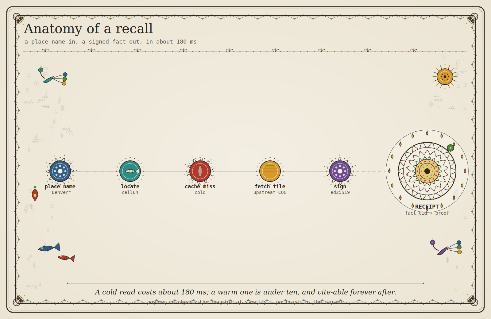
</p>

Every answer is signed, and you verify it yourself, offline. The chain, in order:

1. A **fact** is one measurement keyed by place, band, and time.
2. emem packs it in a fixed byte order, so the same reading serializes to the same bytes on every machine.
3. It hashes those bytes with **BLAKE3**. That hash is the `fact_cid`. The fact's address is its own fingerprint, which is what content-addressed means. Change one byte and the id changes, so the id proves the bytes.
4. The responder signs the result with an **ed25519** key, the same kind of key people use to log into servers over SSH. The signed envelope is the **receipt**, and it checks out against the responder's public key alone. No call back to the server.

<p align="center">
  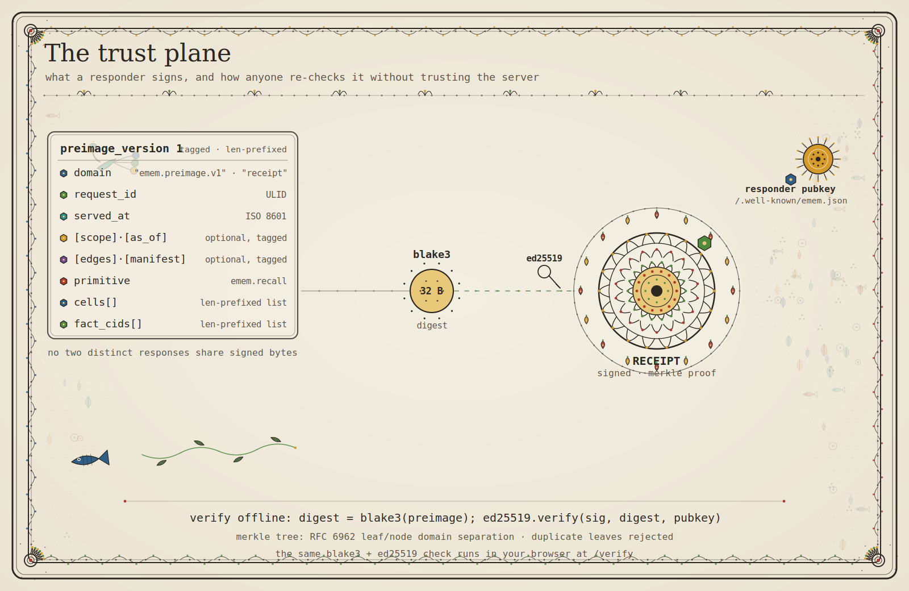
</p>

The responder's public key is published at [`/.well-known/emem.json`](https://emem.dev/.well-known/emem.json); pin it once and every receipt from that responder checks against it. Paste any `fact_cid` into [emem.dev/verify](https://emem.dev/verify), or open `https://emem.dev/verify/<fact_cid>` directly. Your browser pulls the bytes, re-derives the hash, and checks the signature locally. Nothing leaves the page.

<details>
<summary>Verify a receipt in 4 curl commands</summary>

```bash
# 1. Get a signed receipt for a real fact.
curl -s -X POST https://emem.dev/v1/recall \
  -H 'content-type: application/json' \
  -d '{"cell":"defi.zb5c4.guxe.nuxe","bands":["copdem30m.elevation_mean"]}' > receipt.json

# 2. Read out the fact's content id.
jq -r '.receipt.fact_cids[0]' receipt.json

# 3. Re-derive the hash and check the ed25519 signature.
curl -s -X POST https://emem.dev/v1/verify_receipt \
  -H 'content-type: application/json' --data @receipt.json | jq .

# 4. Pin who signed it, and which source binary they were running.
curl -s https://emem.dev/.well-known/emem.json \
  | jq '{responder: .responder.pubkey_b32, operator_attestation}'
```
</details>

<details>
<summary>The exact bytes that get signed</summary>

The signed input is domain-separated and length-prefixed: `blake3("emem.preimage.v1" || "receipt" || tagged(request_id, served_at, primitive, cells[], fact_cids[], ...))`, so no two different responses can ever share signed bytes. The `fact_cids` sit in an RFC 6962 merkle tree (duplicate leaves rejected) alongside a proof. A `preimage_version` field selects the rule, so older receipts still verify.

A conformance-vector format for independent implementations is specified under [`spec/test_vectors/`](spec/test_vectors/); the vector files themselves are still landing. The server's signer and the in-browser checker at `/verify` implement the same byte rules and must always agree.

The `operator_attestation` in `/.well-known/emem.json` binds the running binary's BLAKE3 hash to its git commit and build time, signed, so you can confirm the live node runs the source it claims.
</details>

One honest limit on the trust model. The signature covers the facts and the places served. It does not cover the original question text or the choice of which place to read. It proves the responder signed these facts at these places. Whether those facts actually answer the question is the calling agent's job. Check `selected.is_high_confidence` from `emem_locate` before you trust a place-based answer.

## The memory links facts and improves

A plain vector store, the kind agents use for memory, saves a note and searches it later. emem does that too, and three things a plain store does not.

- **It flags disagreement, with a score.** When several sources sign different values at the same place, band, and time, `emem_memory_contradictions` keeps them all and scores the spread. Your agent gets one number to threshold on: ignore a hairline gap, escalate a real one. Two sources reporting 12% versus 31% forest loss at one place surface as a scored gap the agent can branch on, instead of an average that quietly splits the difference.
- **Facts carry typed links.** `emem_edges_recall` reads a fact's signed connections (`relates_to`, `supersedes`, `disagrees_with`), bounded by time. A newer, better reading does not silently overwrite the old one. It supersedes it, and the trail stays.
- **It refines without rewriting.** An opt-in refinement pass turns a scored contradiction into a signed `disagrees_with` edge and marks the weaker fact as contested. It never mutates a content-addressed fact body, so the shared memory sharpens as more agents read and write against it, and the originals stay checkable.

## An open model that reads the memory

You do not need it to use emem. **[TerraGround-Gemma](https://huggingface.co/avijeetsingh1608/TerraGround-Gemma-4-12B-LoRA)** is an optional open model that turns the memory into plain answers. It is a small fine-tuning layer on Google's [Gemma 4 12B](https://huggingface.co/google/gemma-4-12B-it) that reads a place's signed record and answers grounded questions about it, and plans the tool calls an agent needs. A deterministic capability gate refuses questions the signed evidence cannot support, the same honesty as a signed absence.

It was trained on 4,164 examples across 1,286 varied places, and it builds on the Tessera foundation model ([arXiv:2506.20380](https://arxiv.org/abs/2506.20380)). The adapter is under Gemma terms; the surrounding code is Apache-2.0.

<p align="center">
  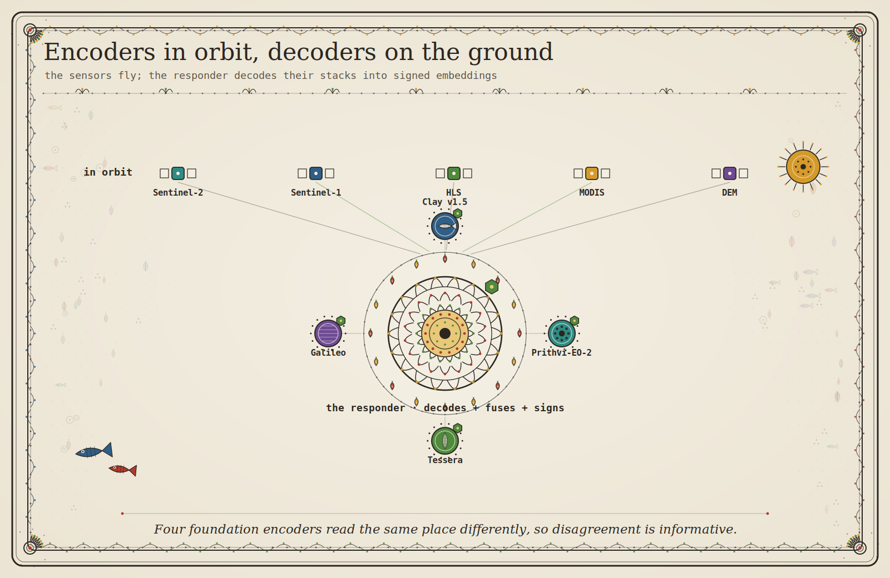
</p>

## Surfaces and primitives

One binary, one core. The same handlers answer MCP tool calls and plain REST, so an agent and a `curl` script see identical facts and identical receipts. Reads need no auth. Every write lands in an append-only, signed log.

| Surface | Endpoint | What you get |
| --- | --- | --- |
| **MCP** | `https://emem.dev/mcp` | JSON-RPC 2.0 over Streamable HTTP. 81 tools: 10 core plus 71 extended. |
| **REST** | `/v1/*` | 93 documented paths, described by [`/openapi.json`](https://emem.dev/openapi.json) (OpenAPI 3.1). |

Every MCP tool ships a `when_to_use` line and four hint flags (read-only, destructive, idempotent, open-world), so a planner picks the right tool without guessing. `tools/list` returns all 81; pass `{"tier":"core"}` for the 10 you need most.

<details>
<summary><b>160 named algorithm recipes</b>: a formula an agent can read, with its source and honest accuracy</summary>

Recipes like `flood_risk@2`, `heat_index@2`, `carbon_sink_score@1`, and `eudr_compliance@1` live in a content-addressed registry. Each one carries a `formula` the agent can read and apply, the `inputs` it needs, a `when_to_use` note, a `citation` to the primary source, an honest `accuracy_band`, and `learned_from` provenance for every tuned number. Recipes with an evaluation tree run in-process against the recalled facts and return a signed composite value that anyone with the same inputs reproduces. Browse [`/v1/algorithms`](https://emem.dev/v1/algorithms).
</details>

<details>
<summary><b>Machine discovery</b>: emem publishes its own map so an agent can read the memory before it acts</summary>

| Surface | Serves |
| --- | --- |
| `/v1/agent_card` | agent-readable capability card |
| `/v1/tools` | all 81 tools with `when_to_use` and hints |
| `/v1/algorithms` | 160 named algorithm recipes |
| `/v1/topics` | 27 topic-grouped measurement areas |
| `/v1/manifests` | the four ids that pin measurements, algorithms, sources, schema |
| `/.well-known/{emem,agent,mcp,ai-plugin}.json` | discovery plus `operator_attestation` |
| `/agents.md` · `/spec.md` · `/openapi.json` | agent loop, wire spec, REST schema |
| `/llms.txt` · [`/llms-full.txt`](https://emem.dev/llms-full.txt) | plaintext catalog for LLMs |
| `/v1/stream` | signed live heartbeat of memory state |
</details>

## See it in the wild

Three surfaces, three jobs. Pick by what you are trying to do.

| Surface | Reach for it when | What it is |
|---|---|---|
| **[geo.qa](https://geo.qa)** | you are new and want to see it | a globe you spin and explore, no docs |
| **[emem.dev](https://emem.dev)** | you are building against a live node | the hosted responder, plus a try-it drawer and machine-discovery surfaces |
| **[eudr.dev](https://eudr.dev)** | you want proof it holds in a regulated workflow | a compliance agent whose every citation is a signed fact |

**eudr.dev is the proof in a regulated setting.** It is an independent compliance agent built on emem for the EU Deforestation Regulation. Every paragraph it quotes resolves to a signed `fact_cid` served from the emem responder: the forest baseline, the clearing history for a plot, the coverage check. Its output is a signed, Annex II-shaped Due Diligence Statement covering the geolocation and deforestation checks, the part of an EUDR filing an auditor can re-verify offline. A customs officer, an auditor, or a rival lab can pull the exact bytes behind any claim from any node and re-check the signature. This is the whole idea, working in a setting where being wrong has a cost.

<p align="center">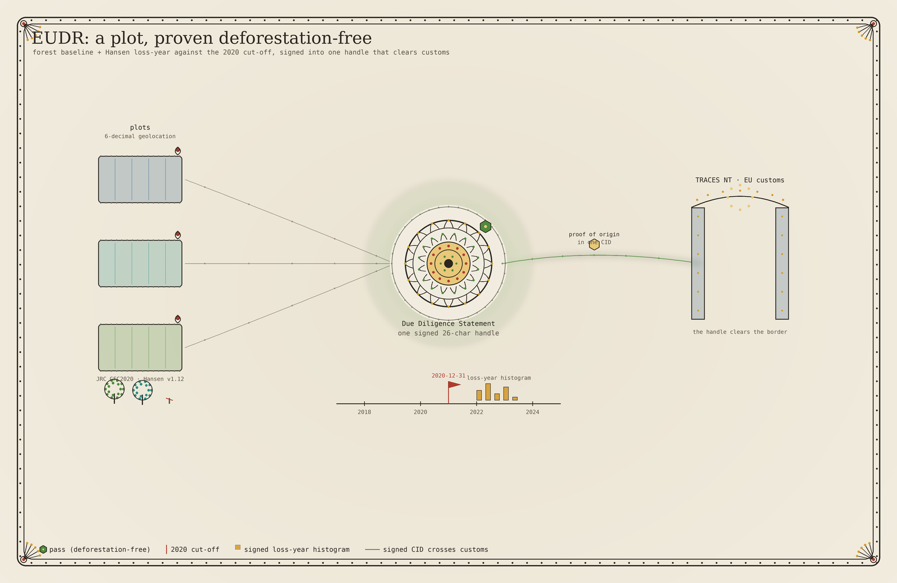</p>

<details>
<summary>Where a shared, signed memory earns its keep</summary>

The mechanism is the same every time: a stable handle for a real place, a fingerprint for the exact bytes, source disagreement kept and scored, and time-bound recall so you can ask both "what was on the ground" and "what did we know" on a given date.

- **Defense and intelligence**: many agents read and write one address space and cross-check each other, and where they disagree is recorded, not hidden.
- **Disaster response**: flood extent, burn severity, and landslide signals arrive signed and time-stamped, so field teams and models work off one verifiable picture.
- **Carbon accounting**: every measurement is auditable evidence with full provenance, from forest baseline to loss year.
- **Agriculture**: field boundaries, vegetation trends, soil, and crop-stress scans per place.
- **Insurance**: a signed receipt for the state of a location on a date settles what a policy covered.
- **Supply-chain compliance**: the eudr.dev workflow generalized, proving where a commodity came from with citations a regulator can verify.

<table>
  <tr>
    <td>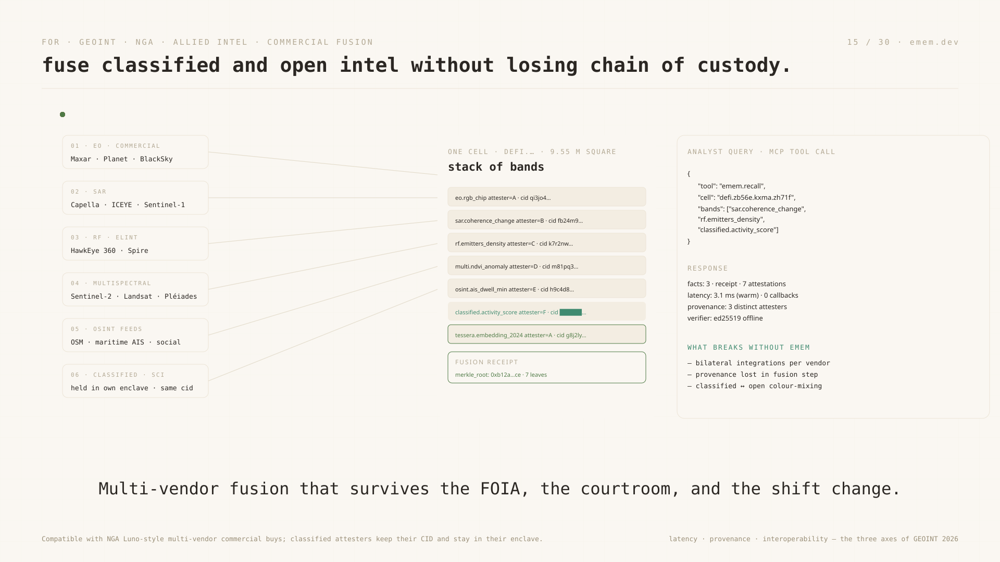</td>
    <td>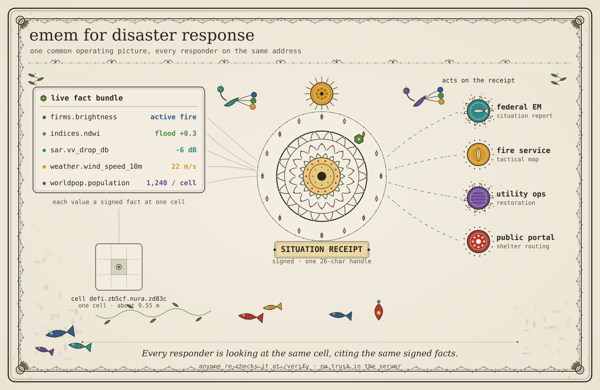</td>
  </tr>
  <tr>
    <td>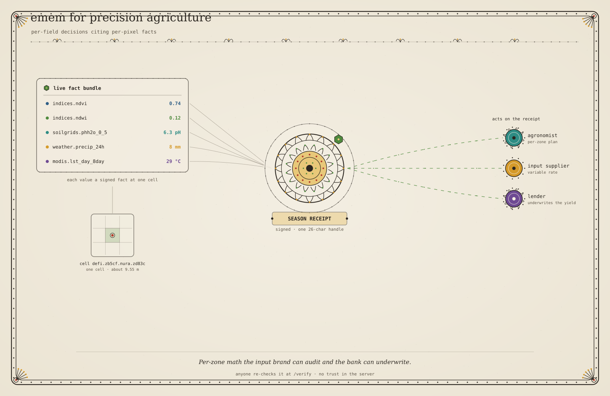</td>
    <td>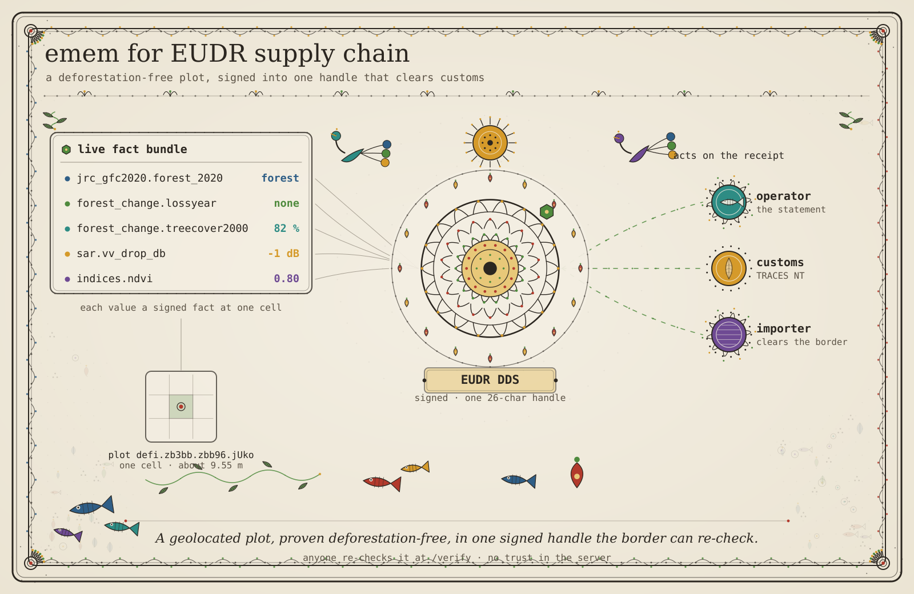</td>
  </tr>
</table>

Full set: [the protocol and industry diagram gallery](https://emem.dev/docs/diagrams).
</details>

## Where the facts come from

This is the layer that fills memory on a miss. It sits below everything above, on purpose. An agent almost never touches it directly.

The raw material is the public record of the physical world: open satellite and earth-observation data from agencies like ESA, NASA, USGS, and the EU's Joint Research Centre, plus open reference datasets for land cover, water, terrain, weather, and rainfall. **46 declared sources** feed the memory, including Sentinel-2, Landsat/HLS, Copernicus DEM, JRC Global Surface Water, Hansen forest change, ESA WorldCover, Overture Maps, Fields of The World, CHIRPS rainfall, and more. **124 measurements are wired and fetch on demand**; a handful that are declared but not wired here return a typed "not available" rather than pretending.

Four open foundation models (Tessera, Clay v1.5, Prithvi-EO-2, Galileo) turn raw readings into the numeric fingerprints used in the Compare operation. emem runs them for you and signs what they produce, so there is no inference stack to stand up. `emem_state` and `emem_state_multi` return the signed fingerprints; `emem_triple_consensus` runs three of them together and reports where they agree and where they disagree, so a disagreement is a signal rather than an average that hides it.

<p align="center">
  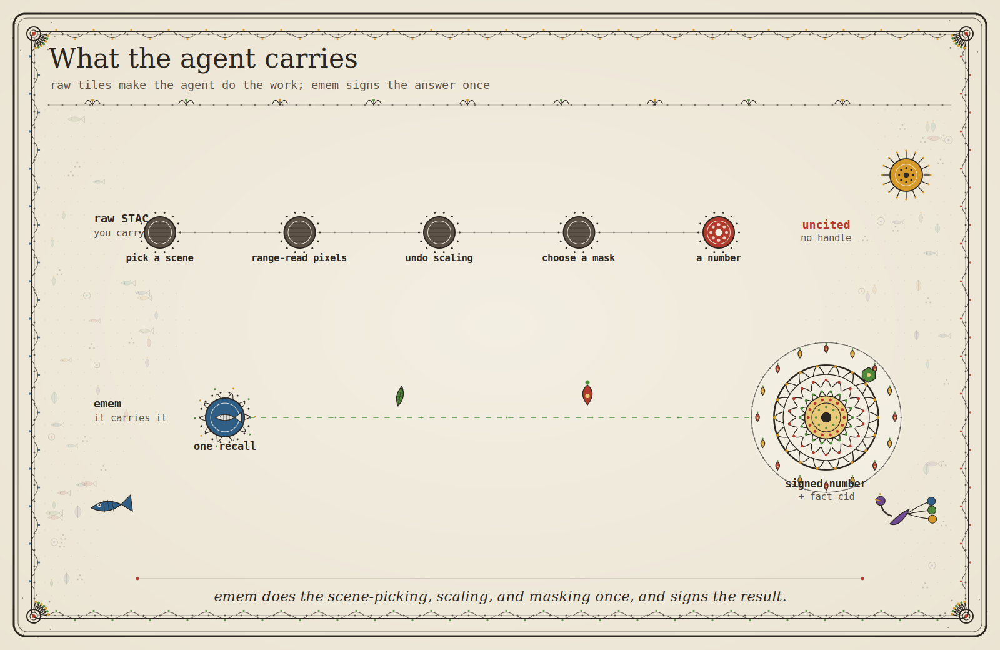
</p>

emem's own job is the last step: sign the result, store it, and give it a stable address so it can be recalled and checked forever. The default build reads only open sources and needs no credentials.

Individual measurements carry plain names like `indices.ndvi` (a greenness measure), `copdem30m.elevation_mean` (ground height), and `weather.temperature_2m` (air temperature). An agent rarely names them. It asks a question or names a place, and the router picks the right measurements.

<details>
<summary>For EO and geospatial teams: how a value maps to a cell</summary>

Every cell is WGS84 (plain lat/lng). A single-cell `recall` is a point sample: emem transforms the cell's lat/lng into the source's own coordinate system and reads the pixel there. It never resamples data onto a new grid, and a 9.55 m cell over 10 m Sentinel-2 does not invent resolution it does not have. `recall_polygon` and the by-place shortcuts aggregate over an area instead; a band named like `copdem30m.elevation_mean` gets the `_mean` from the upstream product, not from emem averaging. By default a recall returns the most recent value available for that band; pin any moment with `as_of_tslot` or `as_of_signed_at`. Units and vertical datums are whatever the named source publishes (Copernicus DEM elevations, for instance, are orthometric on the EGM2008 geoid).

Two practical surfaces sit alongside the stack: `field_boundaries` serves polygons from Fields of The World (~3.17 B fields, 241 countries, 10 m, CC-BY-4.0), and `coverage_map.svg` returns a finished, value-painted figure you can paste into a report.
</details>

<details>
<summary>The four handles that address everything</summary>

All four are deterministic: the same input produces the same string on any node.

| Handle | What it names | Wire form |
| --- | --- | --- |
| `cell64` | one ground cell, about 9.55 m at the equator; ordered so string-near ids are physically near | `defi.zb493.xuqA.zcb5f` |
| `tslot` | a 64-bit time slot | `t.`-prefixed base32 |
| `cid` | fingerprint of a fact's bytes (32-byte BLAKE3); change one byte, the id changes | `72wdchiyurfrjxz7zat6kor7gjnvsn564fbrzjkmlhagoy4rrh4a` |
| `vec` | a place's full state vector | 12-byte prefix in receipts; full vector via `recall` |

The workspace is 16 Rust crates. `emem-server` lives in `crates/emem-cli/src/bin/emem-server.rs`; addressing and signing in `emem-core`, `emem-codec`, `emem-fact`, `emem-attest`; the two API faces in `emem-mcp` and `emem-api-rest`. Clients under `sdks/`, drop-in configs under `examples/`, wire spec and cross-language test vectors under `spec/`, diagrams under `docs/diagrams/`. A file-level map of the load-bearing code paths is in [`docs/ARCHITECTURE_NOTES.md`](docs/ARCHITECTURE_NOTES.md).
</details>

## Run your own node

The hosted node at [emem.dev](https://emem.dev) runs the exact binary in this repo. Self-hosting is not a fork or a cut-down build. You run the same thing, and it names the planet the same way.

```bash
# multi-arch image, anonymously pullable, the fastest way to a local node
docker run -p 5051:5051 ghcr.io/vortx-ai/emem:latest
```

```bash
# or build from source (needs Rust 1.91+; the first release build takes a few minutes)
cargo run --release --bin emem-server
```

No required env vars. It boots empty and fetches on the first request, same as the hosted node. Point a client at `http://localhost:5051/mcp` and reads work with no auth.

| Env var | Default | Effect |
| --- | --- | --- |
| `EMEM_BIND` | `0.0.0.0:5051` | listener address and port |
| `EMEM_DATA` | `./var/emem` | data dir; set to `:memory:` for a node that persists nothing |
| `EMEM_SECRET_B32` | unset | pin the signing key (base32, 32 bytes); otherwise one is created and saved under `EMEM_DATA` |

One operational note worth reading twice: the signing key is your node's identity. Without a persistent `EMEM_DATA` volume or `EMEM_SECRET_B32`, a fresh container mints a fresh key, and receipts minted under the old key stop matching your published pubkey. Mount a volume or set the secret before you hand out receipts you care about.

What makes your node and emem.dev the same memory is not a network link. It is the addressing math. Both derive the same id for a place and the same id for a reading, so a receipt minted on one verifies against the other, offline. Paste a `fact_cid` from emem.dev into your local node and you pull the identical bytes.

<p align="center">
  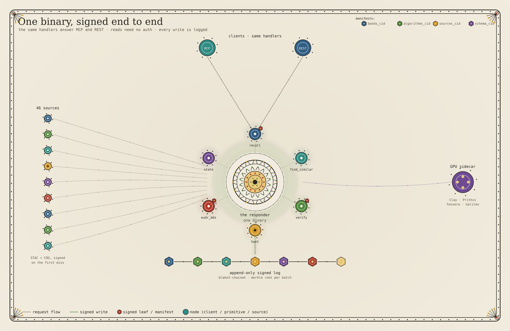
</p>

## Honest limits

emem is version 0.1.0. What it does not do yet, so you can plan around it:

- **Single host.** No federation, no global routing, no SOC 2 yet. One responder, one signing key. Durability today is the hosted node plus any node you run; content addressing means any node that holds the bytes can re-serve and re-verify them, so run your own if the facts matter to you.
- **Thousands of places, not billions.** The memory grows every day it is used, but it is early. Check the live count before you assume coverage.
- **It grounds facts about physical places,** not arbitrary text. It is not a general-purpose citation store for any document.
- **Place ids are compact, not yet token-optimal.** A `cell64` measures 12 to 13 BPE tokens today. The id format is built for a tokenizer-optimized alphabet that would cut that further; the shipped alphabet does not achieve it yet.
- **The learned predictor is an honest baseline.** `jepa_predict_v2` returns the last known reading until its dynamics head is fully trained, and says so.
- **Some foundation-model fingerprints are sidecar-gated on the hosted node** today. A cold place returns a signed absence for those, so `triple_consensus` runs partial when cold. Tessera fetches on demand.
- **Upstream rate limits.** Some sources are rate-limited or slow to fetch (one land-surface-temperature source takes about 30 seconds per place).
- **No sub-meter imagery** in the default build, and no notebook UI. Drive it from a notebook against REST or MCP.

## Where it is going

emem is a protocol, not a single service. The end state is a federation of independent responders that resolve the same ids byte-for-byte, cross-cite each other, and record where they disagree. **None of the multi-host federation routing ships in 0.1.0.** What ships today is the machinery it stands on: content addressing, signed receipts, an append-only attestation log with per-fact merkle proofs, a multi-writer attest endpoint, typed temporal links, cross-source disagreement scoring, and an offline refinement loop.

The staged work from here, building on those pieces:

1. **One public transparency log.** Signed tree heads and consistency proofs over the existing append-only log, so no responder can tell two clients two different stories about the same history.
2. **Signed absence proofs.** Turn "no fact here" from a signed statement into a checkable non-membership proof.
3. **A public attester spec.** So partners and customers run their own signing nodes against the write path that already exists.
4. **Quorum reads across responders.** Content addressing makes agreement trivial to check: same canonical bytes, same id, k signatures. The design is written up in [`docs/federation.md`](docs/federation.md).

Federate later; the fact ids will not move. Near-term work is tracked in [issues](https://github.com/Vortx-AI/emem/issues).

<p align="center">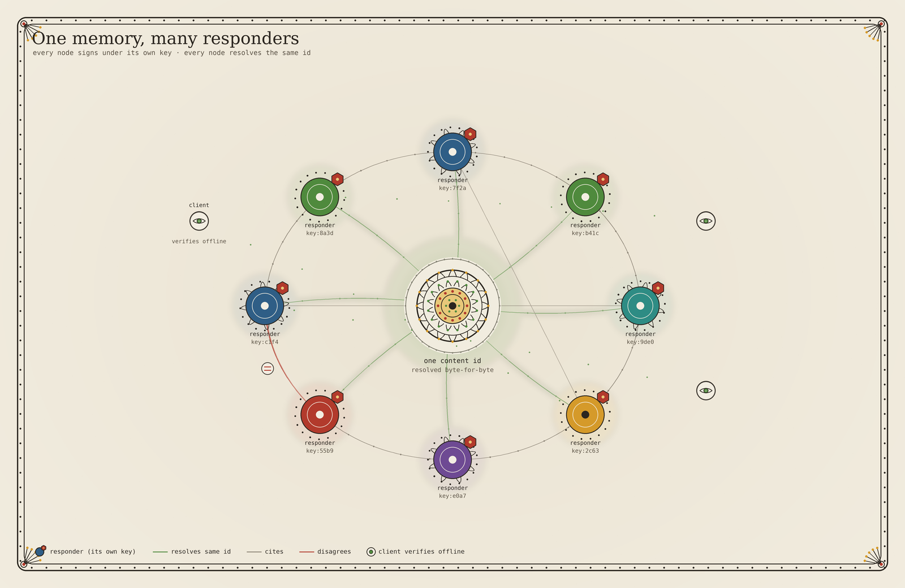</p>

## Research and citation

The protocol is written up in an open whitepaper:

> **emem: A research on Content-Addressed, Verifiable Earth-Memory Protocol for AI Agents over Foundation-Model Embeddings.**
> Jaya Kumari, Avijeet Singh. Vortx AI, 2026. Open preprint (Zenodo, CC-BY-4.0; not yet peer-reviewed).
> [doi.org/10.5281/zenodo.20706893](https://doi.org/10.5281/zenodo.20706893)

```bibtex
@misc{emem2026,
  title  = {emem: A research on Content-Addressed, Verifiable Earth-Memory
            Protocol for AI Agents over Foundation-Model Embeddings},
  author = {Kumari, Jaya and Singh, Avijeet},
  year   = {2026},
  doi    = {10.5281/zenodo.20706893},
  publisher = {Zenodo}
}
```

## Resources

| What | Where |
|---|---|
| Whitepaper (Zenodo, CC-BY-4.0) | https://doi.org/10.5281/zenodo.20706893 |
| Companion model (Hugging Face) | https://huggingface.co/avijeetsingh1608/TerraGround-Gemma-4-12B-LoRA |
| Hugging Face Space | https://huggingface.co/spaces/vortx-ai/emem |
| Agent loop · Wire spec | https://emem.dev/agents.md · https://emem.dev/spec.md |
| LLM catalog (plaintext) | https://emem.dev/llms.txt · https://emem.dev/llms-full.txt |
| OpenAPI 3.1 (96 paths, 93 under `/v1/*`) | https://emem.dev/openapi.json |
| MCP endpoint (81 tools) | https://emem.dev/mcp |
| In-browser receipt verifier | https://emem.dev/verify |
| Python SDK on PyPI | https://pypi.org/project/ememdev/ |
| Container (multi-arch) | `ghcr.io/vortx-ai/emem:latest` |
| Issues · Security | https://github.com/Vortx-AI/emem/issues · avijeet@vortx.ai |

## Contributing

Issues and pull requests welcome. See [CONTRIBUTING.md](CONTRIBUTING.md), [CODE_OF_CONDUCT.md](CODE_OF_CONDUCT.md), and [SECURITY.md](SECURITY.md). Pure Rust.

A shared memory is worth more the more agents read and write it. If yours use emem, starring the repo is the cheapest way to help the next builder find it before they build another private cache.

## License

Apache-2.0. See [LICENSE](LICENSE) and [NOTICE](NOTICE). Default-build data sources are open (Copernicus DEM, JRC Global Surface Water, Hansen forest change, ESA WorldCover, Overture, Fields of The World, and more), with no API keys and no lock-in. Built by [vortx.ai](https://vortx.ai). Contact avijeet@vortx.ai.
