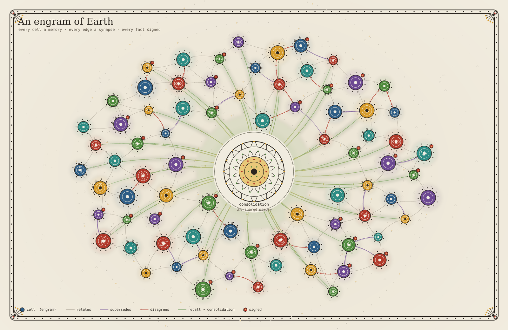
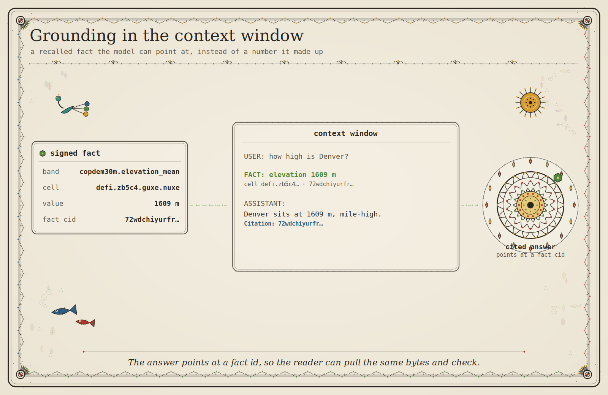

<div align="center">


# emem

**Earth as memory for real-world agents.** Every fact is signed and content-addressed. Its id is a hash of its own bytes, so anyone can re-check it offline, without trusting the server that served it.

*Give your AI agent verifiable, citable facts about any place on Earth. One MCP endpoint, no key.*

[](./LICENSE)
[](https://www.rust-lang.org)
[](https://emem.dev/mcp)
[](https://emem.dev/openapi.json)
[](https://doi.org/10.5281/zenodo.20706893)
[](https://huggingface.co/avijeetsingh1608/TerraGround-Gemma-4-12B-LoRA)
[](https://github.com/Vortx-AI/emem/pkgs/container/emem)

[Hosted](https://emem.dev) · [Try it](https://emem.dev/humans) · [Verify](https://emem.dev/verify) · [Whitepaper](https://doi.org/10.5281/zenodo.20706893) · [Model](https://huggingface.co/avijeetsingh1608/TerraGround-Gemma-4-12B-LoRA) · [Proof: eudr.dev](https://eudr.dev) · [Docs](https://emem.dev/agents.md) · [Spec](https://emem.dev/spec.md) · [OpenAPI](https://emem.dev/openapi.json) · [Gallery](https://emem.dev/docs/gallery)

</div>

---

Ask an AI agent what's on the ground at 19.07°N, 72.87°E (WGS84) and it guesses. It has no fixed handle for that patch of Earth, and no way to prove what it hands back. **emem is the handle:** a shared memory of the planet an agent can read, write, and cite. The first request for any place fetches the real value from a named satellite or Earth-observation source, signs it with an ed25519 key, and stores it in the same response. Anyone can re-check that answer offline, with no account and no trust in the server that gave it to you.

It is a working protocol with a hosted node, a written spec, an open [whitepaper](https://doi.org/10.5281/zenodo.20706893), and a companion open model.

<div align="center">

### [▶ Try the hosted node](https://emem.dev) &nbsp;&nbsp;·&nbsp;&nbsp; [⧉ Run it yourself](#run-your-own-node)

</div>

## Try it (no install, no key)

Three requests, straight against the live node at `https://emem.dev` (you need `curl` and `jq`).

```bash
# 1. Geocode a place to a cell64: a stable id for one ~9.55 m square of ground (WGS84).
CELL=$(curl -s -X POST https://emem.dev/v1/locate \
  -H 'content-type: application/json' \
  -d '{"q":"Bengaluru"}' | jq -r .cell64)
echo "$CELL"          # -> defi.zb493.xuqA.zcb5f
```

```bash
# 2. Recall a band (one measurement layer, like temperature or elevation) at that cell.
#    The first ask fetches it from satellite data and signs it; repeats are instant.
curl -s -X POST https://emem.dev/v1/recall \
  -H 'content-type: application/json' \
  -d "{\"cell\":\"$CELL\",\"bands\":[\"weather.temperature_2m\"]}" \
  | jq '.facts[0].value'   # -> 27.3  (°C)
```

```bash
# 3. Ask in plain language. It routes to the right data and signs the answer.
curl -s -X POST https://emem.dev/v1/ask \
  -H 'content-type: application/json' \
  -d '{"q":"find places like Yellowstone","place":"Yellowstone National Park"}' \
  | jq -r '.answer'   # -> "Places with a similar climate and terrain profile: …"
```

The `recall` response carries a `fact_cid`: a fingerprint of the exact signed bytes. Paste it to a colleague and any node returns the same bytes; the signature checks in their browser. Same id, same value, in any year.

Explore the live console at [emem.dev](https://emem.dev), or spin the planet in the [geo.qa](https://geo.qa) globe demo.

## What emem is

The planet is cut into fixed WGS84 cells, ~9.55 m across at the equator (a little narrower toward the poles), the way a page is cut into words. A cell addresses a place the way a token addresses text in an LLM: a stable, reusable unit you can point at, pass around, and build on. One measurement at one cell is a **fact**: one **band** (a single measurement layer such as elevation, rainfall, or this year's forest loss) at that spot. A satellite embedding, a vector fingerprint of what the ground looks like produced by a foundation model, is a fact too. Every fact is signed.

Nothing is stored in advance. The first time anyone asks about a place, emem fetches the real value from the named source, signs it, saves it, and returns it in the same response. Every cell on Earth answers from the first request.

A cache hands back a tile. A memory remembers what it saw, links it to what it saw before, and says so when two sources disagree. emem is the second one.

<p align="center">
  
</p>

## Why agent developers should care

If your agent ever reasons about a physical place, whether a farm, a warehouse address, a wildfire, or a delivery route, emem hands it a fact it can cite instead of a guess.

An agent that answers with no source, no measurement, and no byte you can pull up tomorrow is an agent you can't audit. That gap is where long runs drift, and where you can't tell a good run from a bad one. emem closes it.

<p align="center">
  
</p>

- **Grounding, not a guess.** `locate` turns a name or lat/lng into a `cell64`. `recall` returns the band you asked for with a named source and a fingerprint of the exact bytes. No value at that band returns a signed "no data here, and why," so your agent never fills the hole with a guess.
- **An external anchor for long runs.** Context gets summarized and re-summarized until, after many passes, an agent is reasoning over its own earlier guesses. A `fact_cid` names one exact set of bytes; ask for it this year or in five and you get the same value back, or a signed reason it's unavailable. The anchor doesn't move under the agent.
- **Shared ground truth across agents.** `memory_bundle` folds many facts into one signed citation; `memory_token` composes a checkable pointer. One agent hands another the evidence, not a paraphrase. That helps multi-agent systems, robots, and observation fleets that must agree on what's real.
- **Disagreement is kept, not averaged away.** When two sources sign different values for the same place, emem keeps both and scores the gap instead of silently averaging, giving a number your agent can branch on (more in [The memory links facts](#the-memory-links-facts-and-improves)).
- **Reproducible audits.** Two independent time axes: what the world looked like on a date, and what the system knew on a date. A review months later replays the exact answer the agent acted on.

## Everything emem gives an agent

Most of what's here is invisible in a one-line pitch. Here is the whole surface, in plain terms, and each row is a live tool over both MCP and REST. (*A **band** is one named measurement layer: temperature, elevation, forest loss, and so on. A **signed absence** is a signed "no data here, and why," never a bare 404. **Tessera, Clay, Prithvi, Galileo** are open AI models that turn satellite pixels into vectors.*)

**New to this?** The only rows any agent needs are `locate`, `recall`, `ask`, `verify`, and the `memory_*` tools. The rest are Earth-data tools you reach for when you need them.

| You want to… | Use | What comes back |
|---|---|---|
| Turn a place name or lat/lng into a stable id | `locate`, `emem_at` | a `cell64` for one ~9.55 m square |
| Read any Earth measurement at a place | `recall`, `recall_many`, `recall_polygon` | a signed value from a named source, auto-fetched on first ask |
| Get a place's state vector from foundation models | `state`, `state_multi` | a signed embedding from Tessera, Clay v1.5, Prithvi-EO-2, or Galileo |
| Find places that look like this one | `find_similar` | nearest matches over any embedding, by meaning (k-NN) |
| Cross-check across satellite AI models | `triple_consensus` | how much Clay, Prithvi, and Tessera agree, or a signed absence when an encoder isn't loaded on the hosted node |
| Read by topic, by place name | `emem_ndvi` (vegetation) · `emem_water` · `emem_forest` · `emem_soil` · `emem_air` · `emem_lst` (land-surface temp) · `emem_weather` | the right band(s), located and aggregated for you |
| See how one place changed over time | `compare`, `diff`, `trajectory`, `state_diff` | pairwise deltas and time series |
| Ask a free-text question | `ask` | routed to the right data, answered with a citation |
| Discover events over a region | `hunt` | hotspots for 12 event types (floods, wildfire, deforestation, methane…) |
| Keep and search the agent's own notes | `memory_create/insert/str_replace/view/delete/rename`, `memory_search` | signed, capability-bound files; meaning-based search |
| Link facts and catch conflicts | `edges_recall`, `memory_contradictions` | typed relations; a disagreement score across sources |
| Ask "what did we know on date X" | any read + `as_of_tslot` / `as_of_signed_at` | a reproducible answer bound to that moment |
| Prove any answer, offline | `verify`, `verify_receipt`, [`/verify`](https://emem.dev/verify) | a signature check anyone can run without an account |
| Simulate or forecast | `heat_solve`, `wave_solve`, `jepa_predict` | physics- and model-based estimates, signed |
| Apply a named, cited recipe | `algorithms` (160 of them) | a formula with its source, accuracy, and tuned parameters |
| Produce a compliance statement | `eudr_dds` | a signed EU Deforestation Regulation Due Diligence Statement |
| Get farm/field boundaries | `field_boundaries` | polygons from Fields of The World (~3.17 B fields) |
| See a place or the whole corpus | `coverage_map.svg`, `scene_overlay.svg` | rendered maps you can drop straight into a report |
| Watch the memory grow live | `GET /v1/stream` | a signed heartbeat of corpus state |

Full tool reference: **81 MCP tools** (10 core + 71 extended) and **93 REST paths**, listed at [`/v1/tools`](https://emem.dev/v1/tools) and [`/openapi.json`](https://emem.dev/openapi.json). Worried about tool sprawl? Ask your MCP client for the `core` tier and it loads just the 10 essentials; the other 71 stay available when you need them.

## The model layer: TerraGround

You don't need TerraGround to use emem; it's an optional companion model. emem is the memory, and **[TerraGround](https://huggingface.co/avijeetsingh1608/TerraGround-Gemma-4-12B-LoRA)** is an open model that reads it. It's a LoRA adapter (a small fine-tuning layer) on Google's [Gemma 4 12B](https://huggingface.co/google/gemma-4-12B-it) (instruction-tuned) that turns a general model into an Earth-observation analyst. Within the regime it was trained on, it answers grounded questions about a place, such as dominant land cover, vegetation vigour, and surface water, and plans the tool calls an EO agent needs. It's trained to say "not enough data" when the evidence doesn't support an answer, the same honesty as a signed absence.

<p align="center">
  
</p>

It was trained on 4,164 examples across 1,286 geographically diverse places, pairing ESA WorldCover land-cover labels with Tessera embeddings, the same foundation embeddings emem serves. That makes the full stack verifiable end to end:

**satellites → foundation models (Tessera · Clay v1.5 · Prithvi-EO-2 · Galileo) → emem (signed, addressable memory) → TerraGround (grounded, abstaining answers) → your agent.**

The adapter is under Gemma terms; the surrounding code is Apache-2.0. It builds on the Tessera foundation model ([arXiv:2506.20380](https://arxiv.org/abs/2506.20380)).

## For EO / geospatial teams

*Not doing geospatial work? Skip to [APIs & primitives](#apis--primitives).*

You already know the drill. STAC search, COG windowing, reprojection, mosaicking, then glue code to keep the coordinate bookkeeping straight. emem collapses that into one address space: `locate` a place, `recall` a band. A first-time read fetches the upstream tile, signs it, saves it, and returns it in the same response (timing in [How a fact is made](#how-a-fact-is-made-and-proven)). Out of coverage or upstream down, you get a signed "no data, and why," not a silent gap.

emem serves the whole stack for a place, and it leads with the AI layer:

1. **Foundation models.** Tessera, Clay v1.5, Prithvi-EO-2, and Galileo are four open models that read a patch of ground the way an LLM reads text. emem runs them for you and signs what they produce, so there is no GPU inference stack to stand up.
2. **Embeddings.** `state` and `state_multi` return a signed per-place vector from those models (a 128-number encoder view, or the full 1792-number cube). `find_similar` searches any embedding by meaning, and `triple_consensus` runs Clay, Prithvi, and Tessera together and reports where they agree and where they don't, so a disagreement is a signal rather than an average that hides it. (These encoders run on a GPU sidecar, so on the hosted node today a cold cell returns a signed absence for Clay, Prithvi, and Galileo while Tessera fetches on demand; see [Honest limits](#honest-limits).)
3. **Satellite and Earth-observation imagery.** 46 declared sources feed everything above: Sentinel-2, Landsat/HLS, Copernicus DEM, JRC Global Surface Water, Hansen forest change, ESA WorldCover, Overture Maps, Fields of The World, CHIRPS rainfall, FIRMS active fire, WorldPop, TerraClimate, and more, all keyed to the same `cell64`. 124 bands are wired and auto-fetch on demand; five declared-but-unwired schemes return a typed "not available here" rather than pretending.
4. **Calculated indices and recipes.** Vegetation and water indices, land-surface temperature, and 160 named algorithms (each with its formula, source, and honest accuracy) compute on the layers below, so you cite a finished number instead of building a pipeline.

Two more practical surfaces sit alongside the stack. `field_boundaries` serves polygons from Fields of The World (~3.17 B fields, 241 countries, 10 m). `coverage_map.svg` and `scene_overlay.svg` return finished figures, a value-painted grid over a place with legend and scale bar, that you can paste into a report.

<p align="center">
  
</p>

**How a value maps to a cell.** Every cell is WGS84 (plain lat/lng). A single-cell `recall` is a point sample: emem transforms the cell's lat/lng into the source's own coordinate system and reads the pixel there. It never resamples data onto a new grid, and a 9.55 m cell over 10 m Sentinel-2 doesn't invent resolution it doesn't have. (`recall_polygon` and the by-place shortcuts aggregate over an area instead; a band named like `copdem30m.elevation_mean` gets the `_mean` from the upstream product, not from emem averaging.) By default a recall returns the most recent value available for that band; pin any moment with `as_of_tslot` / `as_of_signed_at`. Units and vertical datums are whatever the named source publishes (Copernicus DEM elevations, for instance, are orthometric on the EGM2008 geoid).

Every value is packed the same way and fingerprinted, so identical readings match byte-for-byte on any node, and four manifest ids pin exactly what produced an answer. An EO output becomes evidence you can attach to a compliance filing, an MRV claim, an insurance payout, or an intel product.

## How a fact is made and proven

The first request for a place is a **cold** read; every request after is **warm**.

| Request | What happens on the wire | Latency |
|------|--------------------------|--------:|
| First (cold) | fetch upstream tile → sign → save → return | ~180 ms |
| Repeat (warm) | serve the stored, signed fact | <10 ms |

*Cold time is source-dependent: ~180 ms is typical, but slow upstreams like MODIS land-surface temperature and Tessera can take seconds. See [Honest limits](#honest-limits).*

When a band genuinely has no value, whether it's out of coverage, upstream unreachable, or a source that isn't wired here, you still get a signed **absence** carrying a reason a machine can read, not a `404` and not an empty body. An empty answer is a citable receipt. The catalog never promises more than it can sign.

<p align="center">
  
</p>

## Signed + verifiable

Every answer emem returns is signed, and you verify it yourself, offline, with no account and no key to manage. The chain, in order:

1. A **fact** is one measurement keyed by place, band, and time.
2. emem packs it in a fixed byte order, so the same reading serializes to the same bytes on every machine.
3. It hashes those bytes with **BLAKE3**. That hash is the `fact_cid`: the fact's address is its own fingerprint, which is what "content-addressed" means. Change one byte and the id changes, so the id proves the bytes.
4. The responder signs the result with an **ed25519** key, the same kind of key people use to log into servers over SSH. The signed envelope is the **receipt**, and it checks out against the responder's public key alone. No call back to the server.

<p align="center">
  
</p>

Denver sits a mile high. Ask for its elevation and you get `1609.0 m`, plus a receipt anyone can re-check:

```jsonc
// POST /v1/recall {"cell":"defi.zb5c4.guxe.nuxe","bands":["copdem30m.elevation_mean"]}
{
  "facts": [{ "cell": "defi.zb5c4.guxe.nuxe", "band": "copdem30m.elevation_mean",
              "value": 1609.0, "unit": "m", "source": "copernicus.dem.glo30" }],
  "receipt": {
    "primitive": "emem.recall",
    "fact_cids": ["72wdchiyurfrjxz7zat6kor7gjnvsn564fbrzjkmlhagoy4rrh4a"],
    "responder_pubkey_b32": "777er3yihgifqmv5hmc2wwmy…",
    "preimage_version": 1,
    "signature": "…ed25519 over the canonical preimage…"
  }
}
```

(That elevation is orthometric, referenced to the EGM2008 geoid, the datum Copernicus DEM publishes.) Paste that `fact_cid` into [emem.dev/verify](https://emem.dev/verify), or open `https://emem.dev/verify/<fact_cid>` directly. Your browser pulls the bytes, re-derives the hash, and checks the signature locally. Nothing leaves the page.

<details>
<summary>Verify a receipt in 4 curl commands</summary>

```bash
# 1. Get a signed receipt for a real fact.
curl -s -X POST https://emem.dev/v1/recall \
  -H 'content-type: application/json' \
  -d '{"cell":"defi.zb5c4.guxe.nuxe","bands":["copdem30m.elevation_mean"]}' > receipt.json

# 2. Read out the fact's content id.
jq -r '.receipt.fact_cids[0]' receipt.json

# 3. Re-derive the hash and check the ed25519 signature.
curl -s -X POST https://emem.dev/v1/verify_receipt \
  -H 'content-type: application/json' --data @receipt.json | jq .

# 4. Pin who signed it, and which source binary they were running.
curl -s https://emem.dev/.well-known/emem.json \
  | jq '{responder_pubkey_b32, operator_attestation}'
```
</details>

<details>
<summary>The exact bytes that get signed</summary>

The signed input is domain-separated and length-prefixed, `blake3("emem.preimage.v1" ‖ "receipt" ‖ tagged(request_id, served_at, primitive, cells[], fact_cids[], …))`, so no two different responses can ever share signed bytes. The `fact_cids` sit in an RFC 6962 merkle tree (duplicate leaves rejected) alongside a proof. A `preimage_version` field selects the rule, so older receipts still verify.

The `operator_attestation` in `/.well-known/emem.json` binds the running binary's BLAKE3 hash to its git commit and build time, signed, so you can confirm the live node runs the source it claims.
</details>

## The memory links facts and improves

A plain vector database, the kind agents use for memory, saves a note and searches it later. emem does that too, and three things a plain store does not.

- **It flags disagreement, with a score.** When several sources sign different values at the same place, band, and time, `memory_contradictions` keeps them all and scores the spread: how far apart the numbers are, how different two vectors are, or how split a category vote is. Your agent gets one number to threshold on: ignore a hairline gap, escalate a real one. Two sources reporting 12% versus 31% forest loss at one cell surface as a scored gap the agent can branch on, instead of an average that quietly splits the difference.
- **Facts carry typed links.** `edges_recall` reads a fact's signed connections (`relates_to`, `supersedes`, `disagrees_with`), bounded by time. A newer, better reading doesn't silently overwrite the old one; it supersedes it, and the trail stays.
- **It re-derives a fact when better evidence arrives.** When a newer reading or a `disagrees_with` link lands, emem re-derives that one fact, and nothing rewrites silently, so the shared memory sharpens as more agents read and write against it.

Writes to an agent's own notes are locked to one key: a path under `/memories/by_attester/<pubkey>/` only accepts writes signed by that key, so a reader can confirm both who wrote a note and that nobody changed it since. The same signature that proves a satellite reading proves the agent's private memory.

## APIs & primitives

One binary, one core. The same handlers answer MCP tool calls and plain REST, so an agent and a `curl` script see identical facts and identical receipts. Reads need no auth. Every write lands in an append-only, signed log.

| Surface | Endpoint | What you get |
| --- | --- | --- |
| **MCP** | `https://emem.dev/mcp` | JSON-RPC 2.0 over Streamable HTTP. 81 tools: 10 core + 71 extended. |
| **REST** | `/v1/*` | 93 documented paths, described by `/openapi.json` (OpenAPI 3.1). |

Every MCP tool ships a `when_to_use` line and four hint flags (read-only, destructive, idempotent, and open-world, where open-world means "may fetch new data"), so a planner picks the right tool without guessing. `tools/list` returns all 81; pass `{"tier":"core"}` for the 10 you need most.

<details>
<summary><b>160 named algorithm recipes</b>: a formula an agent can read, with its source and honest accuracy</summary>

Recipes like `flood_risk@2`, `heat_index@2`, `carbon_sink_score@1`, and `eudr_compliance@1` live in a content-addressed registry. Each one carries:

- `formula`: plain math the agent can read and apply.
- `inputs`: the bands it needs, with roles.
- `when_to_use`: when to reach for it.
- `citation`: the primary source (peer-reviewed where one exists).
- `accuracy_band`: an honest precision estimate, not marketing.
- `learned_from`: provenance for every tuned number, traceable to a referee.

Recipes with an evaluation tree also run in-process against the recalled facts and return a signed composite value that anyone with the same inputs reproduces. Browse [`/v1/algorithms`](https://emem.dev/v1/algorithms).
</details>

<details>
<summary><b>Physics, prediction, and compliance</b></summary>

- `POST /v1/heat_solve`: 2-D heat diffusion seeded from MODIS land-surface temperature.
- `POST /v1/wave_solve`: 1-D shallow-water along a coast.
- `POST /v1/jepa_predict`: near-term NDVI from a seasonal model; `jepa_predict_v2` (Tessera dynamics) returns the last known vintage as an honest baseline until its head is trained.
- `POST /v1/eudr_dds`: a signed, Annex II-shaped Due Diligence Statement under EU Regulation 2023/1115, the engine behind [eudr.dev](https://eudr.dev).
</details>

<details>
<summary><b>Machine discovery</b>: emem publishes its own map so an agent can read the catalog before it acts</summary>

| Surface | Serves |
| --- | --- |
| `/v1/agent_card` | agent-readable capability card |
| `/v1/tools` | all 81 tools with `when_to_use` + hints |
| `/v1/algorithms` | 160 named algorithm recipes |
| `/v1/topics` | 27 topic-grouped bands |
| `/v1/manifests` | the four ids that pin bands, algorithms, sources, schema |
| `/.well-known/{emem,agent,mcp,ai-plugin}.json` | discovery + `operator_attestation` |
| `/agents.md` · `/spec.md` · `/openapi.json` | agent loop, wire spec, REST schema |
| `/llms.txt` · `/llms-full.txt` | plaintext catalog for LLMs |
| `/v1/stream` | signed live heartbeat of corpus state |
</details>

### Connect your AI assistant

Point your client at `https://emem.dev/mcp` and it gets all 81 tools. Here's the Claude Code shape, and the same endpoint drops into every client below (here `"http"` is MCP's transport type, not the URL scheme; copy it exactly):

```jsonc
// .mcp.json at your project root.
{ "mcpServers": { "emem": { "type": "http", "url": "https://emem.dev/mcp" } } }
```

<details>
<summary>Copy-paste configs for 12 clients (all under <code>examples/</code>)</summary>

| Client | Setup |
| --- | --- |
| Claude Desktop | `examples/claude-desktop.json` |
| Claude Code | `examples/claude-code.mcp.json` |
| Cursor | `examples/cursor.mcp.json` |
| Cline (VS Code) | `examples/cline.mcp.json` |
| Gemini CLI | `gemini extensions install https://emem.dev/gemini-extension.json` |
| ChatGPT (Custom GPT) | `examples/openai-gpt-action.json` |
| LangChain | `examples/langchain/` (Python + MCP agent) |
| LlamaIndex | `examples/llamaindex/` (Python + MCP) |
| Agno | `examples/agno/` |
| AutoGen | `examples/autogen/` |
| CrewAI | `examples/crewai/` |
| Mastra | `examples/mastra/` |

Native SDKs: Python `ememdev` (`sdks/emem-py/`) and TypeScript `@emem/client` (`sdks/emem-ts/`). PyPI and npm publication is pending; install from the repo today, e.g. `pip install ./sdks/emem-py`.
</details>

## See it in the wild

Three surfaces, three jobs. Pick by what you're trying to do.

| Surface | Reach for it when | What it is |
|---|---|---|
| **[geo.qa](https://geo.qa)** | you're new and want to *see* it | a globe you spin and explore, Earth as memory, no docs |
| **[emem.dev](https://emem.dev)** | you're building against a live node | the hosted responder, plus a try-it drawer and machine-discovery surfaces |
| **[eudr.dev](https://eudr.dev)** | you want proof it holds in a regulated workflow | an EU deforestation-compliance agent whose every citation is a signed fact |

**eudr.dev is the flagship proof.** It is an independent compliance agent built on emem for the EU Deforestation Regulation. Every paragraph it quotes resolves to a signed `fact_cid` served from the emem responder: the forest baseline, the clearing history for the plot, the coverage check. Its output is an Annex II-shaped Due Diligence Statement produced by `POST /v1/eudr_dds`, and that statement is what clears customs. A customs officer, an auditor, or a rival lab can pull the exact bytes behind any claim from any node and re-check the signature offline.

<p align="center"></p>

<details>
<summary>Critical industries where a signed memory earns its keep</summary>

The mechanism is the same every time: a stable handle for a real place, a fingerprint for the exact bytes, source disagreement kept and scored, and time-bound recall so you can ask both "what was on the ground" and "what did we know" on a given date.

- **Defense / GEOINT / ISR**: many agents read and write one address space and cross-check each other, and where they disagree is recorded, not hidden.
- **Disaster response**: flood extent, burn severity, and landslide signals arrive signed and time-stamped, so field teams and models work off one verifiable picture.
- **Carbon / MRV**: every measurement is auditable evidence with full provenance, from forest baseline to loss year.
- **Agriculture**: field boundaries, vegetation trends, soil, and crop-stress scans per place, without a STAC pipeline.
- **Insurance**: a signed receipt for the state of a location on a date settles what a policy covered.
- **Supply-chain compliance**: the eudr.dev workflow generalized, proving where a commodity came from with citations a regulator can verify.

<table>
  <tr>
    <td></td>
    <td></td>
  </tr>
  <tr>
    <td></td>
    <td></td>
  </tr>
</table>

Full set: [32 protocol and industry diagrams](https://emem.dev/docs/diagrams).
</details>

## Run your own node

The hosted node at [emem.dev](https://emem.dev) runs the exact binary in this repo. Self-hosting isn't a fork or a cut-down build. You run the same thing, and it names the planet the same way.

```bash
# multi-arch image, anonymously pullable, the fastest way to a local node
docker run -p 5051:5051 ghcr.io/vortx-ai/emem:latest
```

```bash
# or build from source (needs Rust 1.91+; the first release build takes a few minutes)
cargo run --release --bin emem-server
```

No required env vars. It boots empty and fetches on the first request, same as the hosted node. Point a client at `http://localhost:5051/mcp` and reads work with no auth. Foundation-embedding bands (Clay, Prithvi, Galileo, and the `triple_consensus` tool) need a GPU sidecar; without it those bands return a signed absence and everything else runs CPU-only.

| Env var | Default | Effect |
| --- | --- | --- |
| `EMEM_BIND` | `0.0.0.0:5051` | listener address and port |
| `EMEM_DATA` | `./var/emem` | data dir; set to `:memory:` for an ephemeral node that persists nothing |

What makes your node and emem.dev the same memory isn't a network link, it's the addressing math. Both derive the same id for a place and the same id for a reading, so a receipt minted on one verifies against the other, offline. Paste a `fact_cid` from emem.dev into your local node and you pull the identical bytes. (Multi-host federation routing is on the roadmap, not in 0.1.0.)

<p align="center">
  
</p>

<details>
<summary>Address algebra + repo layout</summary>

Four handles address everything emem stores. All four are deterministic: the same input produces the same string on any node.

| Handle | What it names | Wire form |
| --- | --- | --- |
| `cell64` | one ground cell, ≈ 9.54 m × 9.55 m at the equator; ordered so string-near ids are physically near | four dot-separated groups, `defi.zb493.xuqA.zcb5f` |
| `tslot` | a 64-bit time slot | `t.`-prefixed base32 |
| `cid` | fingerprint of a fact's bytes (32-byte BLAKE3); change one byte, the id changes | lowercase base32, `72wdchiyurfrjxz7zat6kor7gjnvsn564fbrzjkmlhagoy4rrh4a` |
| `vec` | a place's 1792-number state vector | 12-byte prefix in receipts; full vector via `recall` |

The workspace is 16 Rust crates; you rarely open more than a couple. `emem-server` lives in `crates/emem-cli/src/bin/emem-server.rs`; addressing and signing in `emem-core`, `emem-codec`, `emem-fact`, `emem-attest`; the two API faces in `emem-mcp` and `emem-api-rest`. Clients under `sdks/`, drop-in MCP configs under `examples/`, wire spec and cross-language test vectors under `spec/`, the diagram set under `docs/diagrams/`.

Going deeper: [`AGENTS.md`](AGENTS.md) for the agent loop, [`spec/`](spec/) for the wire format, and the rendered diagrams at [emem.dev/docs/diagrams](https://emem.dev/docs/diagrams).
</details>

## Honest limits

emem is version 0.1.0. What it does not do yet, so you can plan around it:

- **No sub-meter imagery.** The default build sees Sentinel-2 (10 m) and Landsat/HLS (30 m). No Planet or Maxar (commercial high-res providers) without your own connector.
- **It grounds facts about physical places,** not arbitrary text. It isn't a general-purpose citation store for any document.
- **Single host.** No federation, no global routing, no SOC 2. One responder, one signing key.
- **No edge/onboard inference.** The GPU sidecar runs on one host.
- **`jepa_predict_v2` is an honest baseline.** It returns the last known vintage until its dynamics head is trained.
- **Clay, Prithvi, and Galileo embeddings are sidecar-gated on the hosted node** today; a cold cell returns a signed absence for those bands (so `triple_consensus` runs partial when cold). Tessera fetches on demand.
- **Upstream rate limits.** Tessera is rate-limited at the source; MODIS land-surface temperature is slow to fetch (~30 s per cell).
- **No notebook UI.** Drive it from a notebook against REST or MCP.

## Where it's going

emem is a protocol, not a single service. The end state is a federation of independent responders that resolve the same ids byte-for-byte, cross-cite each other, and record where they disagree. **None of the multi-host federation routing ships in 0.1.0.** What ships today is the machinery it stands on: content addressing, signed receipts, typed temporal links, cross-source disagreement scoring, and an offline refinement loop. Federate later; the fact ids won't move.

<p align="center"></p>

## Research & citation

The protocol is written up in an open whitepaper:

> **emem: A Content-Addressed, Verifiable Earth-Memory Protocol for AI Agents over Foundation-Model Embeddings.**
> Jaya Kumari, Avijeet Singh. Vortx AI, 2026. Open preprint (Zenodo, CC-BY-4.0; not yet peer-reviewed).
> [doi.org/10.5281/zenodo.20706893](https://doi.org/10.5281/zenodo.20706893)

```bibtex
@misc{emem2026,
  title  = {emem: A Content-Addressed, Verifiable Earth-Memory Protocol
            for AI Agents over Foundation-Model Embeddings},
  author = {Kumari, Jaya and Singh, Avijeet},
  year   = {2026},
  doi    = {10.5281/zenodo.20706893},
  publisher = {Zenodo}
}
```

- **Model:** [TerraGround-Gemma-4-12B-LoRA](https://huggingface.co/avijeetsingh1608/TerraGround-Gemma-4-12B-LoRA), grounded and abstaining Earth-observation Q&A plus tool-planning.
- **Foundation model:** Tessera, [arXiv:2506.20380](https://arxiv.org/abs/2506.20380).

## Resources

| What | Where |
|---|---|
| Whitepaper (Zenodo, CC-BY-4.0) | https://doi.org/10.5281/zenodo.20706893 |
| Model (Hugging Face) | https://huggingface.co/avijeetsingh1608/TerraGround-Gemma-4-12B-LoRA |
| Agent loop · Wire spec | https://emem.dev/agents.md · https://emem.dev/spec.md |
| LLM catalog (plaintext) | https://emem.dev/llms.txt · https://emem.dev/llms-full.txt |
| OpenAPI 3.1 (93 REST paths) | https://emem.dev/openapi.json |
| MCP endpoint (81 tools) | https://emem.dev/mcp |
| In-browser receipt verifier | https://emem.dev/verify |
| Container (multi-arch) | `ghcr.io/vortx-ai/emem:latest` |
| Hugging Face Space | https://huggingface.co/spaces/vortx-ai/emem |
| Issues · Security | https://github.com/Vortx-AI/emem/issues · avijeet@vortx.ai |

## License

Apache-2.0. Default-build data sources are open (Copernicus DEM, JRC Global Surface Water, Hansen forest change, ESA WorldCover, Overture, Fields of The World, and more), with no API keys and no lock-in.
