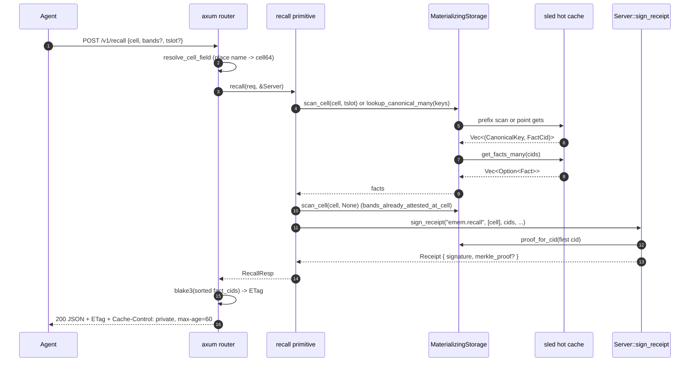
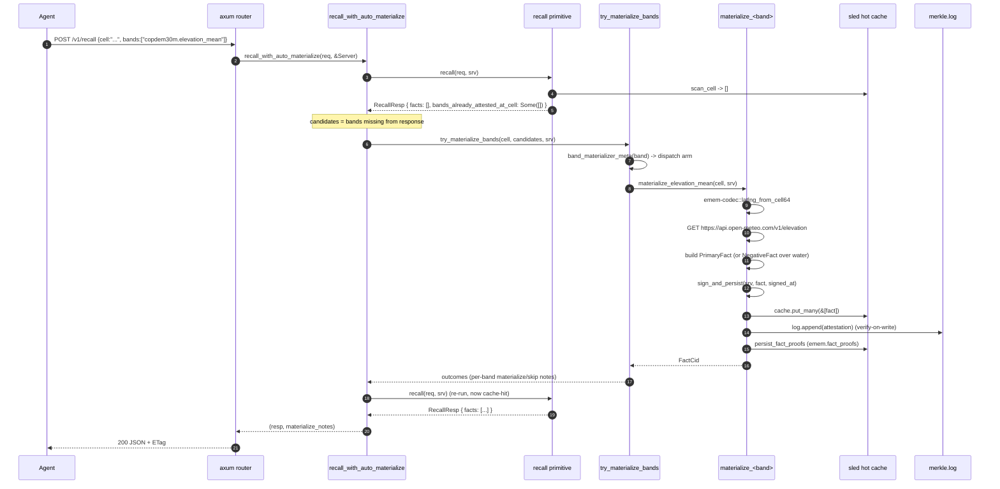
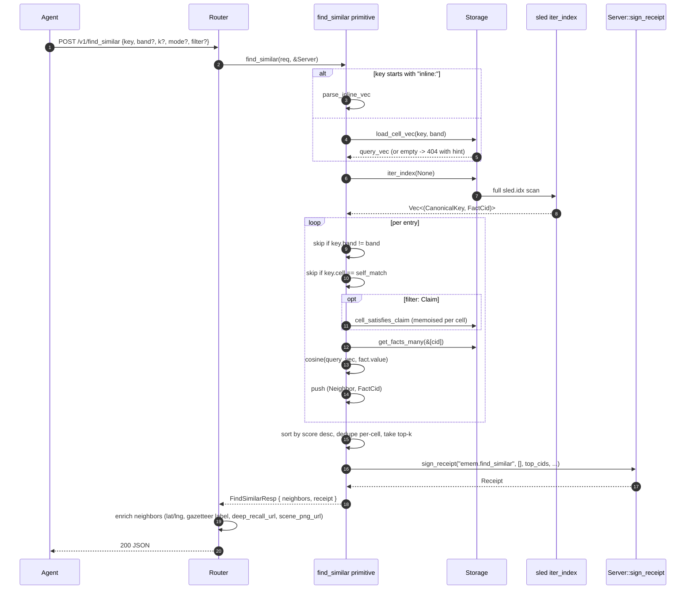

# emem architecture

This document is the system-level mental model for `emem.dev` v0.0.6. It covers process topology, the 14 workspace crates, the data plane (fact lifecycle + recall + find_similar + lazy materialize), the trust plane (identity + receipts + merkle log), the fetch plane (open-data connectors), the inference plane (Python sidecar + physics), and the agent surface (REST + MCP). Companion documents: `protocol.md` for byte-level rules, `agents.md` for calling conventions, `operating.md` for deploy.

## The shape of the system

A single Rust binary `emem-server` listens on one port (default `0.0.0.0:5051`) and serves both HTTP/REST (74 endpoints) and an MCP JSON-RPC endpoint at `POST /mcp` (36 tools). An optional Python sidecar over a Unix domain socket handles GPU inference for Prithvi-EO-2.0, Galileo, and JEPA-v2. Storage is a sled hot cache plus an append-only Merkle log on local disk. Identity is a 32-byte ed25519 secret persisted at `<EMEM_DATA>/identity.secret.b32` (mode 0600); the matching pubkey is published at `/.well-known/emem.json` so any client can verify receipts offline.

Place resolution and admin-boundary lookup happen entirely on open data the binary already carries or pulls keylessly: GeoNames cities-5000 ships embedded (CC-BY-4.0, 68 581 populated places); Overture's `divisions/division_area` theme supplies polygon geometry over anonymous S3 (ODbL). The Photon → Nominatim path remains as the long-tail fallback only for names neither carries. The agricultural-field surface (`/v1/field_boundaries` and the `include:["ftw_fields"]` supplement on `/v1/recall_polygon`) reads Fields of The World's global product (CC-BY-4.0, ~3.17 B field polygons) via PMTiles range reads.

## Process topology

```
+------------------------------------------------------------------+
|                         emem-server (Rust)                       |
|                                                                  |
|  +---------------+   +-----------------+   +------------------+  |
|  |  axum router  |-->|   primitives    |-->|     storage      |  |
|  |  /v1/*  /mcp  |   | recall, etc.    |   | cache+log+ident  |  |
|  +-------+-------+   +--------+--------+   +--------+---------+  |
|          |                    |                     |            |
|          |                    |                     v            |
|          |                    |            +-----------------+   |
|          |                    |            |   sled (hot)    |   |
|          |                    |            |   merkle.log    |   |
|          |                    |            |   fact_proofs   |   |
|          |                    |            +-----------------+   |
|          |                    v                                  |
|          |           +-----------------+                         |
|          |           |  fetch          |--> vsicurl / S3 / REST  |
|          |           |  Dispatcher     |    (S2, Cop-DEM, MODIS, |
|          |           +-----------------+     Tessera, GMRT, ...) |
|          v                                                       |
|   +---------------+                                              |
|   | gpu_sidecar   |---UDS---> Python FastAPI                     |
|   | (HTTP/1.1)    |          (Prithvi/Galileo/JEPA-v2)           |
|   +---------------+                                              |
+------------------------------------------------------------------+
```

The router constructs `AppState = Arc<Server>` (`emem-storage::server::Server`) at boot. `Server` owns three things: the `Storage` trait object, a `ResponderIdentity` (ed25519), and `ManifestCids` (registry, schema, bands, sources). Every primitive call gets `&Server` and returns a signed `Receipt`.

## Crates (14)

LoC counts captured 2026-05-08.

| Crate | LoC | Role |
|-------|-----|------|
| emem-api-rest | 27.6k | HTTP/MCP router + AppState + inline materializers (lib.rs alone is 23.2k; physics.rs is 2068) |
| emem-fetch | 8.8k | 16 connector modules: cache_window, chirps, cog, connectors, dmsp_ols, firms, hansen_gfc, koppen, lib, overture, proj, stac, template, terraclimate, wdpa, worldpop |
| emem-primitives | 3.4k | recall / find_similar / trajectory / compare / compare_bands / diff / verify / query_region + binary_embedding + refinement + cbor_ops |
| emem-core | 3.1k | bands, algorithms, functions, sources, topics, schema, taxonomy, manifest, privacy, tslot, cell, bbox |
| emem-cli | 3.0k | 7 binaries: emem, emem-server, emem-demo, emem-livedemo, emem-realdemo, emem-ask-eval, emem-purge-fnkey |
| emem-storage | 1.3k | MaterializingStorage (cache + fetch + log composite), Server, AttesterRegistry, AttestationLog |
| emem-mcp | 0.76k | Single-file MCP tool registry |
| emem-codec | 0.72k | cell64 / cid64 / tslot_text / vec64 / hilbert / geo / alphabet |
| emem-cache | 0.42k | sled cache wrapper (`SledHotCache`) |
| emem-intent | 0.41k | 7-variant Intent enum and rule-based planner |
| emem-fact | 0.35k | Fact / Receipt / Attestation CBOR types and signing primitives (split across lib/fact/cbor/cid/receipt/attest) |
| emem-attest | 0.22k | `merkle_root`, `merkle_root_and_paths`, `verify_merkle_path` |
| emem-claim | 0.08k | Claim predicate (Op enum + value, no signature) |
| emem-cubes | 0.05k | AgriSynth `.npz` handle (Python authoritative) |

`emem-storage` is the keystone: `MaterializingStorage` glues the cache trait to the `Dispatcher` and the `AttestationLog`, then exposes the `Storage` trait that primitives program against.

## The data plane

### Fact lifecycle

Every value the protocol can cite is one of three Fact variants (`emem-fact/src/fact.rs`): `PrimaryFact`, `DerivativeFact`, or `NegativeFact`. The CID rule is invariant: canonical CBOR, blake3-32, base32-nopad-lowercase. Two encodings of the same Fact converge on the same CID, so cache hits are content-addressed end to end.

```
Upstream source --> fetch connector --> materializer --> PrimaryFact
                                                            |
                                                            v
                                              ciborium canonical CBOR
                                                            |
                                                            v
                                                blake3 -> FactCid (52 chars)
                                                            |
                                                            v
                                          Attestation { facts, batch_root,
                                                       attester, signature,
                                                       registry_cid, schema_cid }
                                                            |
                                              +-------------+--------------+
                                              v             v              v
                                          sled hot       merkle.log    fact_proofs
                                          (index +       (segment      (per-cid
                                           facts trees)  + fsync)       merkle path)
```

`SledHotCache` (`emem-cache/src/sled_hot.rs`) holds two trees:

- `emem.canonical_index` — `cell\0band\0tslot_be8` -> `fact_cid_string_bytes`
- `emem.facts` — `fact_cid_string_bytes` -> canonical CBOR of the fact

`MaterializingStorage` (`emem-storage/src/lib.rs`) opens a third tree, `emem.fact_proofs`, where it persists per-fact merkle inclusion proofs at attestation-write time so receipts can carry a verifier-ready path back to the batch root.

### Recall path



The router additionally honours `If-None-Match`: a repeat recall with a matching ETag returns `304 Not Modified` with empty body. The receipt's `served_at` differs each call but the ETag derives from the immutable `fact_cids`, so it stays bit-stable across calls.

### Lazy materialize (cache-miss recall)



Three policies drive what gets materialized (`recall_with_auto_materialize`, lib.rs:3742-…):

1. Bands are explicitly requested: every band missing from the cache-hit response becomes a candidate.
2. No bands are requested AND the cell is empty: a small default set fires (`copdem30m.elevation_mean`, `weather.temperature_2m`) so a bare `recall` returns *something* cite-able instead of `[]`.
3. No bands are requested AND the cell already has facts: leave alone — the agent didn't ask for new bands.

Gates:

- `EMEM_AUTO_MATERIALIZE` — set to `0` or `false` to disable. Default on.
- `EMEM_MATERIALIZER_TIMEOUT_SECS` — default 30 s, clamped 2..=240.
- `EMEM_TIMEOUT_SECS` — gateway timeout, default 180 s, clamped 1..=600.

The signer of the materialized fact is the responder's own pubkey; trust delegation is "the same key that signs receipts also signs the value, with `derivation.fn_key` declaring exactly how it was produced."

### find_similar (corpus scan)



`Hamming` and `HammingThenRerank` modes branch *before* loading the full vector — for binary-only modes the full f32 payload never enters the candidate scoring loop. Memoisation per cell keeps Claim filter evaluations from re-scanning a cell once per tslot.

When a query cell has no vector under the requested band, `find_similar` returns an `ErrorCode::CidNotFound` with a hint string that names the bands that *are* attested at the cell — distinguishes "wrong band name" from "this place is empty."

### Verify-on-write

Every `MaterializingStorage::put_attestation` call goes through `verify_attestation`:

```
Attestation arrives
  |
  v
re-encode each Fact -> blake3 -> 32-byte leaf
  |
  v
sort leaves bytewise -> merkle_root(&leaves)
  |
  v
compare to att.batch_root
  |  match? no  ->  StorageError::AttestationInvalid("merkle root mismatch")
  |  match? yes
  v
build msg = blake3(batch_root || registry_cid_str || schema_cid_str)
  |
  v
ed25519::VerifyingKey(att.attester).verify_strict(msg, att.signature)
  |  fail -> StorageError::AttestationInvalid("bad signature")
  |  ok
  v
cache.put_many(&att.facts)         (writes both trees, flushes async)
log.append(att)                     (CBOR + 32-byte hash + fsync)
persist_fact_proofs(db, facts, cids)  (best-effort, never fails the put)
attesters.record_attestation(...)     (best-effort reputation tracking)
```

No bypass paths: a bad-merkle-root or bad-signature attestation never reaches the cache or the log. The reputation tracker and proof persister are best-effort — their errors log but never fail a write.

## The trust plane

Per-process responder identity (`emem-cli/src/bin/emem-server.rs::load_or_create_identity`):

- Highest priority: `EMEM_SECRET_B32` environment variable (32-byte ed25519 secret, base32-nopad lowercase).
- Else: `<EMEM_DATA>/identity.secret.b32` if it exists.
- Else: generate fresh, write to that path, chmod 0600.
- `EMEM_DATA=:memory:` skips persistence and uses an ephemeral key (the responder pubkey changes on every restart).

The matching pubkey is surfaced at `/.well-known/emem.json` so any client can verify a receipt offline without contacting the responder again.

### Receipt signing

`Server::sign_receipt` (`emem-storage/src/server.rs:119-189`) constructs the canonical preimage byte-by-byte:

```
blake3(
    request_id_bytes
  | "|"
  | served_at_bytes          (ISO 8601 UTC, no fractional)
  | "|"
  | primitive_bytes          (e.g. "emem.recall")
  | "|"
  | for each cell c: c_bytes | ","
  | "|"
  | for each fact_cid f: f_bytes | ","
)
```

The 32-byte digest is signed with the responder's `ed25519_dalek::SigningKey`. Verification is `vk.verify_strict(preimage, sig)`.

`Cost.was_cached` is `true` for recall (everything served already lived in sled at sign time), `false` for find_similar (fresh scan), and tracked per-primitive elsewhere.

### Merkle inclusion proofs

When `put_attestation` succeeds, `persist_fact_proofs` writes a per-fact `MerkleProof { leaf_index, path, root }` keyed by FactCid into the `emem.fact_proofs` sled tree. At sign-receipt time, `Server::sign_receipt` looks up the proof for the *first* cited fact and embeds it as `receipt.merkle_proof`. A verifier with the responder pubkey can re-derive every other CID from the signed receipt payload, so a single inclusion anchor is sufficient.

`emem-attest::merkle_root_and_paths` (66 LoC) handles the leaf hashing: each leaf is self-hashed `blake3(leaf || leaf)` (domain separation against second-preimage attacks), then pairwise `blake3(left || right)` upward. Empty input yields `[0u8; 32]`.

### Append-only merkle log

`AttestationLog` (`emem-storage/src/merkle_log.rs`) writes to `<EMEM_DATA>/log/merkle.log.{0,1,...}`:

- Record format: `[u32_LE len][CBOR bytes][32-byte blake3(CBOR)]`
- Segment cap: 1 GiB; new segment opens automatically
- Per-segment trailer: `segment_hash = blake3(all_records)`
- `append()` calls `fsync_all()` before returning (durability before ack)
- `verify()` re-hashes every sealed segment and reports mismatches

### Reputation tracking

`AttesterRegistry` (`emem-storage/src/attesters.rs`) opens a sled tree `emem.attesters`. Per-pubkey stats: `{attestations, facts, citations, unique_cells, first_seen, last_seen, last_cited}`. Atomic CAS update per attest call. Score formula: `citations*1.0 + ln(1+facts)*8.0 + ln(1+atts)*4.0`. Best-effort — tracker errors never fail a read or a write.

## The fetch plane

`emem-fetch::Dispatcher` (`crates/emem-fetch/src/connectors.rs`) is stateless. `register_default_https` registers three connectors against three `ConnectorKind`s:

```
+-------------------------+
|      Dispatcher         |
|                         |
| HttpsGeotiff            |---> HttpsConnector  (anonymous reqwest GET, identity encoding)
| HttpsCogVsicurl         |---> HttpsConnector  (same client, Range header path)
| GcsCog (gs://...)       |---> GcsConnector    (rewrites to https://storage.googleapis.com)
| IpldCid                 |---> IpldConnector   (stub; operator must register a blockstore)
+-------------------------+
```

`HttpsConnector::fetch_range` is the hot path: 90 s pool-idle, `Accept-Encoding: identity` (so `Range` offsets stay aligned with the original GeoTIFF), 429 surfaces as `FetchError::RateLimited` with `Retry-After`. Pool max-idle is 8 per host because COG access pattern is many small Range reads against the same hosts.

There are two surface populations producing live facts:

**Dedicated `emem-fetch` modules (12 live + 2 infra)** — verified live 2026-05-08:

| Module | Read path | Bands |
|--------|-----------|-------|
| cog (1047 LoC) | universal pure-Rust COG range sampler — Deflate(8), LZW(5), Predictor 1/2/3, 8/16/32-bit LE, chunky | shared by every raster connector |
| dmsp_ols | NOAA NCEI V4 nightlights tar+gz, F18 default | nightlights.dmsp_ols_avg_dn |
| firms | NASA FIRMS bulk CSV, 60-min in-process cache | fire_detections.firms_modis_viirs_nrt |
| hansen_gfc | earthenginepartners-hansen GCS bucket, v1.12, LZW strip TIFF | forest_change.{lossyear, treecover2000, gain} |
| koppen | Beck 2018 figshare ZIP, PackBits TIFF cached | climate.koppen_geiger_present_day |
| overture | Overture Maps S3, parquet row-group bbox prune | buildings/places/transportation.overture_count |
| terraclimate | UI Climatology Lab THREDDS NCSS CSV | climate.terraclimate_*_normal |
| worldpop | WorldPop /v1/services/stats REST | population.worldpop_2020 |
| wdpa | OSM Overpass `boundary=protected_area` | protected_areas.wdpa_via_osm |
| stac | Element84 + Microsoft Planetary Computer search | (input to Sentinel materializers) |
| proj | hand-rolled WGS84 <-> UTM (Snyder) | (input to Sentinel pixel sampling) |
| template | URL templating for tile paths | (used by all template-driven connectors) |
| cache_window | tokio::Notify in-flight fetch coalescing | (concurrency primitive) |

**Inline materializers in `emem-api-rest/src/lib.rs`** — produce live facts but live in the router crate (architectural debt, tracked in project_fetch_inventory):

- `materialize_gmrt_topobathy` ~ lib.rs:10297 -> `gmrt.topobathy_mean`
- `materialize_ornl_modis_band` ~ lib.rs:12375 -> 7 MODIS bands (`modis.{ndvi_mean, lst_day_8day, lst_night_8day, et_8day, gpp_8day, lai_8day, burned_area_monthly}`)
- `materialize_power_band` ~ lib.rs:11572 -> 7 NASA POWER bands
- `materialize_weather_current` / `materialize_cams_band` / `materialize_era5_band` / `materialize_marine_band` ~ lib.rs:11413/11730/11860/11979 -> ~25 Open-Meteo bands
- `materialize_soilgrids_band` ~ lib.rs:14552 -> 6 SoilGrids depths
- `materialize_firms_active_fires` ~ lib.rs:14340 -> `firms.active_fires` (calls into `emem_fetch::firms`)
- `materialize_chirps_daily_precip` ~ lib.rs:14948 -> `chirps.precip_daily_mm` (calls into `emem_fetch::chirps`)
- Sentinel-1/-2 + GeoTessera + Prithvi/Galileo encoders + JRC GSW + Overture + ESA WorldCover + Köppen + WorldPop + WDPA all dispatched the same way

Four `sources-v0.json` schemes are declared with NO materializer in api-rest: `dynamic_world.v1`, `openet.30m.daily`, `tropomi.s5p.{ch4, no2}`, `viirs.dnb.monthly`. They register as discoverable but a recall on those bands will fail `MaterializeMiss`. (The earlier list included `chirps.daily.v2`; CHIRPS daily precipitation is now wired live through `crates/emem-fetch/src/chirps.rs` and the inline materializer at `lib.rs:14948`.)

## The inference plane

`crates/emem-api-rest/src/gpu_sidecar.rs` is a hand-rolled HTTP/1.1 client over a UDS resolved from `EMEM_SIDECAR_SOCK`. The systemd user unit sets `EMEM_SIDECAR_SOCK=%t/emem/jepa_sidecar.sock` (expanding to `/run/user/<UID>/emem/jepa_sidecar.sock`); the Rust default when the env var is unset is `/run/emem/jepa_sidecar.sock` — useful for ad-hoc dev runs but NOT what the user-mode systemd unit creates, so production must always set the env. The client writes raw bytes, reads until `Connection: close`. Timeout via `EMEM_SIDECAR_TIMEOUT_MS` (default 5000). On `SidecarError::Unavailable` the caller falls back to in-process CPU (where wired); on a non-503 error from the sidecar it MUST refuse — no silent downgrade.

Three models loaded at sidecar start (`python/jepa_v2_sidecar/server.py` registry):

| Model | Status | Input | Output | Latency | Receipt warning |
|-------|--------|-------|--------|---------|------------------|
| Prithvi-EO-2.0-300M-TL | frozen pretrained, production | [B, T=1, H=224, W=224, bands=6] HLS V2 | 1024-D CLS | ~10 s cold / ~20 ms warm | `frozen_pretrained_encoder` |
| Galileo Tiny (5.7M params) | frozen pretrained, production, S2-only modality | [B=1, T=1, H=8, W=8, C=10] | 192-D | ~4 s cold / ~14 ms warm | `frozen_pretrained_encoder` |
| JEPA-v2 dynamics | untrained baseline | 3x128-D lags -> [B, 384] | 128-D residual | CPU ort ~50 us | `untrained_baseline` |

VRAM partition (`server.py:33-44`): `EMEM_SIDECAR_VRAM_BUDGET_GB` default 10 GB, set once via `torch.cuda.set_per_process_memory_fraction`. CUDA OOM surfaces as 503 to Rust.

Physics solvers in `crates/emem-api-rest/src/physics.rs` (2068 LoC) are all in-process Rust, no sidecar dependency:

- `/v1/heat_solve` — explicit FTCS 2D, 3x3 MODIS lst_day_8day stencil, 10 m grid pitch, CFL safety 0.20, horizon <=168 h, <=2M iterations, Dirichlet boundary
- `/v1/wave_solve` — explicit 1D shallow water from N GMRT topobathy_mean cells walked seaward, c=sqrt(g*h) floored at 0.01 m, CFL safety 0.5, land-locked rejection with profile + suggestion
- `/v1/jepa_predict` — closed-form NDVI AR(2) seasonal: `alpha*lag_12 + beta*trend + gamma*recent_mean` (alpha=0.6, beta=0.3, gamma=0.1), output clamped [-1, 1]
- `/v1/jepa_predict_v2` — pulls 3 latest Tessera vintages, calls sidecar, 128-D prediction; receipt always carries the `untrained_baseline` warning until training data exists

`model.via` in the receipt records provenance: `python_sidecar` for sidecar calls, `in_process_cpu` for CPU fallback.

## The agent surface

REST and MCP serve the same primitives. The MCP tool list is a strict read-only subset of REST; writes (attest, backfill, reviews POST) go through REST only.

```
+----------------+        +-----------------+        +------------------+
| ChatGPT / Cline|        | Claude Desktop /|        | direct REST / SDK|
| Cursor / Code  |---MCP->| Cline / Code    |---MCP->|                  |
+----------------+        +-----------------+        +------------------+
        |                          |                         |
        +----------------+---------+-------------------------+
                         |
                         v
                +------------------+
                | POST /mcp        |
                | JSON-RPC 2.0     |   <----  GET /.well-known/mcp.json
                +------------------+         GET /.well-known/agent-card.json
                         |                   GET /.well-known/emem.json (pubkey)
                         v
                +------------------+
                | tool registry    |   crates/emem-mcp/src/lib.rs
                | (34 read-only)   |
                +------------------+
                         |
                         v
                  same handlers as REST
```

Discovery chain an LLM follows on first contact:

1. `GET /v1/agent_card` — metadata, recommended tool order
2. `GET /v1/manifests` — `bands_cid`, `algorithms_cid`, `sources_cid`, `schema_cid`
3. `GET /v1/grid_info` — cell pitch (~10 m square), encoding (cell64, lat 21 bits, lng 22 bits)
4. `GET /v1/data_availability` — which bands have history, where the windows are
5. `POST /v1/locate {q:"<place>"}` -> cell64 (chain: wide_bbox_lookup -> embedded gazetteer -> GeoNames cities-5000 -> sled cache -> Photon -> Nominatim; polygon geometry from Overture `divisions/division_area`)
6. `POST /v1/recall`, `/v1/find_similar`, `/v1/verify`, `/v1/diff` — primitives

The 73 REST endpoints split across 13 categories (full list at `/v1/tools`). A non-exhaustive map:

- Health/discovery (7): `/health`, `/openapi.json`, `/openapi.action.json`, `/.well-known/{emem,agent,mcp}.json`, `GET /mcp`
- Introspection (14): `/v1/{bands, topics, algorithms, algorithms/:key, functions, sources, materializers, data_availability, coverage_matrix, manifests, grid_info, errors, tools, schema}`
- Read primitives (10): `POST /v1/{recall, recall_many, recall_polygon, query_region, compare, compare_bands, find_similar, trajectory, diff}`, `GET /v1/cells/:cell64`
- Write primitives (3): `POST /v1/{attest, attest_cbor, backfill}`
- Verify (2): `POST /v1/{verify, verify_receipt}`
- Physics solvers (4): `POST /v1/{heat_solve, wave_solve, jepa_predict, jepa_predict_v2}`
- Boring API (18): GET+POST variants of `/v1/{elevation, ndvi, air, lst, soil, water, forest, weather, at}` for agents trained on the public-API zoo

`/v1/recall_many` accepts up to 256 cells per request, returning `by_cell: {<cell>: {facts, receipt, bands_already_attested_at_cell}}`. Each cell carries its own signed receipt — there is no aggregate receipt, because verifying any one cell only verifies that cell.

## Storage layout on disk

`<EMEM_DATA>/` (default `./var/emem`):

```
<EMEM_DATA>/
  identity.secret.b32      (0600, ed25519 secret base32-nopad lowercase)
  cache.sled/              (sled hot tier — index, facts, attesters, fact_proofs trees)
  log/
    merkle.log.0           (append-only segment, 1 GiB cap)
    merkle.log.1
    ...
  geocoder.sled/           (locate cache, separate sled DB so it does not share a tree namespace)
  hf_cache/                (HuggingFace model snapshots; HF_HUB_OFFLINE=1 ready)
  models/                  (sentence-transformer ONNX, gazetteer artefacts)
  jepa_v2/
    dynamics_v2.onnx       (8.07 KB, untrained baseline today)
    dynamics_v2.metadata.json
  acme.cache/              (Let's Encrypt cert + account key when EMEM_TLS_DOMAINS set)
```

`EMEM_DATA=:memory:` skips the on-disk path entirely: ephemeral sled DB, fresh ed25519 key on every boot, no log persistence. Useful for tests; receipts produced by such a process verify only until restart.

## Failure modes

- **sled lock contention** — the server holds the exclusive lock on `cache.sled/`. Tools like `emem-purge-fnkey` require the server stopped first.
- **sidecar OOM during Prithvi cold-start** — surfaces as 503 to the Rust client. Receipts under fallback paths set `model.via = in_process_cpu` (where wired); for jepa_v2 the CPU fallback is not wired yet, so a 503 propagates.
- **materializer timeout** — exceeds `EMEM_MATERIALIZER_TIMEOUT_SECS` (30 s default). The recall returns the original (empty or partial) facts plus a `materialize_notes[]` entry of `{band, status: "skipped", reason}`. No silent fallback to zero values.
- **attestation rejected** — `verify_attestation` returns `StorageError::AttestationInvalid` with a message naming the failure (root mismatch or bad signature). The cache and the log are not touched. The reputation tracker is not updated.
- **upstream 502/503** — a `FetchError::Transport` propagates; the materializer either returns it (no fact written) or, for sources where absence is meaningful (e.g. Cop-DEM over water), signs a `NegativeFact` with a content-addressed `ReasonCid` so subsequent recalls short-circuit on the cached absence.
- **scan_cell density limit hit** — `EMEM_SCAN_CELL_LIMIT` (default 10_000 rows per cell scan) caps any single prefix walk. The cap is logged at `target=emem::storage scan_cell_limit_hit`. A legitimate cell holds one fact per (band, tslot), so hitting this cap indicates either a schema mistake or an attack — both are loud.
- **topic router warmup >90 s** — at boot, a dedicated blocking task tries to load the sentence-transformer router. If it exceeds 90 s the server starts anyway and `/v1/ask` falls back to keyword backend until the OnceLock initializer returns.

## Pointers

- `docs/protocol.md` — wire bytes (CBOR field order, CID rules, receipt preimage, attestation envelope).
- `docs/agents.md` — calling conventions for LLM agents (REST + MCP), the locate -> recall -> verify chain.
- `docs/operating.md` — deploy paths (plain HTTP behind a reverse proxy, native TLS via Let's Encrypt TLS-ALPN-01), systemd unit, env knobs.
- `docs/protocol.md` — wire-protocol reference (preimages, encodings, fact CBOR).
- `docs/whitepaper.md` — math + architecture rationale.
- `docs/agents.md` — primitive walkthroughs + the `/humans` interactive console (data-emem-* contract, console pivots, in-browser BLAKE3 + Ed25519 verify).
