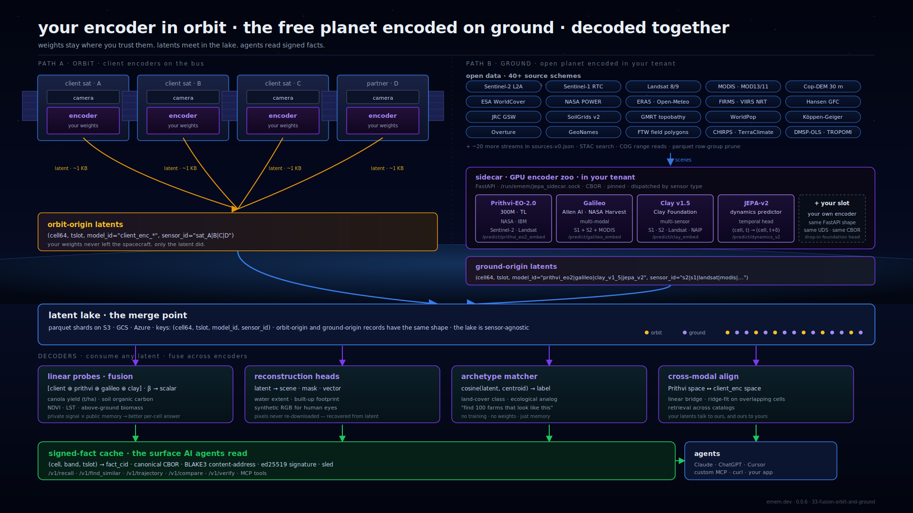

# emem: a content-addressed, agent-native spatial memory protocol

**Version 0.0.6 / 2026-05-11**

---

## Abstract

emem is a protocol for AI agents that need a stable, citation-carrying
place to ground spatial answers. Three primitives — `locate`, `recall`,
`find_similar` — operate over an open-data corpus addressed by `(cell,
band, tslot)`. Every response carries an Ed25519 receipt over the
canonical CBOR of the cited facts, so a downstream verifier can
independently confirm what the responder served.

The protocol is the loader, the validator, the CID rule, and the
primitive semantics. It is never the data. Implementations in any
language must produce byte-identical CIDs from byte-identical inputs;
the conformance test is a content-addressed manifest pinning bands,
algorithms, sources, and schema. The reference implementation is a
Rust workspace at `github.com/Vortx-AI/emem`; the canonical responder
runs at `https://emem.dev`.

This document describes the math and the architecture that 0.0.6
ships. Aspirational features (zero-knowledge proofs, staking
economics, multi-host clustering) are explicitly out of scope and not
discussed.

---

## 1. Motivation

LLM agents currently answer "what is at this place" by sampling
fragmented, undated, unattributed scrapes. Two failure modes recur:

1. **Conflicting answers across runs.** The agent has no canonical
   address for "the patch of land at lat=12.97°, lng=77.59° on
   2024-09-01"; the same question routed twice can return different
   numbers without either being demonstrably wrong.
2. **No way to cite.** Answers blend sources without provenance. The
   underlying tile, the timestamp, the algorithm that converted
   reflectance to index, all get smeared together.

emem's response is a small set of address rules plus one signing rule:

- Every fact is keyed by `(cell64, band, tslot)`. Two responders
  observing the same upstream pixel attest the same key.
- Every fact's CID is `base32_nopad_lower(blake3(canonical_cbor)[..16])`.
  Mutating any declared field changes the CID.
- Every response carries an Ed25519 receipt over a deterministic
  preimage naming the cited CIDs. An offline verifier with the
  responder's pubkey reproduces the preimage and checks the
  signature without calling back.

The surface is small on purpose: three core primitives, one verify
call, seven derived primitives (`compare`, `compare_bands`, `diff`,
`trajectory`, `query_region`, `recall_polygon`, `field_boundaries`).
New bands, algorithms, and sources extend the registries without
changing the primitive surface.

The protocol carries two encoding paths under one fact shape: the
customer's encoder running on the spacecraft (only the latent
downlinks; the weights never leave the bus), and four public
foundation encoders (Prithvi-EO-2.0, Galileo, Clay v1.5, JEPA-v2)
running GPU-pinned inside the same tenant against 43 open-data
sources. Decoders read both. §11 has the topology.

---

## 2. Spatial primitive: cell64

A cell64 is a 64-bit packed identifier for a square lat/lng bucket on
WGS-84. The encoding lives in `crates/emem-codec/src/geo.rs`.

### 2.1 Bit layout

```text
  bit:  63    60 59      52 51      44 43            22 21            0
        +-------+-----------+-----------+----------------+----------------+
        | mode  | resolution|   base    |     lat_q      |     lng_q      |
        | 0001  |    21     |   0xab    |   21 bits      |    22 bits     |
        +-------+-----------+-----------+----------------+----------------+
            4         8           8            21              22
```

- `mode = 0b0001` marks this as a geo cell.
- `resolution = 21` distinguishes the active 10 m grid from the
  pre-0.0.3 305 m grid (`resolution = 12`). A legacy 16-bit-per-axis
  cell64 fails decoding with `NotGeoCell`; it does not silently
  misplace facts by hundreds of metres.
- `base = 0xab` is the geo aperture marker.
- `lat_q ∈ [0, 2²¹)` is the lat axis bucket.
- `lng_q ∈ [0, 2²²)` is the lng axis bucket.

### 2.2 Encoder

```text
  lat = clamp(lat_deg, -90, +90)
  lng = ((lng_deg + 180) mod 360) - 180
  lat_q = round((lat + 90) / 180 · (2²¹ − 1))
  lng_q = round((lng + 180) / 360 · (2²² − 1))
  cell64.raw = (1 << 60) | (21 << 52) | (0xab << 44) | (lat_q << 22) | lng_q
```

The asymmetric bit count (21 lat × 22 lng) is deliberate. The lng
axis spans 360°; the lat axis spans 180°. Equal bit counts produce
1:2-rectangular cells. With 21:22, equator pitch is

```text
  Δlat = 180° / 2²¹ ≈ 8.583e-5°
  Δlng = 360° / 2²² ≈ 8.583e-5°
  lat extent at equator ≈ 9.54 m
  lng extent at equator ≈ 9.55 m
```

The cells are square at the equator and within 0.05 m of square at
all latitudes after rounding. Above the equator the lng pixel narrows
with cos(lat); cells become taller than wide. This is the standard
behaviour of any lat/lng grid. The eventual migration target is an
H3-style hex DGGS at resolution 13 (~3.4 m equal-area cells); cell64
is the active grid in 0.0.6.

### 2.3 Why a square grid

Sentinel-2 native pitch is 10 m. Sentinel-1 RTC is 10 m. Cop-DEM 30 m
mean-pools cleanly to 10 m. A 10 m grid lets a fact be materialised
per pixel without aggregation loss. A coarser grid would force every
optical ingest to either pre-aggregate or pre-resample; either choice
adds an opinion the protocol does not need to take.

### 2.4 Text form

A cell64 is rendered as four CVCV bigrams from a 65 536-entry alphabet
(21 consonants × 10 vowels × 21 × 10 = 44 100 natural pairs, padded with
`z<hex4>` synthetic suffixes), separated by dots:

```text
  damO.zb000.xUti.zde78
```

The alphabet is Hilbert-ordered (`tools/measure_alphabet.py`), so
adjacent codepoints tend to map to nearby cells in the visual
ordering. For exact spatial neighbourhoods, agents call
`/v1/locate.neighborhood_cells` rather than relying on string
prefixes.

---

## 3. Temporal primitive: tslot

A tslot is a `u64` bucket of the Unix timeline at a band's tempo
cadence. The encoding lives in `crates/emem-core/src/tslot.rs`.

### 3.1 Anchor

```text
  tslot = floor(unix_seconds / tempo.slot_seconds())
```

The anchor is the **Unix epoch** (1970-01-01T00:00:00Z), not the
emem-internal 2026 epoch the v0.0.2 codec used. The 2026 anchor
collapsed every pre-2026 historical observation to `tslot = 0`,
which made "five years of MODIS NDVI" structurally unaddressable.
Buckets-of-Unix matches every other Earth-observation system. Pre-1970
timestamps clamp to `tslot(0)`.

### 3.2 Tempo classes

```text
  Tempo       slot_seconds   typical bands
  ----------  -------------  --------------------------------------
  Static      0              copdem30m, gmrt, koppen
  Slow        31_536_000     geotessera.{2017..2024} + .multi_year + .bin128, soilgrids
  Medium      2_592_000      ndvi_monthly, modis composites
  Fast        86_400         s2_raw, s1_raw, modis lst_day_8day
  UltraFast   3_600          weather, air_quality, traffic
```

Tempo is declared once per band in `bands-v0.json` and is the only
thing that decides slot duration. A band cannot be served at a tempo
finer than its declared cadence.

### 3.3 Why tempo

Bands have natural cadences — Tessera annual, MODIS 8-day, Open-Meteo
hourly. Snapping to tempo aligns the index across heterogeneous
sources. A query like "compare NDVI now versus a year ago" maps to
two specific tslot values without the responder having to reason
about source-specific cadences at query time.

### 3.4 Text form

```text
  t.<base32-nopad-leb128>
```

For example `t.aaaaagy` is the tslot literal encoding of the unsigned
integer `1234`. The form is round-trippable; `tslot_text.rs` provides
encode and decode in `emem-codec`.

### 3.5 Recovery

A receipt that cites `(cell, band, tslot)` carries enough information
for a verifier to recover the wall-clock window the fact represents:
multiply tslot by `tempo.slot_seconds()` (read from `bands-v0.json`)
to recover the Unix start.

---

## 4. Content addressing

### 4.1 Canonical CBOR

emem-CBOR is RFC 8949 deterministic encoding plus four mandatory
tags. It uses `ciborium` with serde-derived structs; field
declaration order in the struct decides serialisation order. Two
implementations that share the struct definition produce
byte-identical CBOR for the same fact.

```text
  Tag 65000  emem cell        (u64 packed per spec §3.1)
  Tag 65001  emem tslot       (u64)
  Tag 65002  emem vec64-CID   (32 bytes)
  Tag 42     IPLD CID         (multibase 'b' base32, RFC 9090)
```

Free-form maps must arrive with pre-sorted keys.

### 4.2 BLAKE3 + base32-nopad-lowercase

The CID rule is one line of code:

```text
  FactCid = base32_nopad_lower( blake3( canonical_cbor(fact) )[..16] )
          → 26 lowercase characters

  cid64   = base32_nopad_lower( blake3( ... )[..8] )
          → 13 lowercase characters
```

`FactCid` is the durable form referenced in attestations and
receipts. `cid64` is the visible short form for logs and inline text;
it is a prefix, not a separate hash, and its collision domain is
2⁶⁴.

Manifest CIDs use 32-byte BLAKE3 prefixes (`base32_nopad_lower(...)
[..32]`), giving longer strings appropriate for content-addressing
the band ontology, algorithm registry, source catalog, and CDDL
schema bundle.

### 4.3 Why this choice

- **BLAKE3** is fast, parallel, and ships a keyed/derive_key API used
  by the binary embedding rotation (§8.2.1).
- **base32-nopad-lowercase** is URL-safe, case-insensitive, has no
  padding ambiguity, and contains no slash collisions inside path
  segments. A FactCid drops cleanly into a URL like
  `/v1/facts/<cid>`.
- **128-bit truncation** at the FactCid level is the practical sweet
  spot. A birthday collision needs ~2⁶⁴ facts; the canonical
  responder is at ~10⁵ today.

---

## 5. Trust: receipts and attestations

### 5.1 Receipt anatomy

```text
  field                   meaning
  ----------------------  ----------------------------------------------
  request_id              ULID; sortable + unique per call
  served_at               ISO 8601 UTC
  primitive               "emem.recall" | "emem.find_similar" | ...
  intent                  optional natural-language hint
  cells                   list of cell64 strings the call touched
  fact_cids               list of FactCid the response cited
  schema_cid              CID of the CDDL bundle used
  merkle_proof            optional inclusion proof for fact_cids[0]
  responder               32-byte ed25519 pubkey
  responder_key_epoch     u32; bumps when the operator rotates keys
  signature               64 bytes
  source_versions         per-source freshness map
  registry_cid            CID of the function registry version
  cost                    {credits, latency_p50_ms, latency_p99_ms,
                           source_freshness_s, was_cached}
```

### 5.2 Signature preimage

The bytes that get signed are deterministic in field order, fields
are joined with the literal `|` byte, list elements with the literal
`,` byte. The implementation lives in
`crates/emem-storage/src/server.rs:119-189`.

```text
  preimage_hash = blake3(
      request_id  ||  "|" ||
      served_at   ||  "|" ||
      primitive   ||  "|" ||
      cells[0] || "," || cells[1] || "," || ... || "|" ||
      fact_cids[0] || "," || fact_cids[1] || "," || ...
  )
  signature = ed25519_sign(signing_key, preimage_hash)
```

Both empty `cells` and empty `fact_cids` lists still emit their
trailing field separator, so a verifier reproduces the exact byte
string from the receipt fields without ambiguity.

Verification is `verify_strict` on `ed25519_dalek::VerifyingKey`. The
`strict` variant rejects malleable signatures.

### 5.3 Attestation envelope

A primary fact reaches the index through an Attestation, which the
storage layer re-checks before persisting.

```text
  Attestation {
      facts: Vec<Fact>,
      batch_root: [u8; 32],          // emem_attest::merkle_root over sorted leaves
      attester: AttesterKey,         // 32-byte ed25519 pubkey
      attester_key_epoch: u32,
      registry_cid: RegistryCid,
      schema_cid: SchemaCid,
      signature: Signature,          // ed25519 over the preimage below
      attested_at: i64,              // Unix seconds
  }

  preimage = blake3(
      batch_root  ||
      registry_cid_bytes  ||
      schema_cid_bytes
  )
```

`verify_attestation` (storage/lib.rs:407-440) re-CBOR-encodes every
fact, hashes each to a 32-byte leaf, sorts the leaves bytewise, folds
to a Merkle root via `emem_attest::merkle_root`, compares against
`batch_root`, then re-hashes `(batch_root || registry_cid ||
schema_cid)` and `verify_strict`s the signature. Failure raises
`StorageError::AttestationInvalid`. No bypass paths.

### 5.4 Merkle math

Every leaf is self-hashed once before folding (`blake3(leaf || leaf)`),
giving domain separation between leaves and inner nodes — a leaf
cannot collide with an inner node under adversarial pre-image.
Folding pairs left-then-right (`blake3(left || right)`); odd-cardinality
layers pair the last element with itself.

```text
  layer 0 (promoted):     L0=h(l0||l0)  L1=h(l1||l1)  L2=h(l2||l2)  L3=h(l3||l3)
  layer 1:                P0=h(L0||L1)  P1=h(L2||L3)
  layer 2:                root=h(P0||P1)
```

The inclusion path for leaf 1 is `[L0, P1]`. `verify_merkle_path`
(`emem-attest/src/lib.rs:94-117`) walks the path bottom-up: when
`leaf_index` is even, hash `acc || sibling`; when odd, hash
`sibling || acc`; halve `leaf_index` per step; compare `acc == root`.

### 5.5 Inclusion proofs end-to-end

`emem_attest::merkle_root_and_paths(leaves)` returns `(root,
Vec<path>)` in one pass. Single-leaf trees emit an empty path; the
root equals `h(leaf || leaf)`. Odd-cardinality layers record the
self-paired sibling explicitly so a verifier can reproduce the fold.

`MaterializingStorage::put_attestation` persists per-fact
`MerkleProof` records to a sled tree `emem.fact_proofs`, keyed by
FactCid string. Leaves are sorted by their 32-byte leaf hash; the
proof's `leaf_index` is the position in that sorted order.
`Server::sign_receipt` populates `Receipt.merkle_proof` from the
first cited fact's stored proof. A receipt with multiple `fact_cids`
carries one proof; a verifier already re-derives every other CID
from the signed preimage. Receipts whose facts pre-date the proof
tree (ephemeral runs, earlier-0.0.x attestations) carry
`merkle_proof = None`; the signature still binds the CIDs.

### 5.6 Append-only Merkle log

Every accepted Attestation appends to a per-segment file under
`var/emem/log/merkle.log.{0,1,...}`.

```text
  per-record:    [u32 LE record_len] [CBOR(attestation)] [32 byte blake3(CBOR)]
  per-segment:   [32 byte segment_hash = blake3(all_records_in_segment)]
```

`append()` calls `fsync_all()` before returning. Segments rotate at
1 GiB. `verify()` re-hashes every sealed segment and reports
mismatches; the current segment is verified up to the last
fully-written record.

### 5.7 Identity

A 32-byte Ed25519 secret stored at `var/emem/identity.secret.b32` in
base32-nopad lowercase, mode 0600. Load order:
`EMEM_SECRET_B32` (env) > file > fresh keypair. A `:memory:` data
dir produces an ephemeral key. The `u32` key epoch bumps on
rotation; receipts carry `responder_key_epoch` so a verifier
holding only an old pubkey detects the rotation.

---

## 6. Bands — the 1792-D voxel

The band ontology is loaded from `bands-v0.json` (`emem-core/data/`).
Thirty-five bands sum to exactly **1792 dims**. Offsets are
contiguous; reserved slots leave room for new bands without breaking
existing offsets.

```text
  offset  dims  key                family       tempo   privacy
  ------  ----  -----------------  -----------  ------  --------
       0   128  geotessera         vision       slow    public
     128    64  overture           human        slow    public
     192     7  air_quality        climate      ultra   public
     199   505  _reserved_512      reserved     static  public
     704    10  sentinel2_raw      optical      fast    public
     ...   ...  ...                ...          ...     ...
                                                        (34 entries)
                                                        total = 1792
```

The 14 family enum (Foundation, Optical, Radar, Terrain, Climate,
Soil, Vegetation, Landcover, Water, Human, Vision, Topology,
Encoding, Reserved) is editorial — it routes display behaviour and
documentation but is not load-bearing for the CID rule.

### 6.1 Privacy classes

```text
  Public                          unrestricted at any resolution
  AggregateOnly { min_res }       must snap to coarser res; receipt
                                  carries privacy_snapped: true
  L2OnlyWithModelCid              admissible only at conformance L2;
                                  Source.cid of the model checkpoint
                                  must accompany the fact
  Prohibited                      conforming responders MUST refuse
```

`PrivacyClass::permits_resolution(requested_res, conformance_l2)`
returns the boolean the recall path checks before serving. The four
classes are mutually exclusive; a band declares exactly one.

### 6.2 Manifest CID

`bands_cid = base32_nopad_lower(blake3(canonical_cbor(BandsManifest))[..32])`,
exposed at `/v1/manifests` and on the `/v1/bands` response root. Two
responders shipping the same `bands-v0.json` produce the same
`bands_cid`. Bumping the manifest produces a new CID; old facts
continue to verify because their `schema_cid` and `registry_cid` pin
the contemporaneous registry version.

---

## 7. Algorithms

The algorithm registry (`algorithms-v0.json`) holds 149 entries in
three kinds:

```text
  solo        single input band → derived value
              (e.g. NDVI → vegetation_class)

  combined    multi-band composite score / classification
              (e.g. flood_risk@2 = 0.55·(swr/100)
                                 + 0.25·dem_agreement·(relu(50-cop)/50)
                                 + 0.20·sigmoid((-15-s1)/2))

  embedding   operates on the geotessera embedding vector
              (cosine similarity, novelty, neighborhood consistency)
```

Each entry carries `inputs[]`, `formula` (plain math string), `output`
description, `when_to_use`, `citation`, and an optional `evaluation:
Expr` AST.

### 7.1 The Expr AST

`Expr` is 15 variants for in-process deterministic evaluation:

```text
  Band(key)               Const(f64)
  Add(l, r)               Sub(l, r)
  Mul(l, r)               Div(l, r)
  Linear { weights[], bias }      Σ wᵢ·sampleᵢ + bias
  Clamp { lo, hi, x }
  Where { cond, lhs, op, rhs, then, else }
  WeightedBlend { entries[(weight, expr)] }
  Abs(x)        Sigmoid(x)        Relu(x)        Max(l, r)        Min(l, r)
```

`Expr::evaluate(samples) -> Option<f64>` runs the AST against a
recall snapshot; `Expr::referenced_bands()` enumerates the bands an
algorithm needs. The dispatcher walks the registry, runs every
algorithm whose `evaluation` block has all inputs present in the
recall snapshot, and emits an `algorithm_outcomes[]` array on
`/v1/ask`.

### 7.2 Sensor tier rule

An algorithm that claims a delivery resolution ≤10 m must have at
least one S1, S2, or Landsat input in `variance_sources`. Coarser
inputs (POWER, ERA5, SoilGrids, Hansen, ESA WorldCover, JRC GSW,
Cop-DEM, GMRT) are baseline / context, never the sole variance
source for a fine-resolution claim. The validator order is
`S1 > S2 > Landsat > IoT > OtherSat > Static`; an algorithm whose
declared anchor is below a higher-tier input fails to load.

### 7.3 Worked example: flood_risk@2

```text
  inputs:   surface_water.recurrence, copdem30m.elevation_mean,
            gmrt.topobathy_mean, sentinel1_raw.vv
  formula:  0.55·(swr/100)
          + 0.25·dem_agreement·(relu(50-cop)/50)
          + 0.20·sigmoid((-15-s1)/2)
  output:   [0.0, 1.0] flood-risk score
  citation: Pekel 2016 (JRC GSW), Schumann 2018 (SAR flood detection)
```

The Expr round-trips through canonical-CBOR JSON to the dispatcher
and produces `0.4836` byte-stably (test
`flood_risk_v2_evaluates_to_a_real_number_from_dispatcher`).
`flood_risk@1` remains in the registry so existing receipts still
resolve.

---

## 8. Primitives

Every primitive returns a signed receipt. Empty results are
labelled, not zeroed.

### 8.1 recall(cell, bands?, tslot?)

Index lookup over `(cell, band, tslot)`. The implementation lives in
`emem-primitives/src/recall.rs`.

When `bands` is supplied and matches no facts, the response includes
`bands_already_attested_at_cell: [...]` — the actual band keys present
on the cell. This is the no-silent-fallback contract: an agent
asking for `band="alphaearth"` at a cell that holds geotessera +
soilgrids learns immediately that its band name is wrong, not that
the cell is empty.

When the entire cell is empty *and* `EMEM_AUTO_MATERIALIZE` is set,
the recall path triggers lazy materialisation (§9). Otherwise the
empty result is returned with an explicit `bands_available: []`
signal.

### 8.2 find_similar(key, k?, band?, filter?, mode)

Brute-force k-NN over the canonical-key index for the configured
band (default `geotessera`).

```text
  Mode::Cosine             fp32 cosine over the full vector
  Mode::Hamming            popcount over the binary sibling band
  Mode::HammingThenRerank  4·k Hamming triage + cosine rerank
```

Per-cell deduplication keeps the highest-scoring vintage; without it
multi-vintage bands return k near-duplicates of the same place.

The optional `filter: Claim` is evaluated per cell with memoisation —
a verdict for `(cell, claim.band, claim.op, claim.value)` computes
once and reuses across repeated tslots in the same scan. Cells with
no fact for the filter band are dropped (undecidable, not "false");
agents asking "find places like X where NDVI > 0.5" do not get
silent inclusion of cells with no NDVI history.

The response surfaces both `requested_k` and `returned_k`. When
`returned_k < requested_k` after dedup, the corpus has fewer
distinct cells than the caller asked for; the responder returns what
it has rather than padding.

#### 8.2.1 TurboQuant binary rotation

The `Hamming` modes operate over the binary sibling band
(`geotessera.bin128`); encoder in `binary_embedding.rs`.

```text
  ROT_SEED_TEXT = "emem.binary_embedding.turboquant.v1"
  BIN_DIMS = 128, BIN_BYTES = 16

  ROTATION (built once, cached):
    1. seed a CSPRNG with blake3(ROT_SEED_TEXT)
    2. draw 128² Gaussian samples (Box-Muller)
    3. classical Gram-Schmidt → orthonormal 128×128 matrix

  pack_bin128(vec):
    rotated[i] = Σⱼ ROTATION[i][j] · vec[j]
    bit i      = (rotated[i] >= 0)
    out        = 16 bytes, MSB-first per byte
```

Hamming distance is XOR + popcount — roughly 10⁹ scored pairs/sec
per x86 core, three orders of magnitude faster than fp32 cosine. The
rotation redistributes upstream variance across all 128 dims so a
single bit per dim carries information rather than collapsing to
the dominant axis. Bit-ordering is MSB-first per byte to match JS /
Python encoders byte-for-byte. The Hamming-to-cosine bridge is
`score = 1 - 2·dist/128 ∈ [-1, +1]`. The matrix's content address is
`rotation_cid()`; a verifier rebuilds the same matrix from the seed
text and re-packs the source vector to byte-compare.

### 8.3 verify(claim, cell, mode)

A `Claim` is `{ band, op, value, tslot? | window? }` where `op` is
one of `eq`, `ne`, `lt`, `le`, `gt`, `ge`. `verify` evaluates the
claim against the index.

```text
  Mode::Fast      look up canonical fact_cid; agree/disagree+evidence;
                  no inference

  Mode::Resolve   when the band has no fact at the targeted tslot,
                  call storage.materialize_many(...) and re-scan
```

Resolve mode previously degraded silently to Fast on a miss. The
0.0.4 sweep (`emem-primitives/src/verify.rs:92-111`) now actually
resolves: a `MaterializeMiss` (no upstream connector for this band)
surfaces to the caller rather than collapsing to `verdict=false`.
Open-ended windows (no `tslot`, no single-point `window`) cannot pick
a target tslot to materialise, so they fall back to Fast over
whatever is already in the index. The doc comment names this gap
explicitly.

The pre-0.0.4 `Mode::Zk` variant has been removed — Rust enum, MCP
schema, OpenAPI VerifyReq schema. It returned 500 on every call. A
ZK verifier is not in 0.0.4; v0.1+ may revisit.

### 8.4 compare / compare_bands

Two Primary facts side by side, with a structured difference object.
`compare_bands(cell, a, b, tslot_a?, tslot_b?)` resolves omitted
tslots to the **latest** tslot for that band at the cell. A caller
who omits both tslots gets `tslot_resolution.reason =
"auto_picked_latest"`; a caller who supplies tslots gets
`"caller_supplied"`. A band with no history at the cell surfaces as
`bands_with_no_history[]` and the response carries an empty-cite
receipt — labelled empty, not zeroed.

### 8.5 diff / trajectory / query_region / recall_polygon

- `diff(cell, band, t0, t1)` — change between two tslots for a single band. Non-numeric bands return a structured error.
- `trajectory(cell, band, [tslots])` — ordered series; missing tslots surface as gaps with explicit reasons.
- `query_region(geometry, bands?, agg?)` — geometry is `<cell64>`, `cells:c1,c2,...`, or `bbox:lon_min,lat_min,lon_max,lat_max`. Bbox synthesis caps at `MAX_BBOX_CELLS = 4096` (~6.4 km × 6.4 km at the equator) and `MAX_REGION_FACTS = 65_536`. Beyond either cap the responder stops scanning and aggregates over what it has; `receipt.fact_cids` reflects exactly what contributed. GeoJSON polyfill returns a structured error pointing to the bbox or cells form.
- `recall_polygon(polygon_bbox, n_cells)` — fans out across up to 1024 sample cells; returns mean / median / min / max / std per band plus per-cell `scene_thumbs[]`, `scene_overlay_url`, `geojson`. An `include: ["ftw_fields"]` flag attaches the field-boundary block from §8.6 inline.

### 8.6 field_boundaries

Per-field agricultural polygons from Fields of The World (FTW), a global product of ~3.17 billion field polygons across 241 countries at 10 m, CC-BY-4.0. The connector reads the upstream PMTiles archive (2.14 TB, hosted on source.coop) over anonymous HTTP range requests; MVT tiles are decoded and reprojected from Web-Mercator to WGS-84 in-process. Auto-zoom shrinks the request when a bounding box exceeds the 16-tile-per-query cap.

```text
  POST /v1/field_boundaries
  body  { place: "Patiala, India", zoom?: u8 }
        | { polygon_bbox: [w,s,e,n], zoom?: u8 }

  response {
      count: u32,
      total_area_m2: f64,
      zoom_used: u8,
      geojson: FeatureCollection,
      source_cid: FactCid,         // CID of the pmtiles archive entry
      provider_url, license, attribution
  }
```

The output is a polygon FeatureCollection, not a per-cell scalar, so the primitive lives in the API layer instead of `emem-primitives`. Provenance is the FTW source CID plus license and attribution, carried inline on the response.

The place-name path (`{ place: ... }`) reuses the locate cascade described in §11.6: GeoNames cities-5000 → Overture divisions → Photon → Nominatim, with polygon enrichment from Overture's `divisions/division_area` theme.

---

## 9. Lazy materialisation

A `recall` on a cell with no attested fact, for a band with a
registered upstream connector, triggers materialisation:

```text
  recall(cell, band, tslot) → miss
    → function-registry lookup (fn_key)
    → connector dispatch (fetch.rs or inline materializer)
    → upstream Range read (vsicurl COG, STAC, JSON API)
    → compute fact value
    → Fact::Primary → sign as responder → put_attestation → return
```

Gates: `EMEM_AUTO_MATERIALIZE` env (default **on** — set to `0`/`false`
to disable), 30 s materialiser timeout, 180 s gateway timeout, 16 MiB
body cap. A miss with no registered connector returns
`MaterializeMiss` — structured error, never a silent empty.

Inline materializers in `emem-api-rest/src/lib.rs` cover gmrt,
ornl_modis (NDVI / LST day+night / ET / GPP / LAI / burned-area),
nasa_power, open_meteo (current + cams + era5 + marine variants),
soilgrids v2 (SOC / pH / clay / sand / BDOD / nitrogen, 0-30 cm),
firms (active fires via the bundled `viirs.fire.nrt` connector),
chirps.daily.v2, prithvi_eo2 and clay_v1 (sidecar embeddings), and
ftw.field_polygons.v1. Five schemes remain declared but unwired:
openet.30m.daily, dynamic_world.v1, tropomi.s5p.ch4 / .no2,
viirs.dnb.monthly.

---

## 10. Inference

Four frozen-pretrained encoders, one untrained dynamics predictor,
and three explicit-method physics solvers — together they make up the
in-tenant **encoder zoo**. The Python sidecar lives at
`python/jepa_v2_sidecar/`; the Rust client is
`crates/emem-api-rest/src/gpu_sidecar.rs`.

### 10.1 Sidecar transport

Python FastAPI over a Unix domain socket
`/run/user/{UID}/emem/jepa_sidecar.sock`. The Rust client is a
hand-rolled HTTP/1.1 parser writing raw bytes over UDS. Failure
returns `SidecarError::Unavailable`; in-process CPU fallback is
wired where it exists, otherwise the responder returns a structured
503.

VRAM budget defaults to 10 GB and is set once at registry init via
`torch.cuda.set_per_process_memory_fraction()`. CUDA OOM surfaces as
503 to Rust.

### 10.2 Frozen pretrained encoders

```text
  model                    input shape           output  cold    warm    endpoint
  -----------------------  --------------------  ------  ------  ------  -----------------------------
  Prithvi-EO-2.0-300M-TL   [B, 1, 224, 224, 6]   1024-D  ~10 s   ~20 ms  /predict/prithvi_eo2_embed
                           (HLS V2 6-band)
  Galileo Tiny             [1, 1, 8, 8, 10]      192-D   ~4 s    ~14 ms  /predict/galileo_embed
                           (10 S2 bands @ 30 m)
  Clay v1.5                [B, C, 224, 224]      768-D   ~6 s    ~18 ms  /predict/clay_embed
                           (S1 · S2 · Landsat ·
                            NAIP · multi-sensor)
```

All three serve frozen embeddings; receipts carry warning
`frozen_pretrained_encoder`. Galileo's S1 / ERA5 / TC / VIIRS / SRTM /
DW / WC / LandScan / location modalities are zero-masked; only S2 is
wired today. Clay v1.5 is loaded from
`made-with-clay/Clay/v1.5/clay-v1.5.ckpt` via the
`Clay-foundation/model` git package pinned at SHA
`f14e698f3c237cabf8d28dec669a362d66625381` for reproducibility.

The FastAPI shape — `POST /predict/<name>` with `{cell, scene_url?,
band_indices?}` request and `{embedding, model: {id, version, sha}}`
response — is a public contract. A customer drops in their own encoder
under the same call.

### 10.3 JEPA-v2 dynamics — untrained baseline

Architecture: 3 × 128-D lags → flatten [batch, 384] → 128-D projection
→ 4 pre-LN residual blocks (dim 128, hidden 256, dropout 0.10) →
zero-init head → `last_vintage + delta`. Delta starts at zero; the
baseline is identity. On disk: `var/emem/jepa_v2/dynamics_v2.onnx`
(8.07 KB, `trained: false`).

The trained-checkpoint loader (`server.py:_Registry.load_dynamics`,
2026-05-08) runs `torch.load(weights_only=True)` →
`load_state_dict(strict=True)` (architecture drift fails at load, not
at prediction) → optional `blake2b_hex(state_dict_bytes) ==
declared_hash`.

Receipt warnings: `untrained_baseline`,
`upstream_geotessera_single_vintage`. Training is gated on upstream
Tessera publishing ≥3 vintages per cell; `python/jepa_v2/assemble_data.py`
+ `train.py` (cosine + smooth-L1 loss, K=5 + positional, cell-level
split) are ready but no training data exists.

### 10.4 Physics solvers

`crates/emem-api-rest/src/physics.rs` (2068 lines).

#### 10.4.1 /v1/heat_solve — explicit FTCS 2D

```text
  ∂u/∂t = α ∇²u

  9-cell stencil (NW N NE / W centre E / SW S SE) at the cell64
  10 m grid pitch. Read modis.lst_day_8day at the centre and 8
  cell64 neighbours.

  stability:    α · Δt / Δx² ≤ 0.20    (theoretical 0.25, 20% margin)
  defaults:     α = 1e-6 m²/s          (urban surface diffusivity,
                                        Oke 2017 §2.3 table 2.4)
  horizon:      ≤ 168 h
  iterations:   ≤ 2 × 10⁶
  boundary:     Dirichlet (held neighbours)
```

Detects uniform stencil (ΔT < 0.01 K) and surfaces imputed neighbours
in the receipt rather than running a degenerate solve.

#### 10.4.2 /v1/wave_solve — explicit CTCS 1D shallow water

```text
  ∂²u/∂t² = c² ∂²u/∂x²        c = √(g·h)
                              c floored at 0.01 m for numerical safety

  1-D profile walked seaward from the coastal cell using
  gmrt.topobathy_mean (cardinal-only).
  forcing: H_s · sin(2π·t / T) at offshore boundary
  hard wall at the coast.

  CFL safety: c · Δt / Δx ≤ 0.5
  land-locked rejection: offshore boundary ≥ 5 m AND ≥ 50 % of
                         profile > 1 m, else 422 with profile +
                         suggestion
```

#### 10.4.3 /v1/jepa_predict — NDVI AR(2) seasonal (closed form)

```text
  y_{t+1} = α · (lag_12 NDVI ∨ recent_mean)
          + β · (last + slope)
          + γ · recent_mean

  α = 0.6, β = 0.3, γ = 0.1   (fixed from agricultural-NDVI literature,
                               NOT a learned MLP — receipt says so)
  lookback: ≤ 24 months, default 6
  output:   clamped to [-1, 1]
```

Surfaces `lag_12_used` so an agent can audit which terms drove the
prediction.

#### 10.4.4 /v1/jepa_predict_v2 — sidecar Tessera dynamics

Pulls 3 latest Tessera vintages → sidecar → 128-D prediction. The
receipt always carries `untrained_baseline` until §10.3 changes.

`model.via` is set by sidecar response: `python_sidecar` for all
four models. In-process Rust ort CPU fallback would set
`rust_ort_cpu` (wired for Prithvi, not yet for jepa_v2).

---

## 11. Fusion: client encoders in orbit, open-data foundations on the ground

The protocol does not assume a single encoder. At any given cell at
any tslot, multiple encoders may have produced a latent for the same
patch of Earth. emem treats these as parallel views of one place and
lets the decoder layer consume them together.



A simpler frame — one customer fleet, one decoder layer — is at
[`diagrams/31-encoders-in-orbit-decoders-on-ground.svg`](diagrams/31-encoders-in-orbit-decoders-on-ground.svg).

### 11.1 Path A — encoder on the spacecraft

Customer satellites carry the customer's proprietary encoder on the
bus. The encoder reads the raw scene at the focal plane and produces
a fixed-length latent vector. Only the latent downlinks — typically
~1 KB per scene where the raw pixels are ~100 MB. A Sentinel-class
scene is ~100 MB at L1C; the latent for the same footprint at 1024-D
fp16 is ~2 KB, and at 128-D fp16 is ~256 bytes. A spacecraft downlink
budget that fits ~150 raw scenes per orbit fits ~100 000 latents.

The encoder weights never leave the spacecraft or the customer's
tenant. The customer keeps the imagery, the encoder, and the latent;
emem records only the resulting `(cell64, tslot, model_id, sensor_id,
value)` triple. ITAR-clean by construction when needed.

### 11.2 Path B — encoders on the ground, in the customer's tenant

`emem-fetch` pulls 43 declared open-data schemes anonymously, with no
API keys. The current set:

```text
  imagery        Sentinel-2 L2A, Sentinel-1 RTC, Landsat 8/9,
                 MODIS MOD13/MOD11/MOD15A2H/MOD17A2H/MCD64A1
  terrain        Cop-DEM 30 m, GMRT topobathy
  landcover      ESA WorldCover, Hansen GFC, Dynamic World, FTW
  hydrology      JRC GSW occurrence + recurrence
  weather        NASA POWER, ERA5 + CAMS + Marine (Open-Meteo, met.no)
  climatology    Köppen-Geiger, TerraClimate, CHIRPS
  soil           SoilGrids v2 (SOC, pH, clay, sand, BDOD, N · 0-30 cm)
  fire / nrt     FIRMS MODIS+VIIRS, VIIRS DNB
  population     WorldPop, GHSL population + built-up, DMSP-OLS
  divisions      Overture (places · buildings · transportation ·
                          division_area)
  gazetteer      GeoNames cities-5000 (68 581 places ≥ 5 000 pop)
  vector         FTW field polygons (~3.17 B fields, 241 countries),
                 OSM Overpass (WDPA fallback)
  embeddings     Tessera annual vintages (multi-year + bin128)
  + 5 declared but unwired: openet.30m.daily, dynamic_world.v1,
                            tropomi.s5p.{ch4,no2}, viirs.dnb.monthly
```

Each scene is dispatched through the sidecar zoo of §10 — Prithvi-EO-2.0,
Galileo, Clay v1.5, JEPA-v2 — running GPU-pinned inside the same
tenant under `python/jepa_v2_sidecar/server.py`.

### 11.3 One latent record shape

Latents from either path are stored under the same fact key:

```text
  (cell64, tslot, model_id, sensor_id)  →  vec64-CID
                                        →  128- to 1024-D float array
```

`model_id` identifies which encoder produced the latent
(`client_enc_A`, `prithvi_eo2_300m_tl`, `galileo_tiny`, `clay_v1_5`,
`jepa_v2_dynamics`, ...). `sensor_id` identifies which platform the
encoder consumed (`sat_A`, `s2_l2a`, `s1_rtc`, `landsat_8_oli`, ...).
The vec64-CID is the BLAKE3-addressed payload (§4.2 tag 65002). Two
encoders that see the same cell at the same tslot produce two
distinct facts with the same `(cell64, tslot)` but distinct
`(model_id, sensor_id)`. Both are queryable; neither shadows the
other.

### 11.4 Decoders that read both paths

Decoders are registered in `algorithms-v0.json` (149 entries today)
with explicit input bands. The dispatcher (§7.1 Expr AST) runs every
algorithm whose inputs are present in the recall snapshot. Four
decoder families consume the latent lake:

- **Linear probes.** A learned weight vector `β` over a single
  latent or a concatenation of latents from the same `(cell, tslot)`.
  A probe trained on `[client_latent ⊕ prithvi_latent ⊕
  galileo_latent]` for canola-yield prediction uses the customer's
  spectral signature plus the public foundation context jointly.
- **Reconstruction heads.** Masked autoencoders restore
  `latent → scene · mask · vector`. Used for water-extent recovery,
  building-footprint reconstruction, synthetic RGB.
- **Archetype matchers.** Cosine against a learned class centroid in
  latent space — land-cover labels, ecological analogs, "find 100
  fields that look like this one" retrieval.
- **Cross-modal alignment.** A ridge-regression bridge between two
  encoder spaces, fit on cells where both encoders have produced a
  latent. Lets a customer holding only their own latents at one
  site retrieve neighbours from the Prithvi-encoded global pool.

### 11.5 What this is not

The decoder is not an ensemble that votes on one prediction. It
consumes whichever latents are present at the cell, concatenates
them, and applies a learned weight to produce a single signed fact.
The mathematics is a linear concatenation followed by a regression.
The win comes from inputs aligning in latent space.

Every step writes a signed fact with citations: the latent fact
cites the source scene CID; the linear-probe output cites the
latents it consumed; the receipt over the agent's call cites both. A
verifier with the responder's pubkey reproduces the chain offline.

### 11.6 Locate cascade

The fusion path needs to resolve place names to cells. `/v1/locate`
walks a five-layer cascade so common queries never reach a rate-limited
upstream:

```text
  1. wide_bbox_lookup     embedded country / region polygons,
                          ~5 ms
  2. embedded_gazetteer   in-binary place atlas (countries,
                          capitals, major cities), ~5 ms
  3. geonames             cities-5000 (68 581 entries, CC-BY-4.0,
                          gzipped 5.5 MB, loaded once via
                          include_bytes!), ~10 ms
  4. sled cache           memoised result from any prior resolve,
                          ~2 ms
  5. photon (open-source) Komoot-hosted Photon for the long tail,
                          ~80 ms
  6. nominatim (fallback) for queries Photon misses, hard
                          rate-limited
```

Polygon enrichment in branches 2-4 reads Overture's
`divisions/division_area` theme (ODbL, anonymous S3 parquet with
row-group bbox pruning, exact-name match plus subtype rank
country > region > county > locality > borough > ... > microhood).
Mumbai, São Paulo, Tokyo, Patiala, Manhattan all resolve with
`polygon_bbox.source = overture_division_area`; Photon / Nominatim
handle only the long tail (e.g. Yellowstone). The canonical
responder does not hit OSM at all for ~99 % of city queries.

---

## 12. Conformance

Two implementations conform when, given byte-identical inputs, they
produce byte-identical CIDs over the manifest set exposed at
`/v1/manifests`:

```text
  bands_cid        BLAKE3 over canonical_cbor(BandsManifest)
                   (1792 dims, 35 bands)
  algorithms_cid   BLAKE3 over canonical_cbor(AlgorithmsManifest)
                   (149 entries, three kinds)
  sources_cid      BLAKE3 over canonical_cbor(SourcesManifest)
                   (43 schemes)
  topics_cid       BLAKE3 over canonical_cbor(TopicsManifest)
                   (26 topics)
  schema_cid       BLAKE3 over canonical_cbor(SchemaBundle)
                   (CDDL pinning hash=blake3, signature=ed25519,
                    cid_encoding=base32-nopad-lowercase)
  registry_cid     BLAKE3 over canonical_cbor(FunctionRegistry)
                   (20 functions: 17 primary / 2 derivative / 1 negative)
```

A receipt directly binds **two** of these — `schema_cid` and
`registry_cid` — as struct fields. The other four (`bands_cid`,
`algorithms_cid`, `sources_cid`, `topics_cid`) are exposed at
`/v1/manifests` and `/.well-known/emem.json`; conformance against
them is verified by re-pulling the manifests and checking the CIDs
the verifier holds match what the responder served at the time the
receipt was signed. The receipt's `registry_cid` pins the function
registry, and that registry references all the others by their CIDs.

`cargo test --workspace` is the de-facto conformance check today —
244+ tests pass on the reference responder. Per-vector test fixtures
under `spec/test_vectors/` are not yet shipped; the crate-internal
tests at `crates/emem-codec/src/geo.rs`, `tslot_text.rs`, and
`emem-attest/src/lib.rs` are the de-facto fixtures until they are.

---

## 13. Privacy

The four classes from `emem-core/src/privacy.rs` (§6.1):

- **Public** — default for open-data bands (Cop-DEM, Tessera, WorldCover, GMRT, MODIS, Open-Meteo).
- **AggregateOnly { min_res }** — population-density bands snap to coarser resolution; the recall path rounds the queried cell up to `min_res` and marks `privacy_snapped: true` in the receipt.
- **L2OnlyWithModelCid** — fine-resolution embeddings tied to a specific model checkpoint; conformance level L2 plus a `Source.cid` pointing at the checkpoint. L1 responders must refuse.
- **Prohibited** — reserved. No band declares it today; conforming responders MUST refuse if any does.

Legal surface (documented with citations in SPEC.md §13): GDPR
(Reg 2016/679), UK-GDPR, DPDP-2023, CCPA-CPRA, RFC 9116. The
canonical responder logs `agent_ip_hash =
base32_nopad_lower(blake3(client_ip)[..8])`, not the raw IP; POST
bodies are not captured; GET query strings are captured for the
30-day journald retention window.

---

## 14. What 0.0.6 deliberately does NOT include

The protocol stays small until each item has a working code path:

- **Zero-knowledge verifier.** `verify Mode::Zk` was advertised in 0.0.3 and returned 500; removed in 0.0.4. No halo2 / Circom circuits in the workspace.
- **Stake / economics.** `Attestation.stake` was a reserved field; removed from the struct and its 9 call sites. There is no roadmap commitment to bring it back — if economics is ever designed for the protocol, a properly-named field will be added at that time.
- **Multi-host clustering.** Single primary; replicas are read-only.
- **Trained JEPA-v2.** Loader is wired; the model on disk is an identity-initialised baseline. Training is gated on upstream Tessera publishing multi-vintage history (§10.3).
- **Filecoin / IPFS bridge.** `IpldConnector` is a stub; operators register their own.
- **Python / TypeScript SDKs.** `sdks/emem-py/` and `sdks/emem-ts/` are empty placeholder directories; agents use REST or MCP directly.
- **Per-vector test vectors.** `spec/test_vectors/` directories exist; vectors not yet extracted.
- **Multi-modal Galileo and Clay.** Galileo's S1 / ERA5 / TC / VIIRS / SRTM / DW / WC / LandScan / location modalities are zero-masked; Clay v1.5 is wired for S1 / S2 / Landsat but does not yet ingest NAIP, MODIS, or LINZ. The model architectures accept the full multimodal shape; the chip-fetcher coverage is the bottleneck.
- **On-orbit encoder firmware.** §11.1 describes the topology — encoder weights on the spacecraft bus, ~1 KB latents downlinked — as the architecture pilot customers are building toward. emem does not ship spacecraft firmware. The protocol surface accepts whatever model_id and sensor_id a customer attests under their own ed25519 key.

A request that names a missing surface returns `MaterializeMiss` or a
structured `ErrorCode`. No surface returns `verdict=false` for an
absent capability.

---

## 15. Comparison with adjacent work

- **STAC** describes scenes; emem describes per-pixel facts with provenance. STAC catalogs are one of seven upstream connector kinds, not the protocol.
- **GeoParquet** is a data format; emem is an addressing rule plus a receipt schema. A GeoParquet column can hold an emem fact's value, but the file carries neither the responder signature nor the Merkle path.
- **Web of Things** describes thing ontologies; emem describes spatial-temporal observations. A WoT thing can emit an emem fact when it observes; neither replaces the other.
- **IPLD** is a CID layer; emem composes a CID rule on top of IPLD's CBOR tag 42 base32 encoding plus a domain-specific fact ontology.

emem sits in the middle: a CID rule + a fact ontology + a primitive
surface, agent-readable end-to-end.

---

## 16. Open questions

- **H3 hex migration.** Spec target is an H3-equivalent DGGS at resolution 13 (~3.4 m equal-area cells). cell64 is square at the equator, progressively non-square poleward. Migration requires a new manifest CID for the band ontology and an in-flight-fact story. No timeline; raised so the gap is explicit.
- **Trained JEPA-v2.** Gated on upstream Tessera publishing multi-vintage history. Training script ready; data is not.
- **WorldPop population latency.** Currently 2–4 s/cell because the responder reads upstream COG at request time. Pre-baking the global 1 km² raster locally would amortise the fetch — the actual win depends on disk vs CDN trade-offs and is an infrastructure decision that sits outside the protocol.
- **Multi-modal Galileo.** S1 / ERA5 / TC / VIIRS / SRTM / DW / WC / LandScan / location modalities are zero-masked. Each needs a connector + chip fetcher; the model already accepts the full multimodal shape.
- **Five unwired source schemes.** openet.30m.daily, dynamic_world.v1, tropomi.s5p.ch4, tropomi.s5p.no2, viirs.dnb.monthly. Declared, no materialiser, no facts today.
- **Cross-modal alignment at scale.** §11.4 describes ridge-regression bridges between encoder spaces (Prithvi ↔ client_enc, Galileo ↔ client_enc). The mathematics is one linear system per pair; the missing piece is a labelled overlap set per customer. Pilot customers seed this from their own retro-data; there is no general public corpus that pairs proprietary client latents with foundation latents.

---

## References

- Beck, H.E., et al. "Present and future Köppen-Geiger climate classification maps at 1-km resolution." *Scientific Data* 5, 180214 (2018).
- Clay Foundation. "Clay v1.5 — a foundation model for Earth." `made-with-clay/Clay` on Hugging Face; weights pinned at `clay-v1.5.ckpt`. (Sidecar `/predict/clay_embed`, §10.2.)
- Corley, I. "TerraBit — sign-bit rotation for binary k-NN." geospatialml.com/posts/terrabit. (TurboQuant rotation, §8.2.1.)
- Elvidge, C., Zhou, Y. "DMSP-OLS digital number to radiance conversion." (Frozen 1992-2013 nightlights series.)
- Fields of The World (FTW). "Global agricultural field polygons, 241 countries, 10 m, CC-BY-4.0." source.coop pmtiles archive. (Primitive §8.6.)
- GeoNames. "cities-5000 — 68 581 populated places ≥ 5 000 population, CC-BY-4.0." Vendored at `crates/emem-fetch/data/cities5000.txt.gz`. (Locate cascade §11.6.)
- Hansen, M.C., et al. "High-resolution global maps of 21st-century forest cover change." *Science* 342, 850-853 (2013).
- Hinnant, H. "Civil from days." Public-domain date arithmetic used by `iso8601_now()`.
- IBM / NASA / Jakubik et al. "Prithvi: A geospatial foundation model for Earth observation." `ibm-nasa-geospatial/Prithvi-EO-2.0-300M-TL` on Hugging Face. (Sidecar `/predict/prithvi_eo2_embed`, §10.2.)
- O'Connor, J., Aumasson, J.-P., Neves, S., Wilcox-O'Hearn, Z. "BLAKE3: one function, fast everywhere."
- Oke, T.R. *Boundary Layer Climates*, 2nd ed. Methuen (1987); §2.3 table 2.4 (urban α ≈ 1e-6 m²/s for `/v1/heat_solve`).
- Overture Maps Foundation. "Places, buildings, transportation, divisions themes, ODbL." Anonymous S3 parquet; `divisions/division_area` for polygon enrichment. (Locate cascade §11.6.)
- Pekel, J.-F., et al. "High-resolution mapping of global surface water and its long-term changes." *Nature* 540, 418-422 (2016).
- Schumann, G.J.-P., et al. "The need for a high-accuracy, open-access global DEM." *Frontiers in Earth Science* 6:225 (2018).
- Snyder, J.P. "Map projections — a working manual." USGS Professional Paper 1395 (1987).
- Tseng, G., et al. "Galileo — a multimodal geospatial foundation model." NASA Harvest / Allen AI; `nasaharvest/galileo`. (Sidecar `/predict/galileo_embed`, §10.2.)
- RFC 8949 (CBOR §4.2 deterministic encoding), RFC 8032 (Ed25519), RFC 4648 (base32-nopad), RFC 9090 (multibase 'b'), RFC 9116 (security.txt).

---

End.
